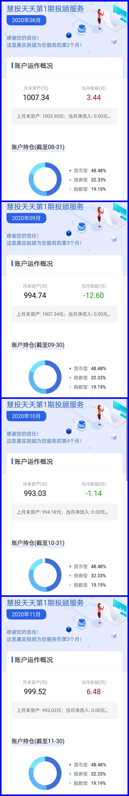

### 每次点开都想吐槽的一款投顾产品

我很少点名吐槽哪家产品，但有些真的太差劲了，我自己买了些实验观察仓，每次点开都想吐槽一把，今天实在忍不了。

我去年7月下旬看到嘉实投顾在天天基金内上架了一款自动止盈的产品，当时我看了条款后就立马买了1000元试验下，并写下了专门的文章测评了其产品的设定是有多么的垃圾：☞ [《嘉实基金的这款投顾产品有收智商税之嫌》](https://blog.ytc1989.com/#/financing/jstg-mbt)

现在将近半年过去了，该产品跑出来的效果如我预期一致的差。这半年沪深300和中证500涨得那叫个洋洋洒洒，优秀的创业板指就更不用说了。在如此好的市场大环境下，这款嘉实投顾的产品真的连余额宝都没跑赢，我也是服气的，要不是最近大盘上了3500点，这货估计还会长期处于亏损中。

关键这款产品宣传上还赫然写着【以客户需求为中心，客户利益为导向。】，**还要额外收取0.5%/年的投顾服务费，这不是收智商税，是啥？**对于产品规则的吐槽以及更好的免费替代工具我在上次文章 ☞[《嘉实基金的这款投顾产品有收智商税之嫌》](https://blog.ytc1989.com/#/financing/jstg-mbt)☜ 中已经写的很详细了，这次主要和大家再次分享下这半年来改产品的业绩展示：

我买的这个是该产品的第一期，8月份卖了第二期后就没再推新的了，两期至今都没触发止盈，也是够差劲的。后面9月和12月分别出了该产品的“进化”品，即把预期受益降低到了年化6.5%（便于更快的止盈），我看今年1月又在募集新的一期了。诉我直言，我不敢说嘉实基金的所有投顾产品都那么差劲，但这款真的很糟糕（产品页面留言板上骂声一片），有点砸嘉实的牌子了，还是早点下架为好。

最后我想说没有对比就没有伤害，投顾的产品我基本上都买了实验观察仓：易方达、嘉实、华夏、中欧、南方、先锋等。绝大多数产品还是可以的，至少对于小白用户来说是个省心省力的选择，但是本文提到的嘉实投顾的这款产品真的是忍不住今天再次吐槽下，希望大家在选择投顾产品的时候还是要有所甄别（仅限小白用户，如果你是老司机请自行投资）。