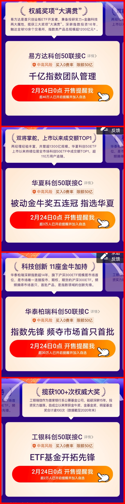

### 科创50将新增200亿以上的流动性

 

富时罗素公布3月半年度评审结果，有11只科创板个股（澜起科技、睿创微纳、君实生物-U、海尔生物、西部超导、康希诺-U、中微公司、杭可科技、安集科技、中国通号、昊海生物）进入富时GEIS名单中，预计将会带来约6亿多人民币的外部资金。

另外易方达、华夏、华泰柏瑞、工银瑞信去年发的对标科创50指数的四只ETF终于要出联接基金了。四只科创50联接基金24日起同步发售，单只限购50亿，一次性就带来了200亿人民币的增量资金，而且我相信后续还会增大规模。当初**搞这四个ETF很大程度上就是为了补充科创板的流动性**，同时也是方便普通投资者参与到科创板里来，这次四家一起获批联接基金也是同样的道理。

顺带插一句，大家都在说2021年又是各家基金公司布局行业主题ETF的关键年。以至于基金公司在发行的每个环节都是分秒必争（毕竟ETF的先发优势是极为明显的），其实在除夕前就基金公司的人发我他们设计好的科创50联接基金的海报等材料了。反正最近的ETF是相当密集：游戏ETF、化工ETF、养殖ETF、稀土ETF，反正每家都说自己是“首发”、“首批”，另外一些非首发的还不在内。

继续说回科创50，四只基金将在2月24日（下周三）同步开售，上面也说了单只限额50亿。但作为看戏吃瓜的我们，可能会比较在意**谁能第一个售罄、哪家没有单日售罄**（没错，对于这四家如果没单日售罄反而是个看点）、**单日售罄的里面各自的配售比例是多少？**

我看了下天天基金和支付宝的基金页面，天天基金暂时没看到有很明显的销售宣传，但支付宝基金页面就有很大一块展示【科创50指数来了！】，那我们就以支付宝的宣传来看看有哪些细节值得关注！

1、支付宝给四家的排序如下：易方达 > 华夏 > 华泰柏瑞 > 工银瑞信。这个东西呢不言自明，你们细品，而且参考上次战略配售很可能，这排序也会影响我上面三个加粗问题的答案。

2、各家的宣传卖点是：易方达-千亿指数团队管理；华夏-被动金牛奖五连冠 指选华夏；华泰柏瑞-指数先锋 频夺市场首只首批；工银瑞信-ETF基金开拓先锋。虽然四家都是大佬级别的基金公司，但你可以发挥九年义务教育考纲内的语文水平，可以很明显的四家还是有强弱之分的。

3、截止21日晚截图数据显示：易方达超40万开启提醒并加入自选；华泰柏瑞超30万开启提醒并加入自选；华夏超3万开启提醒并加入自选；工银瑞信超2万开启提醒并加入自选。这个数据还是蛮值得回味的，我们也可以看出华夏基金即便在场内是规模最大、流动性最强，但场外联接预约这块远不如易方达和华泰柏瑞了，至于工银瑞信我只能说要加油啊，总是陪跑可不是办法呀。

时间不早了，就先闲聊这些，再次也希望四家基金公司的科创50联接基金都能单日售罄。

