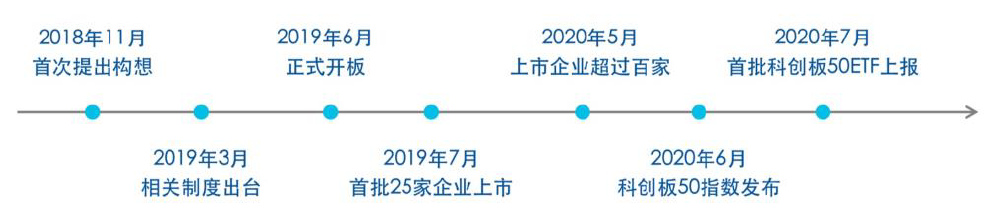
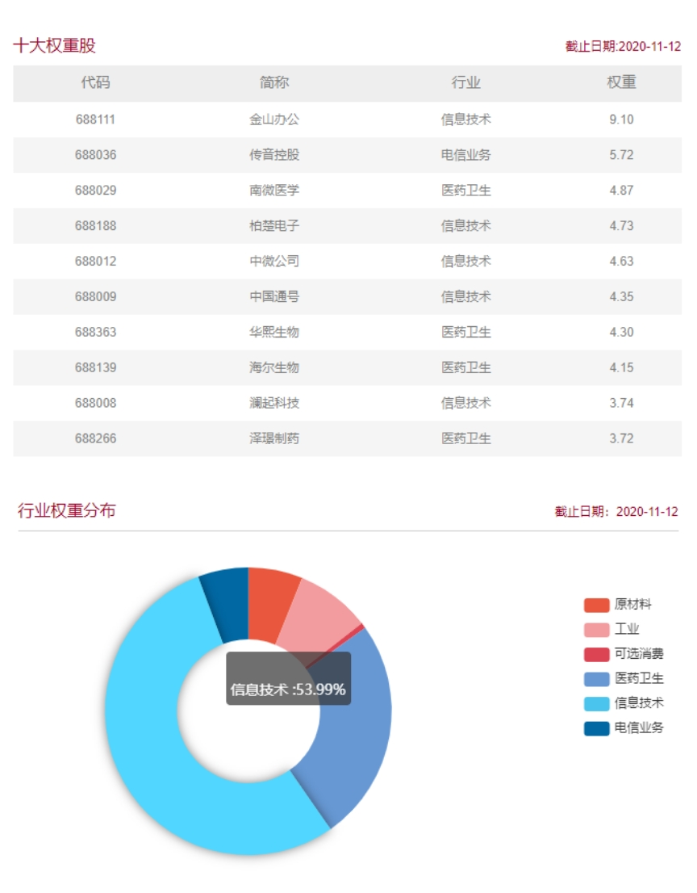
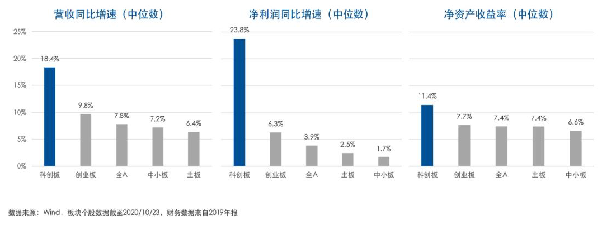
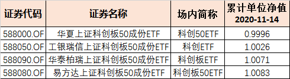

### 下周起人人皆可参与科创板了

如果说A股哪个板是含着金钥匙出生的，那科创板肯定是排第一了。科创板设立这一年多科普的文章已经遍地都是了，这方面我们就少复述一点吧，说说最近两个月谈得比较多的科创板50ETF。7月22日，上交所正式发布科创板50指数；9月11日四家头部基金公司：易方达、华夏、华泰柏瑞、工银瑞信同步获批科创板ETF；9月22日单日限购发行各50亿（实际总认购额超千亿）；9月28日又都火速成立对应的ETF；下周一（11月16日）四只ETF正式上市，真可谓是终于千呼万唤始出来。

科创板50ETF是继上证50ETF、沪深300ETF、中证500ETF和创业板ETF之后，A股市场最重要的代表性指数ETF了。因为上交所规定**科创板开户条件为：投资者证券交易必须要满2年以上，且风险测评需要激进型以上，而且对应的证券账户最近20个交易日日均资产需大于50万元。**这种限制一定程度上保护了中小投资人，但也加大了投资人参与并分享科创板成长红利的机会，而即将上市的科创板50ETF们就很好的解决了这个问题。ETF这种形式大大降低了投资门槛，无需额外开通科创板投资权限，只需有证券账户即可，以1手100元左右的价格就可以参与，场内交易的费率也更低。

对于普通投资人而言，比降低门槛更现实的问题就是科技企业的研究门槛比较高。一方面是技术更新迭代太快，且对于一些极其细分的前沿科技领域，普通投资者说实话也没有能力去辨别真伪，这就使得个人投资者很难跟上变化的步伐；另一方面科创企业的淘汰率极高，最后能跑出来的企业也是凤毛麟角，而且科技行业往往是赢者通吃，这就使得精选个股成了一个赌性很重的事情。好在ETF这种通过买入一篮子成分股的方式，可以有效的降低风险，避免因选错股而跑输市场，事实也证明最后实际的收益很是喜人。

说到成分股我们就来看下科创50指数十大权重：金山办公、传音控股、南微医学、柏楚电子、中微公司、中国通号、华熙生物、海尔生物、澜起科技、泽璟制药。前十权重股中除了传音控股是电信业务，其余都是信息技术和医药卫生，而且整个科创50指数成份股中信息技术占**53.99%**（以上数据来自中证指数有限公司官网，截止2020年11月12日）。这些都是兼具市场热度和知名度的头部公司，从行业占比也看得出科创50指数是专门为了解决科创企业融资而设定的，聚焦的几个高新领域也是中国未来高新技术的集中体现。

从三季报业绩表现看，科创板整体延续了此前业绩改善的趋势且相比于A股其他主要板块，科创板保持更高的业绩增速和更显著的改善趋势。现在越来越多的优质创新企业在科创板上市，尤其是未来更多优质且有发展前景的中概股和红筹股回顾A股，科创板上市企业的质量会越来越高。这些不断涌入的新鲜血液会在每季度成分股调整下，及时纳入新生科技力量，使得科创50指数呈现长期上涨的态势。

如果非要上点什么价值，我觉得中国的科技产业急需转型升级，而科创板对未来完成中国的经济转型产业布局具有核心的重要地位。这也就不难联想到，受益于企业拥有核心技术转化为生产力盈利的增长，直接推动企业稳健增长能成为新的增长引擎，而跑出来的这些企业的股价也就会很好的体现在对应的指数和ETF上了。这就是为什么虽然目前科创板的估值不是很便宜，但大家还是比较看好其未来的发展，毕竟科技创新是未来发展的主题。再说直白点：大家都愿意相信科创板未来很有可能成为中国的“纳斯达克”。关于科技股的估值再说一句扎心的话：好的科技股，古今中外从来就没便宜过！

说完了投资科创50指数基金的前景后，讲讲大家比较关心的：四家基金该选哪个？首先坦言这四家在国内都是绝对的头部基金公司，在ETF的管理上也是不会有什么太大的问题，但我更人倾向于易方达科创板50ETF（588080）。选择易方达这只ETF不仅是因为截止11月14日，其累计单位净值为最高：1.0083元。更在于为保障科创板50ETF的优质运作，该ETF配置的基金经理是林伟斌和成曦。林伟斌为现任易方达指数投资部总经理、指数投资决策委员会成员，持经济学博士学位，从业12年来始终专注于指数产品研发与管理工作，在上交所去年举办的中国ETF十五周年峰会中被评为“十佳ETF行业分析师”。

易方达基金一直致力于帮助普通投资人构件更多更便利的科技及创新类资产配置工具，比如我常提起的中概互联。对于境内投资者关注度较高的腾讯、阿里、美团、京东等海外上市的互联网龙头企业，易方达专门定制了中国互联网50指数、打造了易方达中概互联50ETF，让投资者能够一揽子投资海外互联网龙头企业，深受普通投资者欢迎。不仅中概互联，易方达旗下的中证科技50ETF、中证人工智能主题ETF等产品也是其一直致力于构件便利的科技创新类资产配置工具。

最后说说我自己会如何操作科创板50ETF，我们要知道科创50指数不仅具有长期看涨的趋势，而且科创板的定位就注定这是一个波动极大的指数。所以针对这两个特性，我准备科创板50ETF上市后先买入一部分作为底仓，然后结合市场波动进行一些区间网格和目标投，而网格和目标投的操作也对ETF流动性的要求偏高，因此我更倾向于易方达的这只ETF。

> 小结

万众瞩目的科创50指数对应的四只ETF下周一就要上市了。坦率讲对标纳斯达克的科创板注定不会便宜，但这不影响其长期上涨的历史趋势。与此同时我们还要充分利用其波动性，在获取长期上涨利润的同时也可赚取其波动性带来的超额收益。综上我觉得历史业绩优异，基金流动性有保障的易方达科创板50ETF是个不错的选择。

