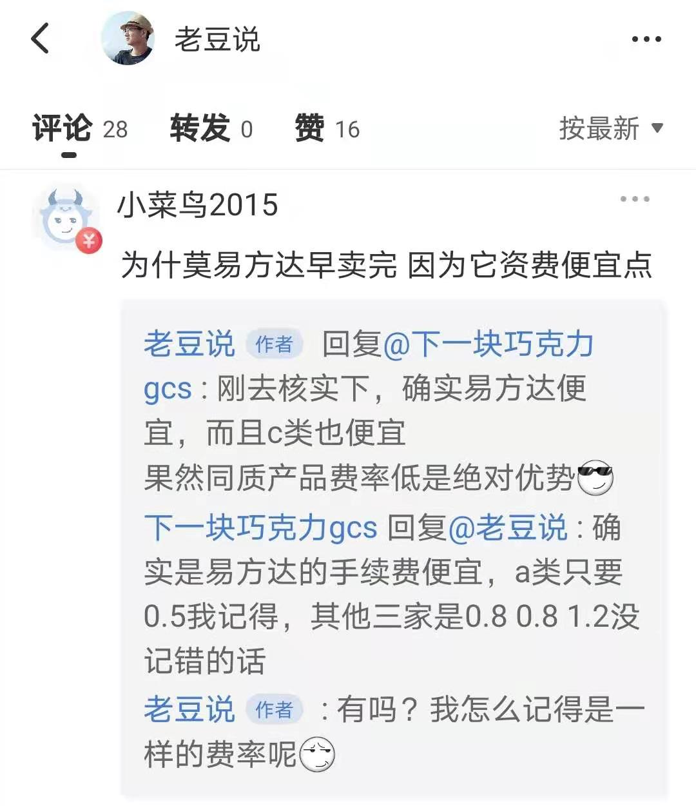
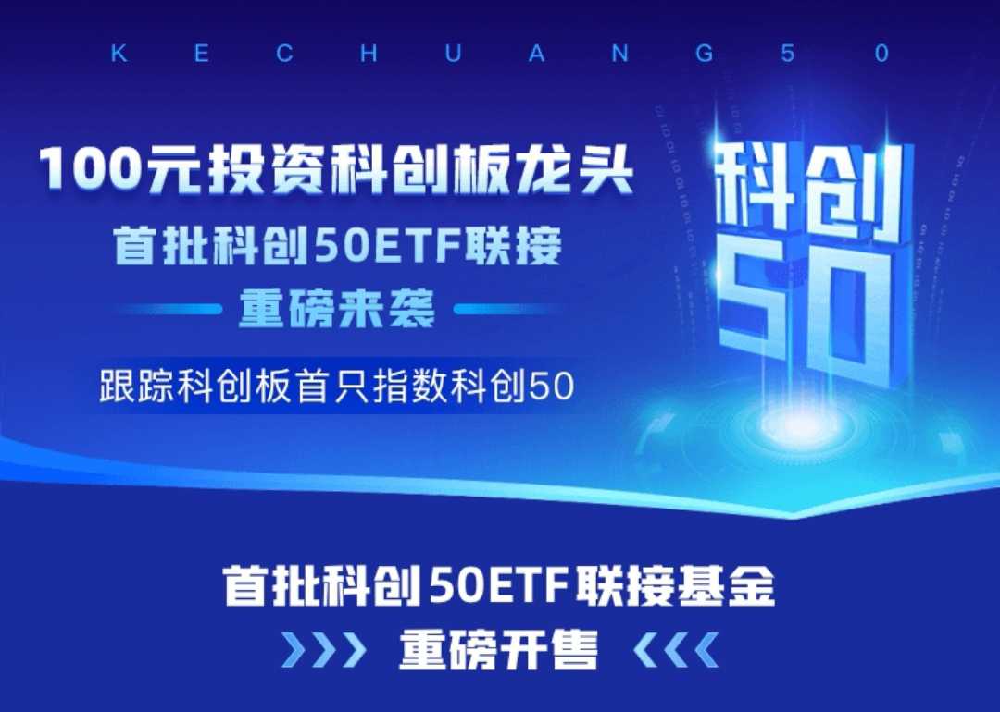

### 四家科创50联接基金费率最大相差4倍

昨天（2月25日）我发了个短帖提到：最近市场跌跌不休导致基民认购新发售的科创50联接基金不太给力，24日同步发售的四家基金（易方达、华夏、华泰柏瑞、工银瑞信）都没有首日售罄，最快的易方达也是昨天才完成50亿募集额度。

但一位朋友 @小菜鸟2015  的留言提醒到了我：**易方达的最先募集完毕是因为其费率便宜。**这个确实我自己也疏忽了，因为四家当初场内发科创50ETF的时候管理费和托管费是一样的（0.5%+0.1%），我想这次又同步发售联接基金应该也是一样的费率吧，也就没去多关注它们各自的费率问题。

同时也感谢 @下一块巧克力gcs   后续的提醒，我看过四家的费率后，还是略感诧异的：单从各销售渠道主推的C类联接基金看，销售服务费最贵的是最便宜的4倍。此次科创50联接基金单从**费率友好度**来看总排序如下：**易方达 > 华泰柏瑞 > 华夏 > 工银瑞信**。

我们先看这四家的C类联接基金费率比较，正如各大渠道首推的那样，我看过后也建议想认购或后期想申购的朋友优先考虑C类联接。

**1、免赎回费期限**：易方达、华夏、华泰柏瑞均为7日后免赎回费，唯独工银瑞信需要30天后才免赎回费。7天1.5%的惩罚性赎回费这是监管要求（避免套利也是监管层不推荐大家短炒），但工银瑞信这30天的设置显得得有点不合群呀。需要补充下说明的是，因为工银瑞信30天后才免赎回费，因此在大于7天小于30天的区间内工银瑞信C类的赎回费率是0.1%

**2、销售服务费率（每年）**：易方达果然是指数基金的低费率先锋，在四家里做到了最低0.1%，这个在所有C类指数基金里都算得上最低梯队了，只能说我很喜欢这种“豪横”的姿态；华夏和华泰柏瑞都是0.25%，这个我认为已经很好了，也体现了两家公司的诚意；最后依然是鹤立鸡群的工银瑞信，直接选择了0.4%，这也是本文题目中提到的4倍差距的由来，坦率得说现在新发C类基金还坚持0.4%销售管理服务费的已经不多了，我被工银瑞信的“勇气”所惊叹到了

然后我们再看看四家的A类联接基金费率比较，但总得来说因为认购费是不打折的，所以我还是不建议大家买这次的A类，非要买也得后面建仓期过了后再申购，毕竟互联网渠道申购费会打一折嘛。 

**1、认购费率**：易方达0.5%、华泰柏瑞和工银瑞信都是0.8%、华夏1%，这个指标应该是工银瑞信这次比较里唯一没垫底的参数了。

**2、申购费率（打一折后）**：易方达0.06%、华泰柏瑞和工银瑞信都是0.1%、华夏0.12%，这个排序与认购费一致。认购费和申购费的比较我们也看到最高的华夏是易方达的2倍，也是没有比较就没有伤害。

**3、免赎回费期限**：华泰柏瑞30天后免赎回费，且大于7天小于30天的期间也只要0.1%的赎回费，这个作为A类基金是相当有诚意了；华夏30天后免赎回费，且大于7天小于30天的期间需要0.5%的赎回费，也是很不错的；易方达180天后免赎回费，这也是易方达近两年的常规规格；工银瑞信需要2年才免赎回费，我只能说这种收费是10年前的标准了

> 小结

如果想买科创50联接基金，那么易方达的C类是首选，7天免赎回且年销售服务费才0.1%，已经是无懈可击了，接下来可以考虑的有华夏的C类和华泰柏瑞的C类联接。如果你是准备长期持有的，那么华泰柏瑞的A类联接也可以考虑下（当然是后期申购，不是现在的认购哈）。

行情好的时候这种头部的基金公司限额50亿真的不愁卖，大家也不会对费率太敏感。但最近行情低迷，市场氛围略凉的时候大家都会多比较两眼，各家渠道资源、宣传力度又差不多，最关键这是极度标准化的产品，近乎无差别的场外联接基金，投资者们肯定会优先考虑费率更为友好的那些产品。

截止本文发布（2月26日20点）依旧只有易方达一家售罄，我也看到各渠道显眼位置的认购入口今天也陆续下架了，细细想来还是略显凄凉的。写完本文后我再看前天发短帖的配图（四家基金在支付宝上被关注的人数：易方达超100万、华泰柏瑞超50万、华夏和工银瑞信均超10万），发现群众的心里其实都是有杆秤的。如果热热闹闹卖了三天连30亿都没有，那么这个结果多少值得这些基金公司反思下了。