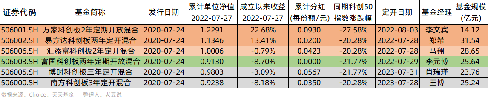
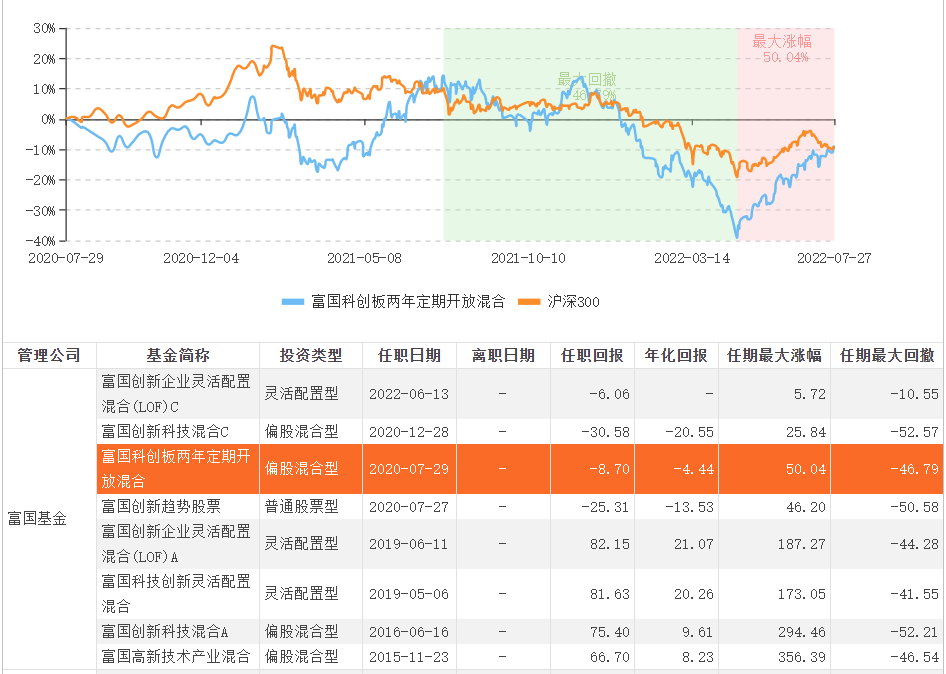

### 说完创业板，再来说说科创板定开基金

前两周写了篇关于创业板定开基金的文章，除了简单盘点下产品业绩，更重要的是提醒当年买了的朋友别忘了赎回。2020年紧接着创业板2年定开基金，各家后面还发行了6只科创板2/3年定开基金（4只两年期、2只三年期），恰好今天开始有基金陆续到期开放了，我们也做一个科创板定开基金的盘点（详见下图）。

在开始盘点前先做两点说明：

1、关于上一篇《两年前的创业板定开基金将陆续到期》里漏了万家基金和南方基金，主要是因为我当时检索的关键词是“创业板两年定开”，而万家和南方名字里是“2年”，我自己买的又是华夏和大成，所以一开始没发现。而且后来发现万家基金的业绩比银华还差，真是“霸气外露”，这个问题我在部分平台的评论区也有过补充说明，特此再正式补充下。

2、科创板定开基金除了上表内的6家，其实后面又发了3家（国泰两年期、广发两年期、长城两年期），但因发行日期相差较远且暂未到期，故不在本文讨论范围内。另外上表内的博时基金和南方基金均为三年期产品（暂未到期），所以也不是本文讨论的重点产品。

- - - - 我是一条不好看的分割线 - - - -

本次复盘的4只产品排序依据仍然是：**有没有给基民带去了可观的收益？**因为这些是定期开放基金，不存在中途的卖出和买入，大家都是发行的时候一起认购，现在到期了一同赎回（再续期2年的不在本文讨论范围内）。

又因为本次4只产品相对同期科创50指数都是有超额收益的，所以我们主要比对的就是两年到期收益率（本文数据默认截至2022年7月27日）：**万家 > 易方达 > 汇添富 > 富国**。排名虽然很明显了，但我觉得还是有必要给大家简单地拆解下一些数据。

**1、科创板定开基金收益率均超同期科创50。**从结果上看科创板定开基金也没那么糟糕，至少相对同期科创50指数是更优的。而且从基金的前十大重仓来看，也没出现“挂羊头卖狗肉”现象，确实几乎都是科创板企业。

但你细看这些基金的业绩基准就会发现，中国战略新兴产业成分指数收益率才是它们的主要基准。该指数20200727~20220727区间收益率为+0.17%，所以从这个角度看，这4只待测基金只要两年到期正收益了，那么基本上就是跑赢真实基准了。

**2、万家基金两个定开产品天差地别。**前面也说了，两周前测评的创业板定开基金里万家是垫底，但这次科创板定开基金又是拔得头筹。所以对于主动基金我一般不喜欢因为个别基金经理业绩差劲就打死一家基金公司，我还是倾向于把“粒度”定到基金经理这个层面（当然如果一家基金公司众多基金经理业绩都不行，那么我也愿意直接一棍“打死”整家基金公司）。

基民给你两年封闭期（没有赎回和规模突变的压力），敞开了手脚让你操作，你没办法做到正收益还跑输了基准，那么我觉得没必要再在这种基金经理身上浪费精力了，毕竟市场上优秀的基金经理还有那么多。

**3、易方达基金一如既往地稳。**因为我自己当初买的是易方达和富国，所以这两只产品的感触会更深一点，简单概括就是：富国基金李元博的一路坑到底，衬托了易方达基金的稳稳幸福。当初富国基金卖这个产品的时候，给李元博的标签是“百亿名将”，现在回头看这一路的业绩，我都无力吐槽他。

虽然定开基金最在意的是到期后的收益率，但如果整个区间持有体验均很稳当，那么这种基金经理的普通产品也是大概率值得信任的，这一点易方达的郑希我觉得做得还可以。

**4、定开基金分红值得点赞。**按理说定开基金是没有义务在封闭前内分红的，且从人性的角度看大家也不会那么做，毕竟分红后资产规模缩减，管理费也就随之变少了。但这次的4只基金除了垫底的富国基金都有分红历史，而且有些还不止分了一次。

虽然封闭期大家无法赎回，但基金经理帮助大家通过在相对高点“分红赎回”锁定盈利，这还是值得称赞的，希望越来越多的基金经理能真的和持有人站在同一立场上。

至于唯独富国基金没分红这事也值得说一说，别告诉我这基金亏损了没钱分。要知道富国基金李元博的这只产品也是曾有过正收益的，而且还不只一次。我们也没见其通过分红来帮助大家锁定部分收益，或许是他自认为可以通过继续持有资产来帮助基民赚更多的钱。可现实就是如此的打脸，敢问富国基金李元博你疼不疼？

下图为李元博在管基金的历史业绩，可以看到其在2020年以后接手的4只基金均为负收益。我们可以初步断定李元博的投资策略在近两年的市场上已失效，2020年前的业绩可能让他建立了较为坚实的自信，在科创板两年定开产品大家都在分红锁定收益的时候，他却选择继续“前进”，最终成了这批次里唯一累计净值为负的那一只基金。

> 小结

每次这种同系列基金业绩盘点总是很“刺激”，因为大家都是差不多时间募集上市，业绩基准和产品定位也是很相似。特别是定期开放类产品，你都没办法用期间规模变动影响业绩这个借口。

这种面对面地”厮杀“比拼是最扎心的，让基金经理们无处躲藏，业绩好就是值得表扬，业绩垫底的朋友你去看看各基金平台的评论区，看完留言的我直呼：评论区的大哥们个个都是人才！

回归最本真的：**能帮基民赚钱的基金经理才是好基金经理，毕竟我们买基金的最终诉求就是能赚钱。**近期也有前辈说，上海的部分基金公司最近口碑在持续下滑。我认为这都是基民们一次次不良持有体验叠加的结果，一家基金公司想要做好口碑，是需要从做好每一个产品开始的。看着基民对基金公司的信任被慢慢地消磨掉还是蛮惋惜的，这种信任感的消磨不是靠地铁里多投放几个灯牌就能抵消的，也不是霸占我们的APP开屏所能弥补的，而是要以做好产品为基石，请善待持有人对你们的信任和托付。
