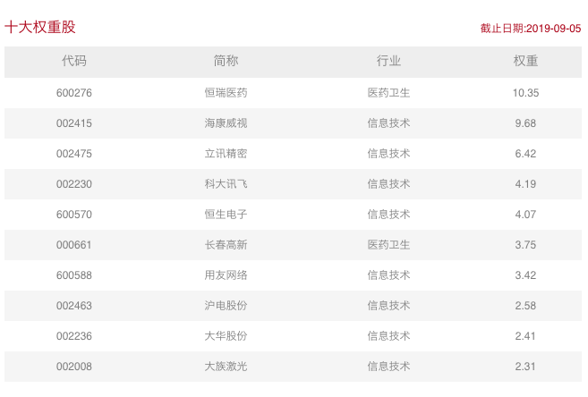
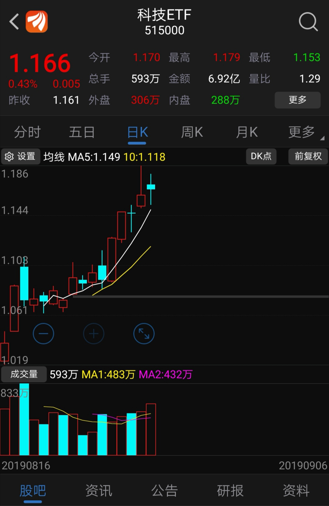

### 不做多中国，我其它选择？

在正式开始前，我先讲一个常识性的点：做多损失有限，收益无限；做空收益有限，风险无限。而且在逼仓行情（多逼空、空逼多）中，多逼空具有天然优势，因为货物永远没有金钱多。

如果觉得开头这句不是很理解，没事。下面我们开始今天的话题：**“做多中国”** 。

改革开放了40多年，中国的飞速发展全世界都有目共睹，中国人民的勤劳与智慧根本不需要那些枯燥的数据去佐证。所以作为一个中华人民共和国的公民放眼全球看去，往前40年、往后40年，除了做多中国，我还有别的更好的选择吗？

前40年我们已经完成了一个很好的快速增长，那么后面40年如何保持这个增长？对于持续增长这一目标我们该做些什么？

我们拥有超级庞大的市场，大到足矣支撑我们挺过绝大部分外来的封闭式抑制。近两年A股对外开放程度越来越大，经过4年多的熊市，价值凸显使得外资也愿意进来布局，继**MSCI**、**富时罗素**之后，另一指数巨头**标普道琼斯**也将纳入A股。配合渐进的退市机制和注册制，股票市场可以更健康的服务于实体经济。加上中国人的勤劳以及对金钱的渴望程度是全世界数一数二的，我相信中国继续前进的趋势不可阻挡。

与此同时中国在部分行业也挤进了世界第一梯队，这也是外部多番抑制我们的最直接原因，如果只是我们‘自夸’那不妥，别人的’迫害‘便是最好的证明。但是我们也需要持续加大对高端研究领域的投入，我们要想做大做强，很多时候不止要参与，还要拿回制定规则和标准的权利，当然前提是你要有对应的能力。

反观美股近十年的行情，就是消费+科技的一个长牛行情，这种走势曲线真的堪称完美。其实现在全世界都遇到了新的瓶颈，在以手机为代表的智能终端和移动互联网普及后，就没有一个很好的新爆发点了，各国都在默默的寻找和试验新的’大陆‘。中国的产业升级也迫在眉睫，很多低端制造业因为人力成本等多方面问题，都慢慢像东南亚等地转移了，所以走科技强国之路是继续支撑做多中国的一个极优选择。

科技概念最近有多火？看看各家基金公司发的产品就知道了。
- 华夏：5GETF
- 华宝：科技ETF
- 国泰：通信ETF
- 平安：AIETF

因受华宝基金的邀请，8月23日去了一趟上海环球金融中心58层。有幸当面听到科技ETF的基金经理胡洁女士当面讲解，不得不说面对面听基金经理讲与自己在网上查资料研究还真是天壤之别。所以现学现卖，今天就侧重讲下华宝科技龙头ETF这一指数基金。

科技ETF对应的指数是【中证科技龙头指数】：由沪深两市中**电子、计算机、通信、生物科技等科技领域**中规模大、市占率高、成长能力强、研发投入高的50只龙头公司股票组成，以反映沪深两市科技领域内龙头公司股票的整体表现，为指数化产品提供新的标的。

其实这个指数的编制规则很讨巧，选择的四个领域：电子、计算机、通信、生物科技，就是大家公认的最有前景的行业，这些行业需要大量的科研投入，技术或产品成功后推向市场可以获得相当可观的利润，然后反哺新的研发的进行。很显然这种行业模式对头部企业很有利，所以这个指数只有50个成分股，还分散在四个行业里，选出来的基本上都是龙头级别的企业。仔细的朋友已经发现了，虽然它简称科技ETF，但是指数全称是科技龙头指数，所以映衬了我刚说的行业龙头特性与优势。

还有一个点是胡洁经理提了我才注意到，中证在编制这个指数的时候，其实也没限定这4个行业，后面还多了一个【等】字。这就使得这个指数后期可以容纳更多有活力的，属于泛科技的企业，这对自我净化的指数来说，是非常‘鸡贼’的一件事。可见在编制该指数的时候，华宝和中证都是花了不少心思的。

接着我们看下中证龙头指数的前10权重股：

我向来喜欢低估值，但是对于需要投入大量研发的企业，我更倾向于用成长的眼光看这些企业。如我上面说的，这些精尖行业得到大力发展，中国的经济实力才会更上一个台阶，当大家都看好这些行业的时候，企业股价存在溢价是正常的，也是良性的。即便你可能只想买便宜的，那么至少也应该多关注下这些行业与这个指数，因为这个指数大概率会和中国国运同步上扬。

看看上面这图就知道科技ETF有多火爆了、走势有多完美了。再看一组规模数据：截至9月5日，科技ETF的最新份额达到27.32亿份，单位净值1.1596元，总规模高达31.68亿元，较8月16日挂牌上市时的10.4亿元增长超过200%。基金规模持续攀升，再叠加平均每天5.12亿元的成交额稳居主题/行业ETF前列，可见其在投资者中的受欢迎程度。

最后分享一个我个人不严谨的想法：近期大量科技类基金募集发行，短期内至少会有一股力量给连续发力提供弹药。

**小结**：从投资方向上看，做多从理论上就比做空要有优势。过往40多年中国经济的飞速发展让大家有了做多中国的底气；而努力寻求全新增长点的中国又让做多中国的投资人更加笃定。面对我们当下的机遇和挑战，走科技强国之路是一个极优的选择，而选择科技ETF又是普通投资者与中国同命运、共呼吸的明智之举。