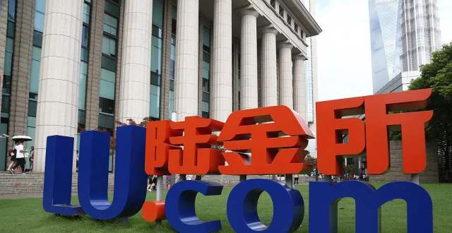
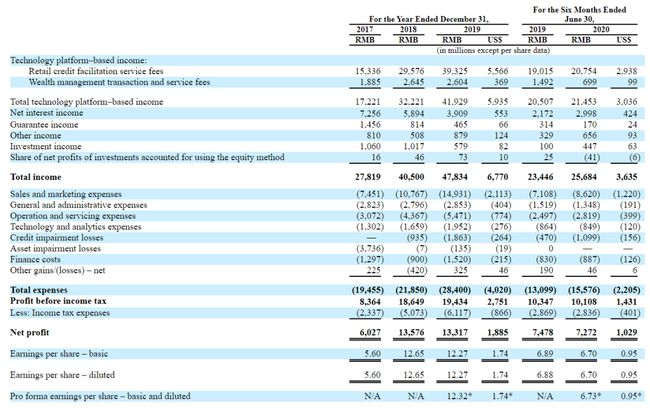
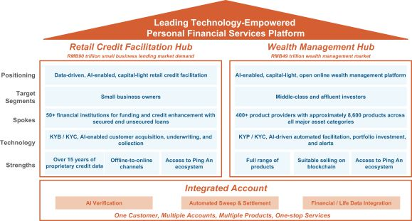

### 中国平安又一独角兽将在美股上市

当年独角兽概念刚兴起的时候，平安集团孵化了4只独角兽。现如今平安好医生已经在港股上市、金融壹账通也在纽交所上市，现在第三只独角兽陆金所也即将在美股上市。

10月23日陆金所更新版招股说明书显示，计划发行1.75亿股美国存托凭证（ADS），价格区间为每股11.5 ~ 13.5美元，初步估算陆金所此次IPO的融资规模约21.88亿美元。再加上发行承销商所拥有2625万股ADS配售权，在完全行权的情况下，陆金所发行总规模将达2.01亿股，融资总额在23.14 ~ 27.17亿美元的样子。这也使之成为了今年美股最大金融科技IPO，而且按现在的进度看，年内可以完成IPO。（今年已在美股上市的企业有：金山云、达达集团、蓝城兄弟、理想汽车、贝壳找房、小鹏汽车、名创优品等）

陆金所的招股文件显示，公司2017 ~ 2019年均实现盈利，营收2017年是278亿元、而2019年涨到478亿元，复合增长率为31.1%；同期的净利润也从60亿元涨到133亿元，复合增长率为48.6%；今年上半年，公司总收入为257亿元、净利润为73亿元。此外可以看到，陆金所计划将本次发行募得的资金主要用于技术研发和基础平台建设、产品开发、技术投资和收购、销售和营销活动、国际扩张，以及一般公司用途。

在平安的四个独角兽企业里，对于普通投资者来说，陆金所可能是最熟悉的一个了。早先在P2P蓬勃发展的时代，陆金所就是一个很热门的存在，最著名的应该就是那个8.4%有保险担保的稳赢系列产品（含后续升级版）。陆金所也是第一批执行资金账户银行托管（平安银行）的网贷平台，当然随着监管政策的变化，这些也都成为了历史（2019年8月，陆金所完全停止新增P2P业务），后来业务也衍生到更全面的财富管理服务（银行存款、基金代销、保险业务等）。

另外我需要和大家解释下，我们平时谈论的大多是指陆金所平台，而这次上市的是陆金所控股，前者是后者的子集。陆金所控股的主营业务为财富管理与零售信贷。两大业务分别在中国非传统金融机构市场中排名第二和第三名。招股书中显示，陆金所控股零售信贷业务由旗下平安普惠提供；财富管理业务由陆金所平台提供。再看组数据，截至今年9月30日，促成零售信贷总余额达5358亿元；财富管理规模达3783亿元。

展开了说就是，零售信贷主要满足中小企业/工薪阶层的贷款需求（这些人群通常提供不了充足的抵押物，银行无法放贷）；财富管理主要满足非高净值人群的理财需求（小额的长尾理财需求也是未被得到满足）。这两大块业务的想象空间就在于弥补了传统金融机构触及不到的地方，更好的满足了不同层次人群的金融需求。

今年对于中国互联网金融公司算是大丰收的一年，现在同期进行IPO的还有巨无霸蚂蚁集团（正在A+H上市中），以及后续的京东数科。因为谈起陆金所上市，那么这两家是绕不开要对比下的，特别是老大哥蚂蚁集团。那我们就看看陆金所与蚂蚁集团对比后的不足：

1、 支付宝越活7.11亿、而陆金所只有1250万；与此同时蚂蚁集团促成的资产管理规模有4.1万亿元、而陆金所仅有3460亿元。这种数量级层面的差距是没有任何争议的，而且客观的说，陆金所在这方面是永远追赶不上支付宝的。

2、 陆金所还有一个不如蚂蚁集团的地方是，没有自己的资金运用场景。比如蚂蚁的花呗最大的使用场景就是淘宝天猫，对应京东数科的京东白条主要使用场景就是京东购物。这方面的差异我觉得陆金所也是羡慕不来的啦，人家都是集团自有电商平台，你也只能干瞪眼。

那难道和蚂蚁老大哥比就没啥优势吗？这倒也不是，比如说陆金所相对于传统金融机构具备了更强的科技属性和风控能力，然后和纯在线科技金融平台比又有更好的金融背景资源和渠道优势。依托平安集团独特的DNA和优势资源，让这种线上与线下之间的顺畅传导优势，在转型之后尤为突出。

最后说下估值吧，我觉得对于我们普通投资者不需要太在意当下的估值。对于互联网金融更应该关注行业天花板有多高，公司的竞争力有多强，在到达天花板前占领多少属于自己的空间，这个可能更加重要吧。这个映射到陆金所就是：陆金所未来的获客能力如何？过往的成长多少来源于平安集团的扶持，以后内身的成长又为几许？

最后的最后，我还是衷心祝愿陆金所上市后能有更好的业绩展现给广大投资人，因为我希望中国的互联网金融公司能给世界带来一点不一样的改变。