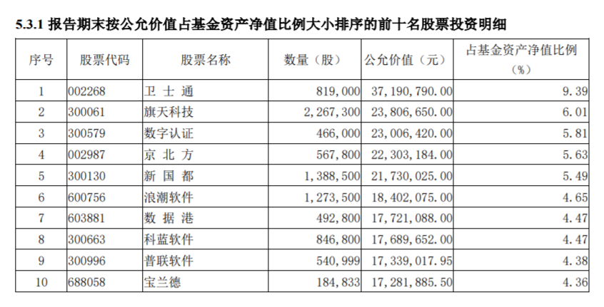
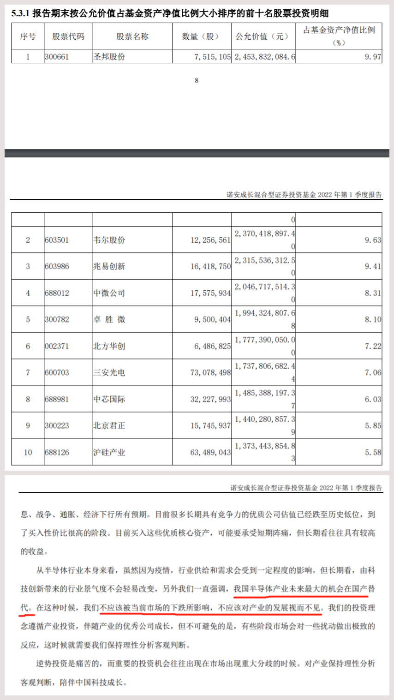

### 听说“菜狗”十大重仓全换了？！

昨天一小伙伴对我说：“豆哥，你知道不？“菜狗”的一季报显示十大重仓全换了！”。呃...直觉告诉我这不太可能，因为半导体板块持仓风格就是蔡嵩松的投资标签，也是他擅长的能力圈。再说蔡嵩松怎么着也是个近三百亿规模的基金经理，前十大重仓怎么可能一下子换个遍？不说别的，就这流动性我估计都不被允许吧。

然后这位朋友就丢了上面这张图我给，乍一看确实不是我印象中诺安成长的前十重仓，满脸问号黑人脸的我打开电脑一查发现这图其实是诺安创新驱动的前十大重仓。经过这么一查我只想说，**标题党小编你“坑”人呀，**在和这位小伙伴聊完后我想着还是写出来和大家做个简短的分享下吧（总得来说我们看一个信息要有自己的辨析，不要被标题党误了认知）。

大家都知道蔡嵩松的代表作就是诺安成长（一季度末规模246.16亿元），因为其有着鲜明的半导体持仓风格，过去两年随着半导体板块的极致涨跌他本人也常在“菜狗”和“蔡神”之间来回切换。每次的狗、神状态切换也伴随着很高的传播热度，所以不少小编把这“流量密码”给拿捏地死死的，这就才有了开头那位小伙伴对我说的事。

但大家也要注意蔡嵩松他还管理着诺安和鑫（一季度末规模33.85亿元）、诺安创新驱动（一季度末规模3.96亿元），而这次换仓新闻的主角是规模仅3亿多的**诺安创新驱动**。诺安创新驱动和另外两只不同，是蔡嵩松去年5月才接管过来的（前两者蔡嵩松均已管理超3年），2021年二季度诺安创新驱动开始买入半导体，我看了下当时的仓位整体思路是和诺安成长类似的。但在诺安创新驱动的2021年三季度报里就已经出现了卫士通等非半导体个股，而四季度非半导体个股又增加了新风光、鼎阳科技等，最终在2022年一季报里十大重仓全部变成了非半导体行业（计算机软件、大数据、信息安全、POS机软硬件等），给我的感觉就是蔡嵩松在看好中国数字经济的未来。

对于诺安创新驱动一季报的运作分析我们看看蔡嵩松自己是怎么说的？我做一个简单的概括：

1、受美国加息预期等影响，市场风险偏好急剧下降，一季度处于疯狂杀估值阶段，半导体、新能源、军工等成长赛道跌幅居前。

2、俄乌冲突使得外资加速外流，新一轮疫情使得全年经济增速压力变大，市场逐渐聚焦于稳增长板块，成长赛道一季度为单边下跌。

3、虽市场预期较为悲观，但加息、战争、通胀、经济下行等利空因素都已较为充分地体现在当下的资产定价内了，短期可能有阵痛、长期仍然看多。

4、本基金主要仓位为计算机板块，是基于国家已把数字经济提升为国家战略，到2025年数字经济核心产业增加值占GDP比重需达到10%，而对比半导体当下的计算机板块处于历史估值中下部。

5、今年数字经济成了行业催化剂，是计算机行业总量提升的逻辑所在。细分板块看好：东数西算、数字人民币、网络安全、行业信创等，行业估值较低，产业基本面出现拐点，就是最大的投资逻辑。

然后我们再看下蔡嵩松在诺安成长季报里显示的持仓和季度运作分析（详见下图），持仓还是妥妥的半导体风格，在运作分析里也再次强调了他看好半导体产业未来国产替代的机会。再浓缩下就是：**今年以来市场环境不佳，成长股经调整后进入高性价比持有区间，持续看多未来。逆势投资是痛苦的，当下不宜急切卖出，底部定投是个不错的选择。**

听完了蔡经理的一季报再看看我自己是如何看待这个事情的？蔡嵩松管理的三只基金在规模上正好是数量级递减，诺安成长是他的招牌，而半导体则是他一直以来的信仰，所以对于诺安成长我不认为在可预见的中长期内他会轻易变动方向。而他对于计算机板块（特别是数字经济）的认知我也不认为有什么大问题（短期阵痛、长期看多），他之所以选择诺安创新驱动来布局数字经济，我猜主要还是因为该产品规模较小。为什么这么说？我的理解是：数字经济在当下的A股其实还算较小众的一个版块，你看这次蔡经理换的前十大重仓除了第一名的卫士通市值两百多亿，其余均是百亿以下甚至大多数规模低于50亿元。这种市值规模的板块根本没办法在诺安成长里做到有效的布局，所以诺安创新驱动就自然而然成了其较好的布局场所。

我在写这篇文章的时候也看到一些朋友说，蔡经理不是专攻半导体的吗？怎么就能力圈外延扩展到计算机行业了呢？对于这个呢我想说：你仔细看下蔡嵩松的履历就会明白，不要以为中科大少年班出来的芯片设计博士当了基金经理就只专注于半导体行业，要知道蔡经理在进入诺安基金前可是位华泰证券的计算机行业研究员，所以计算机行业本身就是蔡嵩松能力圈内的事。

最后呢我想说，今年的行情大家也看到了，基民们的日常就是“跌麻了”。年初大家还嚷着说“保本出”，可现在四月回头看“保本”是一个多么奢侈的念想。就比如我们今天的主角蔡嵩松，三只在管产品今年以来（截止4月23日）收益分别是：-36.54%、-38.76%、-47.78%，这业绩肯定算不上好。但是你买蔡嵩松的基金就是认可了其对半导体等行业的认知，同时也做好了较大回撤的心理准备。**我最近和朋友们说的最多话就是：坚信自己当初的选择，想抄底的别太着急，已套牢的请躺下休息，有闲钱的可以继续定投，珍爱生命远离杠杆，等过段时间回头看这波浪也就不过如此。**

