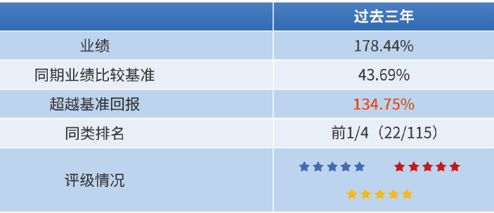

### “跌麻了”才知道控回撤的好

2022年的一季度结束了，如果用一个词来形容今年的行情那就是“跌麻了”。只有经历过几次意料之外的暴跌，投资者们才会更注重持仓组合的“抗跌性”，所以你会看到老韭菜们在面对市场时总会展露出令人诧异的敬畏之心。

我在三月初基本就正式进入了满仓状态（无杠杆且家庭日常开销已预留充足），如果用上帝视角看显然是抄早了。即便是自认投资策略已相当谨慎的我，现如今依然到了无仓可补的境地。另外整个三月份我也基本没有写什么长贴，偶尔发个短帖也多为上海近期防疫观察。因为当下的杀跌已经超出了基本面范畴，如此踩踏行情下我们更应关注市场情绪何时能修复？这般行情叠加自己的仓位状态让我可以比平时有更多的精力去做两件事：**多读几份感兴趣企业的年报、多探寻几位值得关注的优质基金经理。**

上面说了，经历过几次意料之外的暴跌你就会格外注重基金的抗跌性，所以我三月份主要在寻找一些业绩稳健、控回撤能力强、持仓偏均衡价值的基金，要是产品规模较小那就更佳了（超额收益我只能说：真香）。当然底线是基金经理历史业绩稳健，且经过我的观察后能认定其操作业绩具备“可复制性”。

为什么我用的词是“探寻”呢？因为自知我对主动基金经理的认知是不充分的，所以初期筛选时我往往会咨询多个主要研究主动基金经理的朋友。偶尔也会问问基金公司的人，看看他们内部对于这些基金经理的认可度如何，最后就是在精简后的名单里尽可能收集相关的各类资料，多角度去观测基金经理及其产品。这次探寻的方向是小规模稳健绩优基金经理，初筛后圈定了3位基金经理，今天我们先聊聊诺安基金的曲泉儒，其他的后续有时间继续与大家分享。

> “控回撤”小能手--曲泉儒

在找曲泉儒今年的直播或采访视频时，我只发现天天基金上2月16日有一场直播。虽然现在很多基金公司的直播也是按大纲走，但相对于看精修后的文字资料，我认为直播看真人能额外获得一些更真实的信息（当然线下小范围的宣讲会就更佳了）。

直播内容简要概括就是：曲泉儒强调其**赚的是公司业绩和估值匹配下，业绩稳定持续增长的钱。** 他把企业分为“由差变好”、“好上更好”、“由好变差”、“差里更差”四类，而他自己会倾向于买入前两类企业。对于今年的观察他认为会是价值回归和边际改善的一年，如果预判正确他会重点布局周期成长类的制造公司以及消费公司。这些我在另外的一些文字资料里也有看到，但直播中曲泉儒也提到了一个理念：做投资如果做不到比快更快，那就应该尝试做到比慢更慢，毕竟人在AI面前比快还是很苍白无力的（典型的价投派）。

我动笔前也咨询了诺安基金的小伙伴，她提到曲总近期在机构路演后得到了招行、工行等大渠道的较高认可，**诺安新动力（320018）**刚被列入重点产品池。当然卖瓜“王婆”的言论我们听一听就行了，主要的还是靠自己去探究。其实你单从管理基金年限来看（2016年加入诺安、2019年4月开始管理诺安新动力、2020年4月开始单独管理诺安新动力），曲泉儒可能位列个“中生代”梯队都比较勉强。但曲泉儒刚进诺安基金那几年管理的是委外专户，所以到现在其公募产品里也能看到一些绝对收益的投资倾向影子。

以代表作诺安新动力来看，曲泉儒做到了**任职回报115%，连续三年实现正回报，且均超业绩基准30%以上。**这种产品组合本身具备的均衡价值以及优秀的控回撤能力，正是我最近探寻小规模稳健绩优基金经理的目标（曲泉儒在管5只产品规模总计48.72亿元）。

> 诺安新动力的业绩数据

因为诺安新动力是曲泉儒在2019年4月19日开始接手的，所以我们本文讨论的该产品数据原则上只观测近三年的。

业绩比较基准：沪深300 × 60％＋中证综合债券指数 × 40% ；

组合投资比例：权益30% - 80%（其中投资于新动力主题股票比例不低于基金股票资产的80%） 、固收20% - 70% ，现实际仓位为（股票79.28%、债券6.00%、现金14.61%、其他0.11%）；

股债持仓特点：2021年半年报显示持仓个股数不多、且前十大重仓占比极高，债券方面一般就配置5只左右的可转债；

近三年业绩对比（截至2021年12月31日）：178.44%，同期基准为43.69%、同期沪深300为64.10%，连续三年正回报，同类（权益上限80%）排名为22/115 ；

不同持有时间下盈利情况：持有6月以上就是极佳的胜率了，且不同持有阶段的平均收益率都还不错，这样的数据会给基民较好的持有体验（数据截止2022年3月30日，详见下图）；

基金规模及机构评级：基金规模1.95亿元（相比2021-09-30，增加0.77亿元，上升65.96%），三年期评级银河、晨星、海通均给出五星级别。

> 我对诺安新动力的两点认知

**业绩的可持续性、可复制性需进一步关注。**去年开始很多人都在挖掘中小规模的基金经理，“核心资产”打法失效后积极挖掘这类基金经理（比如：姜诚、廖玮彬）是可以在去年获得不错收益的，今年亦如此。也正因此曲泉儒和他的诺安新动力就进入了我们的视野，但曲泉儒与这两位前辈比公募管理年限略少就是硬伤。诺安新动力近两年的业绩确实蛮不错，近乎满负荷的权益仓位下还能有如此舒适的持有体验，但谨慎一点的小伙伴估计会问一句：这个真的可持续吗？如果规模上来后这些操作还是否具备可复制性？好在诺安新动力已经进入了我们的关注池，我自己会边买边持续关注。

**不追热点、坚持价投，逆向+估值。**你看诺安新动力的持仓就可以发现，曲泉儒没有追逐市场热点，坚持着他理解的价值投资（典型的“反卷”先锋），对于看好的细分行业龙头敢于重仓且持有期极长。持仓个股数不是很多，但行业分散度还可以，透过行业弱相关性来控制波动、降低回撤也是这类基金经理的成熟操作。曲泉儒的偏左侧交易其实还是很考验其选股与抗压能力的，同时避免价值陷阱也很重要，我想这可能也是为何曲泉儒多次强调，要学会捕获估值提升带来的收益回报。

> 小结

今年惨淡行情下股债双杀，很多新手经历后才领悟到低回撤的可贵。我们在关注那些高光基金经理的同时也应该多留意一些新生力量，买入一些优质的小规模基金通常会给你带来意想不到的舒适持有体验。海外风雨飘摇，国内疫情反复，这些组合重拳之下一季度的A股已经跌出了机会，我认为可以较乐观地看待剩下三个季度的行情。要是凑巧此刻你想买点基金，那么今天说的曲泉儒的诺安新动力混合(320018)可以考虑下。

最后的最后，我希望上海的疫情能早点结束，想出去看一看春天的尾巴，家门口的公园樱花已开，而樱花树下却空无一人，莫不是花儿开了个寂寞？

