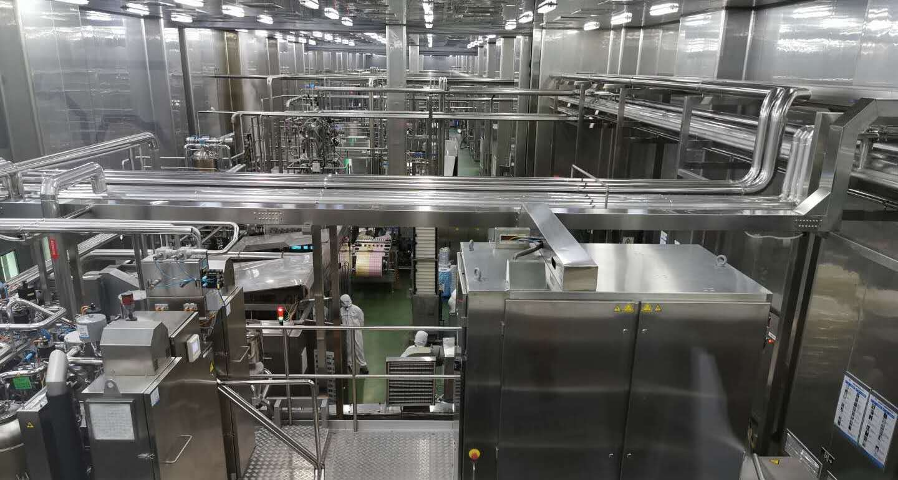

### 新希望乳业参观记

上周六有幸去成都参加了雪球组织的走进新希望乳业的活动，坦率的说因长久专注于指数投资的研究，我已经很久没深度的探究一个具体的企业了。好在平日里对食品饮料行业也常有关注，在得知被选中去参加活动后，我又恶补了一堆关于新希望集团，尤其是新希望乳业的相关的资料。因此我更多的是以一个普通消费者的身份去参观了这家公司的牧场和工厂，以一个参观者的视角描述下我的所见所闻及所思。

> ‘1+N’模式下的聚合舰队

去新乳业官网的时候看到了如上这幅图，第一感觉就是：怎么如此多的子品牌（由于官网信息时效的关系，现在实际子品牌已经不止这10个了），乍看着还是蛮厉害的。在飞去成都的路上我百无聊赖的看着这张照片，想着如果我是新乳业的员工，我该怎么记住这么多品牌的名字，最后就写了两句打油诗：【华西双峰**临**蝶泉，**闻**雪兰天香；南山三牧**献**琴牌，**贺**白帝双喜。】

但回头一想，这么多品牌是如何被整合在一起的呢？这种模式是高效的还是低效的？当然这个在下午的高管沟通会上也有大V问到，新乳业高管回答后我理解如下：2006年新乳业成立后负责集团的乳业业务，经过一段时间的探索，公司结合自身优势认为低温鲜奶是最佳的发力方向，所以在2010年时任总裁的席刚先生提出了“鲜战略”。但低温奶具有极强的区域属性，且中国地大物博，不同地方人的消费、饮食习惯均有差异，所以保留众多当地的子品牌不仅考虑到了本地消费者的消费习惯差异，同时也能应对各地消费者对牛奶口感差异这一现象。通过这种“新希望+子品牌”的企业品牌和重点产品统一的品类品牌来实现全国化的规模效应，同时在产能上也可以完成部分规模化的协同。故‘1+N’模式下的聚合舰队是当下最适合新乳业的一种模式。

> 众多自有牧场加持下的新乳业，奶更优价更稳

新乳业有14个乳品加工厂、12个自有牧场，西南为主，兼具华东、华中、华北，最近收编的夏进属于西北区域，逐步构建一个全国化的网络布局。周六上午我们参观了其中离成都最近的青白江牧场（约45分钟的车程），带领我们参观的是焦浩鹏博士（新乳业牧场方面的负责人）以及青白江牧场的场长。我们在下午参观工厂的时候才知道焦博士是四川省的‘千人计划’，新乳业在深交所上市的时候还上去敲钟了。一上午接触下来觉得焦博士真是年少有为，其实他比我大不了几岁，这让我很是汗颜。牧场的场长略年长还很亲切，大家围着他们俩一边参观一边问问题，我就把牧场的所见所闻整理如下：

1、青白江牧场当前的规模只有1200头左右，所以未来在规模效应方面还有更大的上升空间（3000头以上会更好，新希望有5个牧场到了这个规模）。因为离成都市区近，所以成都市的‘24小时鲜奶’的奶源就是由本牧场提供的。（下午去工厂后才知道鲜奶一般半夜加工，这样能保障奶更新鲜）

2、牧场也是见不到牛奶的，牛奶挤下来后经专门的管道直接进入储奶罐，且入罐前会用速冷设备给奶降温，使得奶降至约2.6度，最后经冷链物流运至工厂。全程的冷链运输可以很好的抑制微生物的滋生，从而保证了牛奶的更高品质。

3、我们很幸运看到一头刚出生2天的小牛（比我预想的要大），牛在前2月是喝奶的（塑料奶瓶也很大），3 ~ 5个月样子会吃些颗粒饲料以及进口草料，半岁开始才和成年奶牛一样吃混合饲料。牛在13 ~ 14月左右的时候会给它们配种，怀孕周期和人接近，270~280天的样子（所以牛2岁后就可以产奶了），生下来的母牛留着，公牛会卖给第三方。为了符合防疫要求，奶牛进口来了以后，牧场内全部奶牛都是自繁自养。

4、我们在青白江牧场看到了常见的引自于荷兰的黑白花奶牛（荷斯坦奶牛），还有引自英国的根西奶牛（大概是叫这个名字，牛是棕色的）。焦博士介绍说这种引自英国的奶牛产的奶，所含的乳蛋白和乳脂的含量要高很多（青白江牧场的乳蛋白已经到了3.36），而且相比黑白花它更耐热、抗病，更适合我们中国的养殖。

5、奶牛在牧场的生活是很规律的，吃的混合饲料也很丰富（所有牧场的饲料是统一采购的）。里面有甜菜颗粒（富含甜菜碱）、黑龙江的压片玉米、美国进口的高蛋白苜蓿草（本土苜蓿质量没进口的好，且成本更高）、澳洲进口的燕麦草（含可溶性水解的多糖）等。饲料的切割、湿度控制、搅拌混合都很有讲究，要利于牛的咀嚼和消化，让牛吃得营养又均衡，这也看得出要想提升奶的质与量，那么每一个细节都很重要。

6、牛睡觉是躺下来的，成年奶牛一头约重500~700公斤，牛属于反刍动物故有4个胃，火锅里的牛肚就是这玩意。

7、气温和湿度都会影响牛的产奶量，四川现在经过科学化管理产量已经从6吨（2014年）提升到了10吨（每头牛一年的产量），同期饲料成本从3元多降到了现在的2.4元（单位好像是元每公斤）附近，而北方可以达到12吨。因为奶牛温度喜欢0~15度、湿度在60%以下，甚至南方到了夏天要给奶牛风扇喷淋，所以这方面北方是具备优势的。而且北方有大片的土地种牧草（地广人稀便于大规模的机械化种植），所以国内好的牧草基本都在北方。但南方因为靠近消费市场，有着巨大的饮奶市场，中国主要饮奶的基本上都在南方和沿海地区。因为一般人均GDP到了1万美元的时候，人们喝奶的习惯会迅速被培养，奶的销售增长率也会非常的高，而就近牧场的鲜奶也会更受欢迎。因此综上南北方牧场的管理也是有一定的区别的。

8、上面说的奶量增产、成本下降主要通过如下几个举措实现：

**三化**：

- 标准化
- 数字化
- 体系化；

**三个方向**：

- 优质：牛群优质、奶源优质
- 高效：数字化精准及时的数据跟踪（每一头奶牛都有项圈，可以监控奶牛每天的生活状态）
- 低碳：投入产出更精准、种养循环、奶牛粪污的回填配合有机农业

9、一头奶牛的综合成本约4~5万（西北区域），夏进牧场的产量接近11吨，奶牛产奶一般3 ~ 5年，这个主要是奶牛的胎次决定的。国内最顶尖的产量是13吨，现代牧业也就10吨的水平，此外新乳业还收购了澳大利亚的一个牧场，是南美最大的牧场。博士对于夏进收购价含蓄地表示：差不多吧，另外去年4月份招标的8千头牛，因为采购及时，至少给公司省下8000万，而采购主要是因为牛不够，培育周期跟不上公司发展的速度。

> 新希望集团全面布局，新希望乳业年少有为

下午我们去了郫县工厂，接待我们的有：新乳业的董秘、财务总监、市场总监、郫县工厂相关负责人。首先参观了新希望的文化走廊，然后是品控实验室以及工厂车间，这些环节当时雪球也有直播，有兴趣的朋友可以点下方链接收看回放，我就不再累述。[雪球直播-走进新希望乳业](https://live.polyv.cn/splash/1760097)

后面的高管沟通环节没有直播，所以我就这部分参会后的一些所见所闻简单的说下：

1、郫县工厂是四川省科普教育基地，每年会接受很多人员来做参观和交流。这种让消费者走进企业、走进工厂的沟通方式可以用较低的成本培养用户的品牌认可度。新乳业不仅仅是请进来，还走出去，很多学校是非常喜欢这类体验课程，通过寓教于乐的方式让小朋友知道什么是营养均衡，不能挑食要吃蔬菜水果还要喝牛奶，当然也得到了学校机构和学生们的认可。讲真这种把品牌扎根于下一代的心间的方式确实很好，也让我想起自己女儿学前托班的那次秋游就是去一个养乐多的工厂。

2、新乳业之所以这么取名，不仅仅因为其源自于新希望集团，更是体现了公司的三新理念：**新鲜、新潮、新科技**。（新乳业高层的年轻化让我很惊讶，他们真的是年少有为）

- 新鲜：鲜奶源、鲜牧场、鲜工艺、鲜供应、鲜体验

- 新潮：在新时代下用流行的新潮沟通方式与消费者建立连接和互动

- 新科技：让乳品更优质的生物科技和让企业更高效的数字科技

3、收购容易，但整合后的管理难度是非常大的，合并后的初期亏损也是有的。好在经过前两轮的并购后，摸索踩坑中不断试错，不断吸取教训，积累了很丰富的经验，新乳业表示对于并购整合后的赋能输出也是越发得心应手。

4、新乳业起初就选择了低温赛道，也一直致力于“鲜战略”。随着大家收入水平的提升以及消费升级，人们越来越重视健康和营养，特别是疫情之后对这个意识会更加强化，显然低温奶品更加健康和营养。而且美日韩欧等发达国家低温奶占比高达90%以上，那从这个角度看我们还有很大的上升空间，所以国内乳业巨头们也纷纷布局低温赛道，表明行业上也有这种共识。

5、最近股价上涨明显，这也反映了市场很看好公司并购宁夏寰美乳业这一事件。新乳业在西南、华东、华中、华北区域陆续布局，并购夏进乳业正好弥补了当前西北区域的空白。西北区域的进入不仅可以让已有的西南与之连成一片，更重要的是宁夏气候条件极佳，是天然的黄金养牛带，又是饲料的上游地。这些都会使得新乳业成本更低、奶质更优，在未来甚至可以反哺西南的奶源供应。

6、新乳业收购夏进后会给与其全方位的赋能：文化、机制、战略、品牌、团队、管理（供应链管理、采购管理、生产管理、财务、人力、质量、审计方面的管理）等。同时还带去了丰厚的激励机制，以激励夏进达成未来三到五年的战略目标。

7、在谈到热门的直播带货时，新乳业展现出了理性的一面，不排斥也不盲目。而是考量如何通过直播把粉丝沉淀到新希望乳业？还有如何针对线上消费习惯的不同来调整自身的服务？新乳业可能更看中期间带来的思路上的扩展，比如将来会更注重数字化营销。

8、市场总监还提到了新乳业与盒马这样的新渠道达成了高效合作，盒马首选的鲜奶合作伙伴就是新乳业。因为新乳业有强大的供应链和服务链体系，够满足盒马在全国布局那么多地方，且新乳业的响应速度相比同行更快。

> 此次实地调研的一些感想，以及对陌生行业的一些认知

其实这次活动整个过程我记录的点远不止上文这些，但因篇幅及其他原因我能展开的就这些吧，下面我还是有些杂感想和大家分享下：

1、新乳业坚定走着低温奶的方向，也是为了避开国内两大乳业巨头的正面锋芒，加之利用了集团优势和并购后的地域特性，我觉得这套逻辑是可以自洽的。

2、隔行如隔山，一瓶看似简单的牛奶，各个环节也充满了专业性。牧场需要提高饲料到牛奶的转化率、提升奶牛的产量和质量、发挥牧场整体的规模效应；产品研发中心需要不断推陈出新，还要结合地域性适当改良口感；品控室要保证每一批的奶制品都是安全优质的；市场渠道要不断的深耕市场，同时把客户的需求适时的反馈给公司...而这些只是我能看到的，还有很多我目所未及的点。一句话就是：**专业化和社会分工真的很重要。**

3、再回头一想，与其说新乳业的团队都是年轻有为，还不如说我们这种85后已不再年轻，需要担负起更多的责任。

4、为了文章的易读性，我尽量避免过多的数值堆列。一来我不是什么专业的财报研究人员，对于数据的正确性总是很敬畏；二是有些数据即便我听到了也不方便说，最确切的数据还是以上市公司正式披露为准。

最后感谢雪球的这次组织，也感谢新乳业的热情接待。同时我需要申明：本人近20交易日未曾持有新乳业股票，在未来20交易日亦不会买卖新乳业的股票（成文于2020年6月4日）。

