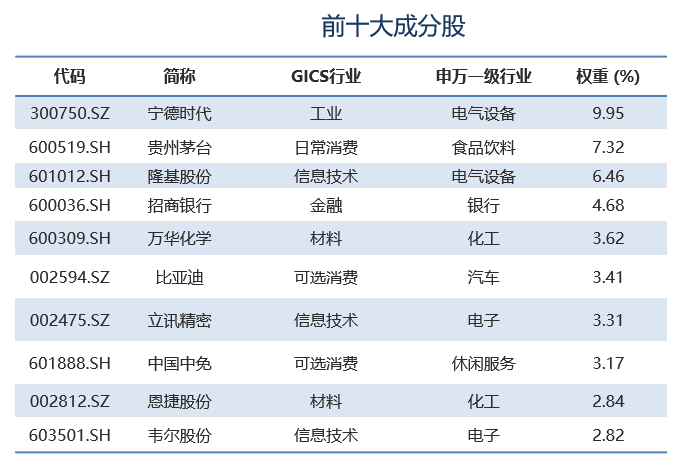
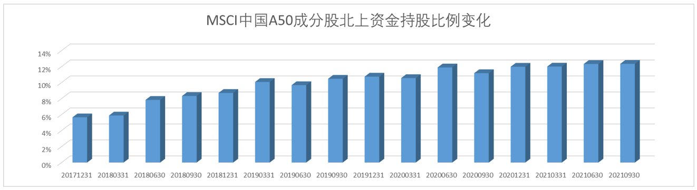
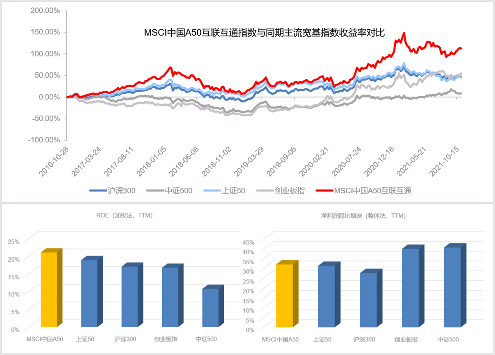

### MSCI中国A50，更真实的反映中国经济的发展趋势

最近大盘行情不是又好起来了嘛，我看公司那些之前喊着“销户删号”的同事们，又开始在午饭后聚在一起聊聊投资啥的了。普通投资者容易受到市场情绪的影响，我觉得这个可以理解的，毕竟这是一个顺人性的事情。可要做好投资就得学会逆人性，因为俗话说得好：赚钱的总是少部分人。

也常有人问我，作为普通投资者该如何做好理财投资？在回答这个问题前我想和大家说下自己对投资的理解，投资的过程其实也是一个“取舍”的过程。我们投资的终极目标就是赚钱，如果这个过程还是稳健的那就更好了，并且不要忘了投资的第一要义就是“守住本金”。那取舍体现在什么地方呢？收益稳健就需要组合投资分散对冲，守住本金就得要求标的组合具备“永生性”，在获取这两点的同时必然要舍去一部分收益，但我觉得这很必要也很值得。

那怎么才能很好地做到这些呢？答案就是投资指数基金，尤其是我们普通投资者就应该利用好指数基金这个优秀的投资工具。当然指数基金不仅仅是具备“永续性”的一揽子股票集合，还因为其透明的编制规则、低廉的交易费率、高效的交易模式等优点而广受大家的喜爱。说到这心急的朋友就会说：道理我是懂了，可致富密码你倒是说呀？

指数选择上我觉得宽基更具普适性，沪深300和中证500都是很经典的代表性宽基指数了。那在2021年我觉有两大极具吸引力宽基指数ETF火热发行值得我们关注：上半年看双创50指数（注册制下的创业板、科创板强势龙头集合）；下半年看MSCI中国A50互联互通指数（首只配套港交所指数期货的A股龙头指数）。关于双创50我们之前已经聊过很多次了，这次我们就重点说一说近期燃爆了的MSCI中国A50互联互通指数（下文简称A50指数）。

看指数全称我们不难发现该指数出自国际权威指数提供商明晟指数公司（全球领先的投资决策支持工具提供商），A50作为MSCI中国的旗舰指数之一，也是其首只A股行业龙头指数。与市场上主流指数的自由流通市值加权不同，A50采用的是行业中性策略，即以MSCI中国A股指数为母指数，按全球11个行业分类，从每个行业里选取两只自由流通市值最大的公司（11*2=22），在确保纳入了各行业最具代表性的龙头企业后（板块内采用市值权重，并将板块总权重标准化至与母指数一致），再选出剩余的28只市值龙头股。相比现有市场主流大盘指数，A50大幅降低了以金融、地产、石化为代表的旧经济行业的权重，增加了以新能源、科技、医药为代表的新经济行业的权重，这也契合未来行业龙头及新经济的投资方向。经过这一系列科学的选股策略后，就得到了如下图的十大权重股（数据来源：Wind，截至2021.10.31），我们也可以看到整体行业分布更均匀，更能真实的反映中国经济的发展趋势。

另外指数名称里的互联互通代表的是成份股必须是陆股通的标的，这个也很好理解，毕竟A50就是一定层度上外资参与中国A股市场的优质工具嘛。上面也说了，MSCI中国A50互联互通指数在港交所是有对应的股指期货的，这就使得境外投资者在通过港股通机制投资A股时，可在港交所进行指数期货买卖从而对冲风险。相较于新加坡交易所的A50股指期货，MSCI中国A50指数期货在交易便利性上有较大优势，极大地提高了境外投资者进行A股风险管理的便利性。基于A50指数之上的ETF和相关衍生品形成了一个完整的生态圈，有效地提升了境外投资者配置这部分股票的积极性（下图数据来源：Wind，截至2021.9.30）。在方便境外投资者的同时强化了香港国际金融中心的地位，也能让外资更好地服务于国家发展战略。

自从陆股通机制建立后，大家就一直很关注被称为“聪明钱”的北向资金，实际情况也确实是这部分资金很明显地影响着我们的A股市场。伴随着基于MSCI中国A50的完整生态圈构建完毕，这种趋势会越发明显。反观近五年数据，我们也可以看出A50的这种编制策略确实很有效地跑赢了同期主流宽基指数，并且成份股在保持高盈利的情况下依然兼顾到了相对可观的成长性。（下图数据来源：Wind，截至2021.10.31）

这么能打的指数对应的ETF产品上市一个多月以来依旧是热度不减（无论是规模增长还是日均交易额），12月8日南方基金等四家的MSCI中国A50互联互通ETF联接基金获批，中国A50ETF联接基金（A类014534 C类014535）的已正式获批也为场外投资者布局中国最优质核心资产提供新利器。ETF联接基金更方便普通投资者进行交易，可直接通过银行、基金公司、第三方基金销售渠道购买。

南方基金旗下指数基金累计获得10次金牛奖，其中中证500ETF上市以来连续7年荣获金牛奖，位居国内指数基金之首，是截至目前唯一上市以来每年均获得金牛奖的指数基金。南方基金指数团队已五度获得金牛团队称号，团队负责人荣获金牛基金经理。中国A50ETF联接基金在如此强大的指数团队之下相信会有不错表现，大家对于MSCI中国A50互联互通指数感兴趣的朋友可以关注下南方基金的中国A50ETF联接基金。

