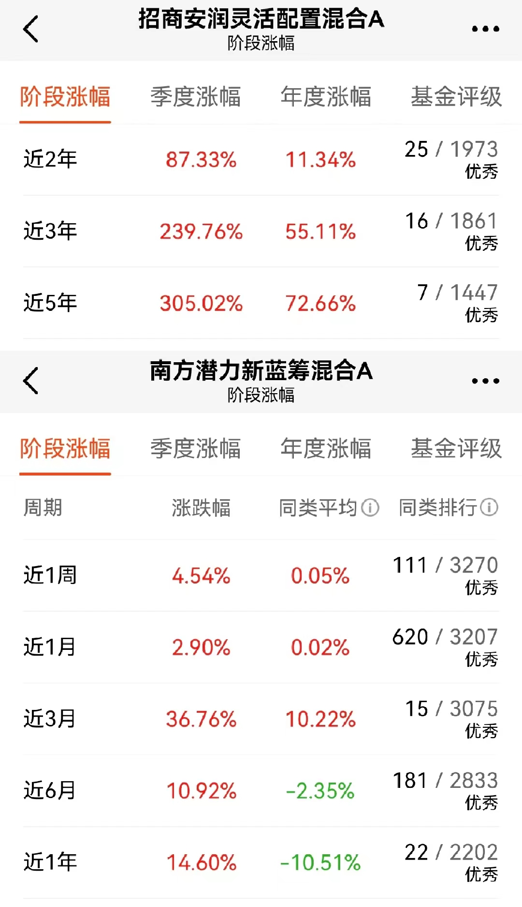

### 南方基金 钟赟 -- 挖掘好行业、捕获超收益

近几年我会额外关注跳槽后基金经理们的业绩，因为人往高处走嘛，能走“高”说明其往往是具有过人之处的。而我关注的一个核心点就是，基金经理换了东家后业绩能否持续（甚至更好）？

今天我们聊聊其中一位较为优秀的基金经理--南方基金的钟赟（yun），他之前在招商基金的代表作是招商安润，到南方基金后接手的是南方潜力新蓝筹。这两个产品在钟赟管理期间业绩都是很优秀的（详见下图），新老东家过渡后其业绩的实力也得到了延续，这就让我有了去了解钟赟的兴趣，查阅了一些资料后想和大家做一个简短的分享。

> 擅长挖掘好的行业，以此获取较高超额收益

钟赟发现2008年~2020年间，每年涨幅前五的一级行业，相对于沪深300的平均超额收益大于30%，这就是他一直执着于寻找那些好行业的底层认知。其投资经历中比较成功选对行业大的之前有半导体、消费电子、建材、新能源车等，这里我想重点讲讲钟赟当年对建材行业的认知。

2019年三季度开始钟赟注意要了B端建材行业，不仅是龙头，当时整个建材公司行业普遍业绩都不错。进一步调研发现是因为开发商为了获取更多的利润（也有年轻人不愿意自己弄装潢的原因在），就提高了精装交付的比例。大量的精装交付使得开发商通过集中采购的方式购买B端建材，这就改变了建材行业以往需求端分散的局面，这种集中度的提升是有利于上市建材企业的。通俗的说就是建材从以前竞争激烈的C端行业转变成了B端集中采购的阶段，而我们知道国内精装比例是远低欧美的，所以钟赟在当时那个节点明智的买入了建材行业，在后面行业的戴维斯双击中也获利颇丰。

> 行业挑选三要素：空间、时间、弹性

看了不少钟赟的访谈和直播，发现他曾多次强调选对行业（持续高增长）于投资而言是异常重要的。其中他常提到的三个词是：空间（天花板）、时间（持续性）、弹性（短期爆发性），这三者的排序就是钟赟对于三个挑选条件权重的顺序，而且这三个挑选维度不仅决定了这个行业好不好，也很大程度上左右着钟赟对于组合内个股权重的排列。

以新能源车为例，虽然十年前大家就预感这里面空间很大，短期的业绩弹性也不错，但这种“繁荣”背后是政府补贴在驱动，显然其可持续是较弱的。这就是三个维度满足了空间和弹性，但时间维度是不满足钟赟对行业选择的要求的。转眼到了2019年，随着补贴的减少行业进入了低迷期，直到2020年三季度国内新能源车的销量远超预期，这就意外这行业拐点到了。新能源车行业现在不需要补贴也能有不错的发展：新型车企加速进入、传统车企也紧随其后，新能源车的车型也逐渐丰富，造车技术也在持续迭代，具备了行业自我驱动增长。那么这就补上了十年前“时间”维度这块短板，三要素的再次聚集就是对于高增长行业重仓介入的时候，现在回头看在2020年、2021年重仓新能源车行业的基金产品基本都获得了不错的业绩。

> 行业逻辑的改变是卖出的首要素

什么时候卖出是基金经理常被提到的问题，钟赟回答也是中规中矩：估值泡沫变贵了、当初买入逻辑转变了、有更高性价比的选择。还是以上面提到的建材行业举例，2020年年中钟赟发现行业动态市盈率已经超40倍，可以看出估值泡沫已经显现；同时那会受政策影响，地产行业的调控力度只增不减，地产商的资金压力就大了起来。地产行业规模扩张的速度减缓，而建材公司还要给地产商垫资，资金周期的拉长影响到了行业的现金流，进而传导到了上游建材行业，这就是很明显的当初买入逻辑发生了转变。这种时间点就是钟赟认为需要卖出建材行业的时候了，而且我看到钟赟是明显更注重买入逻辑变更这一条，毕竟他主要还是选取那些持续高增长的行业，当高增长不可持续时就需要果断卖出。

> 小结

长期关注业绩超预期的行业，迅速挖掘超预期背后的原因，用“空间、时间、弹性”三板斧去探寻现有行业逻辑是否能支持其持续高增长，三要素越满足仓位权重越大，持有后就坐等业绩兑现，最后在行业逻辑转变前及时止盈并寻找下一个更高性价比的标的。文章开头我们就表示会格外注意那些基金经理跳槽后业绩的持续性，从实际数据看钟赟做得不错，我想这定离不开他那自洽的投资框架。