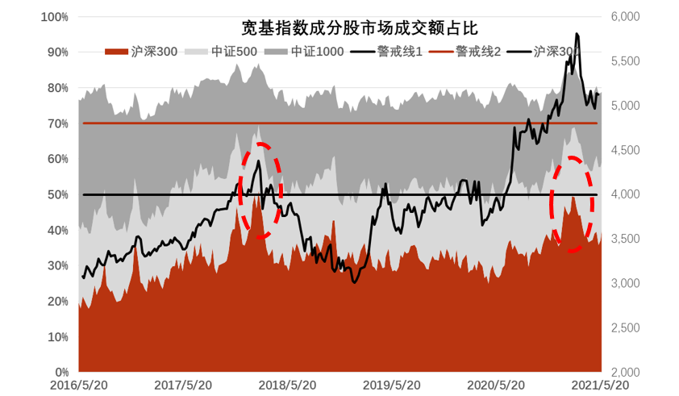

### 这得从一个手语杯子说起

今天上海有点细雨，应邀去参加了一个活动。但是这个地址有点特殊，是上海首家手语星巴克店，首先吸引我的是这个据说只有在手语店才能买到的特殊杯子。

这家店是今年1月28日开业的，地址在黄埔绿地缤纷城的一层，一进门墙上的那句【于无声处，用一杯咖啡传递爱的声音】就让我微有触动。听鹏华的人说，这不是他们第一次选择手语店搞活动，之前在北京等地也有办过。我觉得这个还是蛮加分的，一个企业成长到了一定程度就应该主动承担起一些社会责任，这里的星巴克和鹏华基金都体现了他们的善举。

期间还有听障人士教了我们几句手语，我看大家也都学的很开心，不管资本市场多么冷酷，但是生活的周遭还是要多一点温馨。据说广州、北京、杭州、成都等地也都有这样的手语门店，如果你恰好经过，又恰好有喝一杯的需求，那么可以推开门试一试，用一个平常心对待他们，就是最大的礼貌。

然后说下今天的收获吧，来演讲的是鹏华基金的尤柏年（国际业务部总经理）、苏俊杰（量化及衍生品投资部副总经理）。两位基金经理其实讲了很多，我就抽一些小的点和大家做个分享吧：

1、虽然2018年后ETF进入了快速发展时期，但以往以宽基为主的格局也在加速分化。下图可以清晰的看到宽基的占比在缩减，替代它的是行业ETF，相信这里面不缺乏我这样从股民转过基民的人群都偏爱ETF。

2、而日益壮大的行业ETF中主要集中于证券、银行、半导体、5G通信、互联网、军工、光伏、新能车。你会发现这些板块要么同质化严重，用ETF交易来替代个股交易（比如券商）；要么就是行业波动极大，个股选择又非常难，最后只能用ETF替代（比如半导体）。

3、分享两个比较靠谱的市场风险度数据：股债收益差（10Y国债收益率-沪深300股息率）、沪深300成份股交易量占全市场交易量的比重。观察下图可以看到，这两个指标都说明当前A股的大盘股肯定是存在一定调整风险的。

4、最后说下苏俊杰认为下半年可能存在的风险点：①、谨防前期暴涨行业盈利下行的风险；②、美债冲高对A股核心资产的估值可能存在扰动；③、美联储缩表与资金外流，让A股面临估值和资金流双重冲击；④、美疫情缓和后会对我国进一步施压，会扰动市场情绪和影响出口。