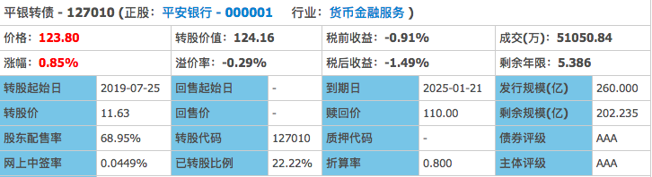
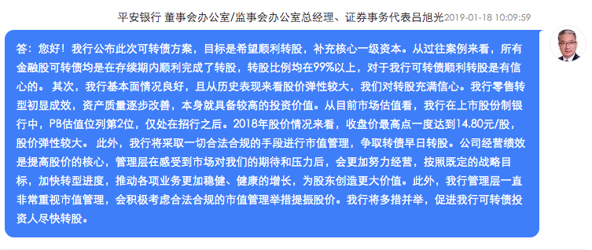
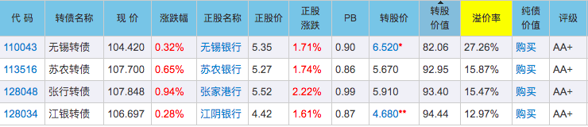

### 平银转债强赎给我的一个思考

今天欧派可转债上市，开盘直接123.64封板，暂停交易半小时后继续上扬，最高达到127.2元，收盘价126.31元。这种可转债就是赢在起跑线上的可转债，当大家还在绞尽脑汁拉抬股价，下调转股价的时候，人家开局就逼近130元，你说气人不气人。当然也庆祝各位中签的朋友们，230+的一个大鸡腿，可喜可贺。

今天收盘后我翻看了下可转债，发现平银转债要强赎了。9月18日为最后的交易日，赎回价为100.13元。平银转债是今年第三只触发强赎的银行转债，前面两个是常熟转债（5月16日，130.09元摘牌）、宁行转债（8月21日，125.7元摘牌）。

当前的平银转债情况如下图：

至今还有200多亿未转股，而债券价格是低于转股价值的，未来两周会有很多搬运工去套利。要知道平银转债是今年1月22日才上市的（106.3元），7月25日才刚到可转股期，半年过一点时间就完成了强赎的触发，这个应该是我映像中最近两年强赎最快的一直可转债了。

平银转债上市的时候大环境不好，但是市场还是给了平银转债很大的溢价，AAA级金融可转债果然是霸气出场，那么平安银行是如何做到那么短时间完成260亿的融资的呢？

我概括为三点：
- **明确表态强烈转股意愿**

大家查下平银转债路演时候相关方的讲述就看得出：[平安银行可转债发行网上路演](http://rs.p5w.net/html/86984.shtml)

我也截取了一个有代表性的一段：

强烈的转股意愿溢于言表，同时言语间透露出转股成功的极强信心，所以机构给了刚上市的平银转债很高的溢价。

- **半年报等连续利好强推**

8月7日平安银行发布了半年报，一句话形容就是超预期。股价随着半年的发布来了一波小高潮，可转债也是水涨船高，也就顺理成章的达到了强赎的条件。

- **非主流的宽松强赎条件**

我们都知道，一般可转债强赎条件是：【在本次发行可转债的转股期内，如果发行人 A 股股票连续三十个交易日中至少有十五个交易日的收盘价格不低于当期转股价格的 **130%（含 130%）**】。但是平安银行就是非主流，选了个120%，这就把强赎的难度降低了很多，这样的话今天上市的欧派转债，上市第一天就满足强赎了呢。

---

到此为止，我不经想，谁会是第四只强赎的银行转债呢？还有哪些银行后面上涨机会比较大？

我是从这几个方面去看待这个问题的：

- **银行为什么在去年底、今年初密集发可转债？**

其实银行急需补充资本金，那段时间趁着行情起来就发了三个大家伙：平安银行的可转债（260亿）、中信银行的可转债（400亿）、江苏银行的可转债（200亿）。之前还发了一大批城商行的可转债，绝大部分是我们江苏的地方银行（无锡、苏农、张家港、江阴），正股规模在90 ~ 100亿，发行转债规模在20 ~ 30亿之间。那群小银行之前赶上了节点密集上市，但是发行规模被砍了，只能靠后期发转债进行再融资。

- **这些可转债是否安全？**

熟悉我的朋友知道我对金融可转债是情有独钟的，外加看着银行都那么急切地想强赎，我真的一点也不担心。我们可以看到无锡转债和江银转债甚至都下调过转股，你看把他们给急得，可见在A股融点资金也不容易。

- **之前为什么不买入？**

因为我一贯的策略就是稳健，所以我只有在跌破面值的时候才会给大家推荐。当然大家去翻我的公众号就会发现我在2018年多次提醒大家买入低价金融可转债。常说到的就有无锡转债、江阴转债、长证转债，还有已经强赎了的常熟转债。今年说的比较多的是敖东转债，因为今年破百的金融转债就这一只。你能想到这些银行可转债去年都在95元下方，甚至有的到了93元以下，是不是很白菜价？

那对于敢于承受一定**波动**的朋友，是否有什么别的参与策略呢？请注意我说的是承受波动，而不是亏损，因为只要你坚持拿住，这种可转债亏损的可能真的微乎其微。

我给的建议是对如下四个转债做个组合，无锡和江银各30%仓位，苏农和张行各20%仓位。买入后不管不问，直到触发强赎为止（或者130元+亦可）。因为我觉得这些地方性小银行忍不住2年，我想保守估计再2年，可能急切的1年就够了，即便真的2年，我觉得这个年化收益也是挺好的。

注： 以上建议仅供参考，最后祝大家能在A股里赚到钱！