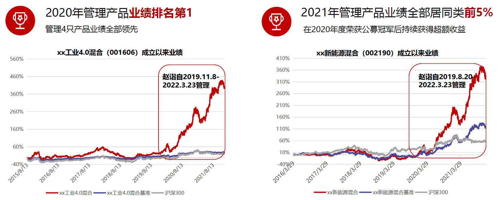

### 赚的是不是运气的钱？

东方红资管两位老人（王国斌、任莉）所发起的泉果基金，在筹备之初就受到了业内很大的关注。人在功成名就之后还愿意出来重新做一些实事，这种气魄还是值得敬佩的。所以之前方丈和王国斌的访谈视频《方略》我有认真看过，就想更深入地了解下这位证券从业28年的“老兵”是如何看待投资的。

这种过了层层合规的访谈视频肯定会有种欲言又止的感觉，但还是可以听出一些王国斌的投资理念、对自己优势的认知、对市场的理解、以及如何应对“叙事”和“噪音”等。最后王国斌管理的泉果基金首只专户产品好像卖出了约120亿的规模，在今年这样的大环境下我觉得已经非常了不起了。

伴随着对泉果基金以及2020年度公募冠军赵诣的好奇，我上周参加了基金调研团第四期的活动。整场会议我都是抱着一个疑问（公募冠军赚的是不是运气的钱？）去听，完了也有了一些收获，想来还是和大家做个简短的分享。

“山下出泉，君子以果行育德” --《易经》，这就是官方对泉果基金名字由来的解读，只能说：行走江湖起个有寓意又好听的名号很重要！

在这宏大的立意之下泉果基金的投资理念就是：以企业家视角践行基本面投资。而赵诣自己也对其做了衍生，概括为“成长股的基本面投资”，他认为成长和价值并不分裂，把握企业价值“成长”的确定性是投资回报的关键。

我看到这次泉果基金给到的投研团队名单除了王国斌，还有副总经理姜菏泽、宏观的戴骏、量化胡卓文、个股研究王惠、财务分析游瑾。在翻看这些人员的过往经历后我觉得阵容还是不错的，而且在他们的官方号上，我看到了首届秋招已经开启。对于一个基金公司，人才的储备也是尤为重要的，最初的这三年加紧磨练新人，下一个三年就可以择优扶持了。

这次赵诣管理的泉果旭源三年持有期混合是泉果基金的首只公募产品（之前王国斌发的专户产品门槛略高），但共同点都是有三年的持有期限制。虽然三年还是蛮长远的，但含持有期限的产品确实更容易实现，泉果基金董事长任莉提倡的“所见即所得、所得几所期”这一美好投资体验。这种三年期的产品“习俗”应该是来自于东方红资管，在他们还在东方红那个时期这个模式也确实获得了不错的持有体验，不少投资者也是认可这种形式的。

然后我们再看看这个自称在2018年差点下岗的冠军基金经理赵诣的历史业绩，不仅是2020年的公募冠军，还独自包揽了当年的前四名，这个“四冠王”也是绝对燃炸的记录了。难得的是在接下来的2021年赵诣没有受到“冠军魔咒”的影响，所管产品继续位居同类前5%，当然这个和之前广发基金的刘格崧一样，因为其重仓的赛道行情在第二年得到了一定程度的延续。

因此很多人有着和本文题目一样的疑问：他们公募冠军赚的是不是运气的钱？在我听了赵诣的一些选股逻辑后，还是能感受到其自身具备不少优势的。简单概括为如下三点：1、精选个股，优选行业：选择市场空间大、成长周期长、竞争格局好的行业，偏好护城河深、治理结构好的公司；2、深耕高端制造，不断扩展能力圈：深耕新能源、机械、军工、半导体等高端制造业，不断积累生物医药、大消费等行业深度认知；3、仓位稳定，长期视角：偏好长周期持股，获取企业成长的收益。陪伴有价值的公司成长，陪伴成长中的公司创造价值。

另外赵诣对于公司治理结构的观点我还是想单独下：选取那些管理层愿意和股东分享利益的企业；看重企业管理层是否专注、是否有远见；优秀的企业会在行业发展好的时候释放利润。这个不仅对于买基金，在我们自己选股时也是极具参考意义的。

最后希望赵诣的新产品可以在国庆后顺利发售，在当下这个大盘点位成立只三年期的产品极大概率是可以跑出优异成绩的，也希望基民们可以实实在在的赚一点钱。