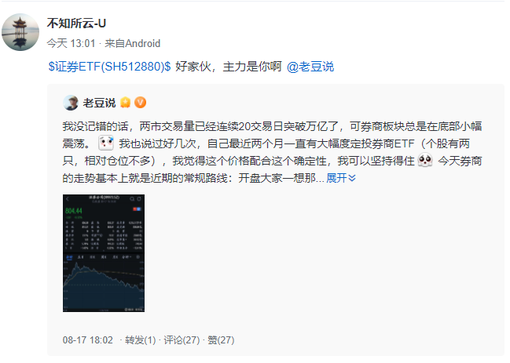
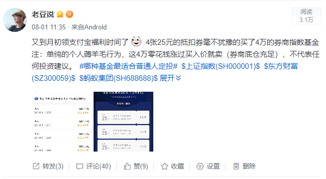
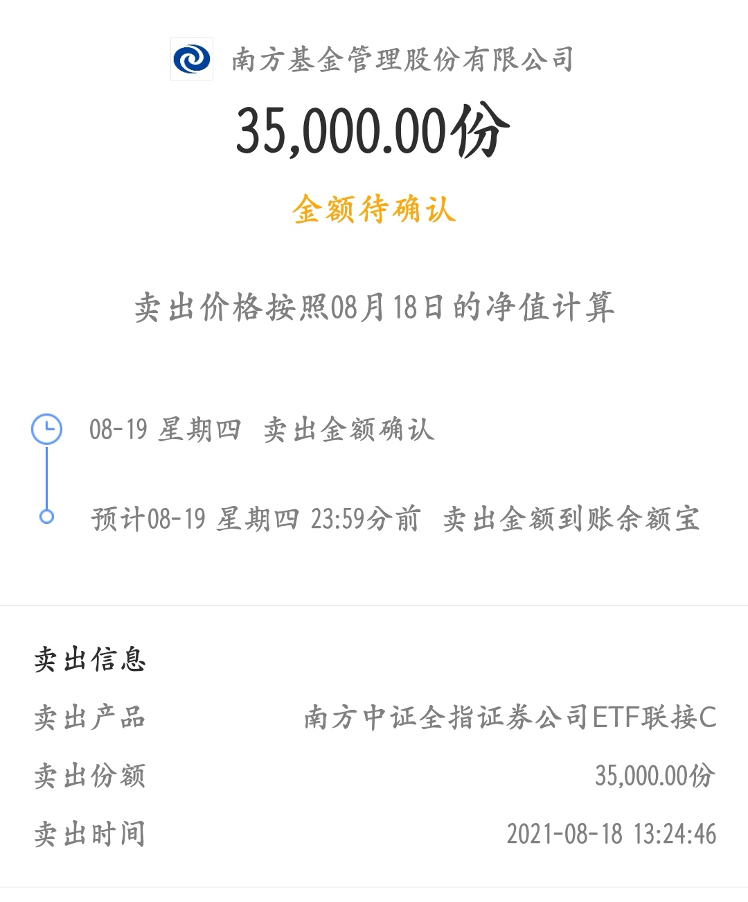
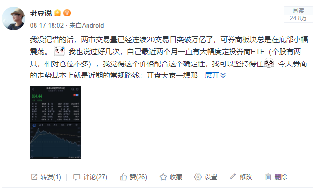
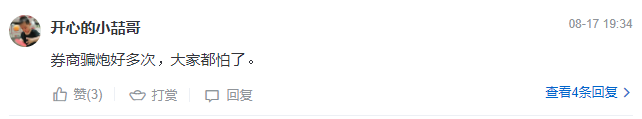

### 每次发帖说完券商就大涨

我对券商指数的喜爱反正老朋友们都知道，看我每周一的定投估值表里唯一的行业指数就是 它。这个月我正式发帖讲券商的就两次，但每次发完第二天就是一顿暴涨，搞得我也很怪异。网友 @不知所云-U 还发帖说我是主力，我直呼我是无辜的

第一次：8月1日

那次其实是我日常的薅羊毛行为，支付宝每个月会给财富黑卡会员送4张25元的抵扣券。因为我支付宝帐号里有一些历史遗留的券商ETF联接基金仓位，结合当时券商估值低且市场交易量还行的情况，我自然而然的选择买了券商去套利这100元的羊毛券。

这里要感谢下 @Ayanami__绫波 ，这位朋友那会还留言告诉我们，其实这个羊毛券买博时债指数这类低风险产品也是可以抵扣的。我觉得大家想薅支付宝的这个羊毛，但又不想承担太大波动风险，或者不知道如何判断机会的时候，通过这类债券基金去做是蛮好的。另外要注意这类债基通常需30天后才能免费赎回，我自己还是倾向于用券商在有底仓的前提下去薅抵扣券羊毛。

另外需要向 @micdyj 这位朋友汇报下，我今天顺利卖出了了月初买入的4万仓位（其余大仓位现在远还不是卖出的时候），运气好赚了点小钱而已（20天不到赚了个8%+），反正家里这个月的水果钱应该够了。

第二次：8月17日

发这个帖子是因为五月初，我在自己的知识星球上小范围内说过券商行业的这么个机会（当时指数点位在750附近），然后我最近又在星球上提过券商的机会仍在（昨天收盘指数在800点附近），大家可以继续做一些相关定投。在和星球会员们的沟通后还是能感受到大家的担忧，所以我想着还是公开发个帖子再帮大家安抚下。

当然类似的担忧在昨晚的帖子留言板上也有体现，比如这位 @开心的小喆哥 直言券商总是“玩弄”大家的感情，我也是能理解的。

我自己对于券商的信心很大程度上来自于前面几轮券商行情里都赚到了钱，另外相对而言券商行业是毕竟容易看懂的（甚至看不懂也没事，只要市场衡量该行业的标准还是粗暴地看成交量，那么这个策略依然有效）。

今天两市成交量毫无悬念地再次突破1亿元，成为第21个交易日成交量破亿。只是我没想到会突然有那么大的反弹，上午收盘后我一直担心下午券商会再次被大盘拖下来，毕竟这种事情在近一个月内屡屡发生。

最后我强调几点：

1、我发帖和次日大涨毫无关联

2、现在还远远不是卖出券商的时候

3、今天券商的暴涨我更倾向于是压抑已久的宣泄

最后给大家推荐一个江苏卫视的青春职场观察类真人秀《闪闪发光的你》，讲的就是9位高学历青年在华泰证券 的一个月实习考验。我其实还是很少看综艺的， 这部正好今天刚追完，总体来说剧本成分较低，对金融有兴趣的朋友可以稍微看看。