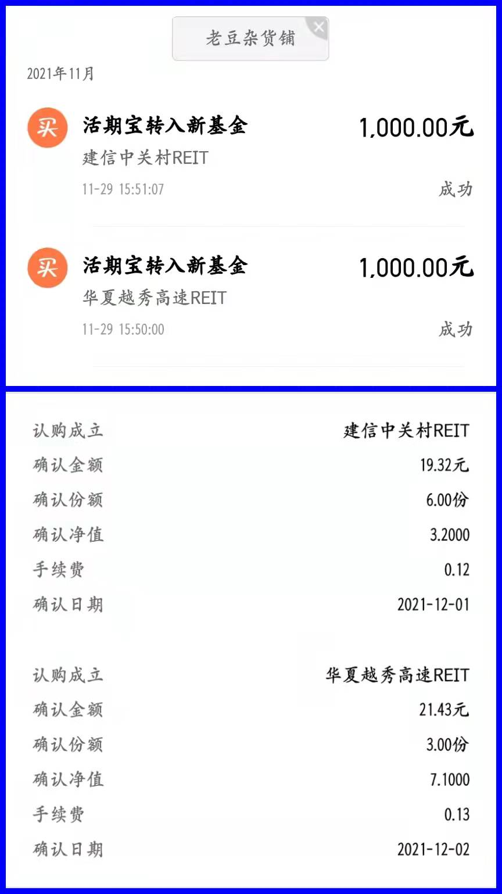

### 记录一次REITs基金场外转场内流程

之前也有人问过我怎么把场外基金转场内去？首先这肯定是需要该基金可以场内外转换（比如像RETIs基金），以前我给人讲的时候呢也只能说个大概，这次正好借体验认购火爆的第二批RETIs基金，顺带也体验下场外转场内的全流程。

我会尽量以图文的形式描述整个过程，流程主要包括：**场外认购、等待份额确认、建立场内账户与TA账户关系、场外基金转场内、转出份额到账后的卖出。**

**0、提前准备：**因为牵涉场外基金和场内基金的交易，所以需要同一个人的场外基金帐号和证券账户，本文以天天基金和华宝证券为例说明具体操作流程。

**1、场外认购：**这步大家应该很熟悉，基金开始募集的时候直接去基金销售平台认购即可。如下图所示，我是11月29日收盘后认购的。这里也顺带验证了部分渠道认购首日售罄的时候，部分产品是以5点为结算节点的（但从两家的确认日期看又略有不同，华夏当作次日交易，而建信视同首日交易）。因为主要是为了体验操作，就选择了最小认购额度1000元，当然我也没想到RETIs基金的认购会如此火爆。（华夏越秀高速配售比例为2.14%、建信中关村配售比例为1.93%）

**2、等待份额确认：**这步没有什么需要操作的，只等系统自动确认份额即可。这次第二批RETIs基金就两只，分别是华夏越秀高速和建信中关村。我各自申请了1000元，最终分别获得3份和6份；确认金额分别为21.43元和19.32元；手续费分别是0.13元和0.12元（详见上图）。

**3、建立场内账户与TA账户关系：**我已华宝证券为例，在APP“业务办理”菜单内找到“场内外对应关系维护”（提醒需要在业务时间段，即9：00~16：00办理），进入后点击申请则会自动带出你名下沪深两市对应的场内帐号和TA帐号，你只需要分别点击“建议关系”按钮给以确认即可。（详见下图）

**4、 场外基金转场内：**这步应该是最关键的，需要在场外基金帐号上操作，我已天天基金APP为例。在“我的”页面内下滑找到“快捷交易”区域（详见下图1），点击“转场内”后进入场外基金转场内列表。这里会展示你账户内可以转到场内的所有基金产品，点击选择对应产品后就进入了具体的转出页面（详见下图2）。

需要注意的是证券营业所的席位号不能搞错，这需要咨询你自己的证券经纪人（通常是协助你开证券户的那个人），而且还提醒一点，这个席位号沪深两市是不同的代码。最后点击确认提交，那整个流程基本就完成了。

因为基金募集完成确认份额后，到上市其实还是有一段时间间隔的，所以我这次也顺带验证了下“已确认份额但未上市的基金能否场外转场内？”。因为华夏越秀高速先上市，我们就在越秀高速上市后一并申请了建信中关村，实操后发现只要份额在场外基金帐号内确认，那么即便还没上市，依然可以顺利转入场内账户。（补充下：场外基金转场内是不需要手续费的，但在场内帐户卖出时需按自己券商的佣金费率结算）

**5、转出份额到账后的卖出：**最后就是等待T+2后，份额转到你的场内证券帐号后就可以正常卖出该基金份额了。另外这次体验第二批RETIs基金认购，其中华夏越秀高速上市后溢价很高，而建信中关村上市就折价，所以之前说无脑认购后吃上市溢价貌似也没那么靠谱，还是需要结合具体的产品质量和市场情绪。

> 小结

我还是建议大家优先用证券账户购买，如果真要场外转场内的话需：**场外购买 => 建立场内与TA关系（证券账户内操作） => 场外份额转场内（场外基金帐号内操作）。**

坦率地说，自己也很少有这类操作，但这次实操能一次性验证这么多情况我还是挺满意的。RETIs基金的封闭期一般都要几十年，转场内是较为常见的操作，希望这次记录也能给大家带来一点小小的帮助。我也是一个普通基民，遇到问题会习惯性自己去试试看，如果大家有这方面的疑惑可以给我留言交流。