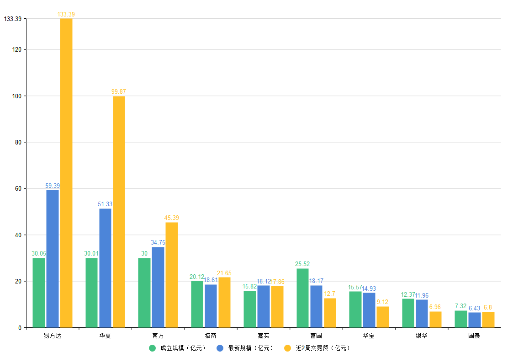
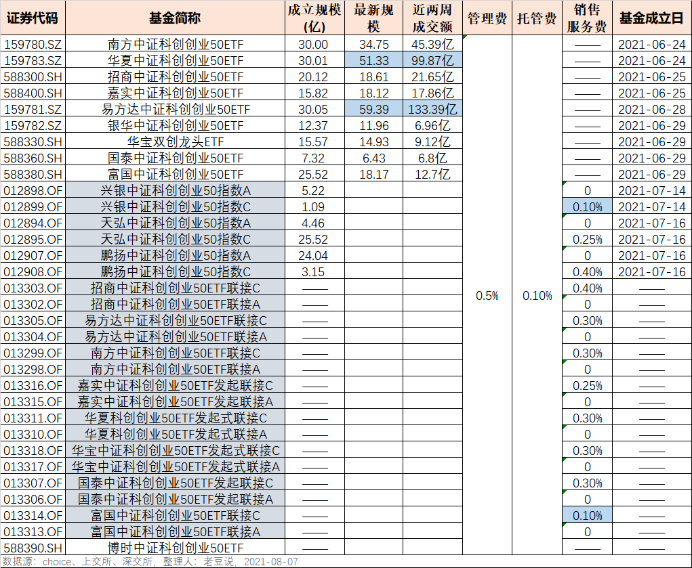

### 16只双创50指数联接基金周一齐发

大家还记得夏至那天（6月21日），9家基金公司**（易方达、华夏、南方、招商、嘉实、富国、华宝、银华、国泰）**齐发9只双创50指数的ETF不？紧接着7月5日又有三家基金公司**（天弘、兴银、鹏扬）**一同发了6只（含A/C类）场外的双创50指数基金。

相关阅读☞《双创50批量上市首日观测》

8月9日又是指数基金热闹的一天，上次**9家首发双创50ETF的基金公司中有8家（除银华基金外）会在明天发行对应的场外联接基金共16只（含A/C类）。**在聊这次的联接基金前我们先看看这段时间下来当初的9家ETF近况如何？

上图中我们主要是观测了这9只双创50ETF的**成立初始规模、最新规模（截至8月7日） 、近2周交易总额。** 拉取数据后我自己有这么几个观察：

**1、易方达这次有很努力在保持双创ETF第1的名次。**近2年很多热门ETF易方达和华夏作为头部基金公司都是一同首发，但在ETF这块真的连易方达都拿华夏没办法，所以这次我们是看到了易方达想攻下双创50指数的决心。

**2、华夏紧随其后且两家远远甩开了其他小伙伴。**伴随着芯片和新能源等板块的大热，双创指数也是大受欢迎，规模增长得很快，但貌似都被前3家给占据了，特别是易方达和华夏这两家。

**3、没有对比就没有伤害，陪跑的6家略显凄凉。**其实这9家都是非常不错的基金公司，能拿到大热门双创50的首批资格就是一个很好的佐证，但没有对比就没有伤害。后6位除了嘉实基金稍微涨了点规模，其余的都是在规模缩水，这也是ETF行业很残酷的现实：大家费率一样、又都是不错的基金公司，肯定是谁的流动性（规模）好就买谁呀。

然后我们再说下场外的双创50指数基金，除了上月先发的3家，就是明天发的8家。这总共11家基金公司都是有A/C类的，从费率价格战上看基本还是很克制的。**只有兴银基金和富国联接C是设定了0.1%的销售服务费，鹏扬和招商联接C就比较“硬核”地设定了0.4%的销售服务费。**

还有表上没列出的一个数据我觉得也有必要提下，就是发行周期。8家基金公司里南方基金最“急吼吼”8月9日~8月17日；易方达最淡定8月9日~8月27日；其余6家均为8月9日~20日。

最后要说下的是，“孤零零”的博时基金上周也发行了双创50ETF，让我想起了上次落单的天弘双创50ETF到现在也没发，好在上面也给了天弘首批的场外基金名额。这是天弘基金的优势，后面再发场内ETF，然后把场外转成对应联接基金直接拉大规模，这招天弘基金也是百试百灵。