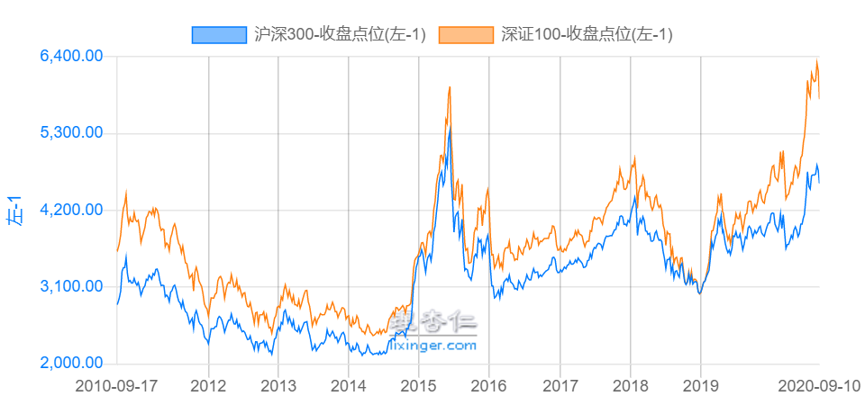

### 除了沪深300我们还有哪些宽基可以推荐？

天下没有不透风的墙，公司知道我做基金自媒体的人越来越多了，偶尔还有些仅有几面之缘的同事过来问**有啥消息吗？买哪个基金能涨？现在还可以上车不？**听着他们常见的三连问，我估摸着大概率是入门级投资者，所以对于这些人我一般就说试试定投沪深300指数基金吧。

偶尔几个稍微有点基础的，听了我的推荐后脸上微微露出一些不屑，虽然我知道他们碍于礼貌表现的不那么明显。但往往会追问还有别的好一点的指数基金不？我说那你再配合下中证500指数呗，一个大盘、一个中盘，双轮驱动定投，然后选个合适的止盈目标即可。我看到他们眼神里还是没得到满足，我就接着说：那你试试深证100指数吧！

这个指数其实相对于沪深300和中证500略微有点小冷门，但是老基民都蛮喜欢这个指数，对应的基金产品也是非常多、规模也不小。既然很多人不满足于仅投资沪深300指数，那么我们还有什么其他较好的选择？今天就展开说下：**深证100指数。**

官方定义（国证指数官网）：深证100由深圳证券市场中**市值大、流动性好**的100只股票组成，定位旗舰型指数，表征创新型、成长型龙头企业。指数基本信息如下：

指数代码：399330；指数全称：深证100指数（价格）；调样周期：每半年一次；指数基准日期：2002年12月31日。

有一个点是需要解释下的，这个深圳100指数除了价格指数，还有收益指数（399004）。价格指数和收益指数的区别是老生常谈了，**简单说就是：收益指数相对于价格指数是红利再投入的**。但对应到实际的指数基金，效果几乎没差别，所以我们本文就放在一起探讨了。

编制规则我简短的说下，具体的可以参阅官网文档（[深证 100 指数编制方案](http://www.szse.cn/marketServices/message/index/project/P020190201583197629505.pdf)）

① 选样空间：非ST类股票，上市超6月（市值排名前1%除外），近一年无重大违规、财务报告异常、经营异常、重大亏损、股价异常波动。

② 选样方法：对入围股票按近半年日均成交额排名后剔除最后的10%，然后按近半年日均总市值排序选前100名。

③ 权重计算：主要看企业的自由流通量（即实际可供交易的流通股数量），简单说就是企业所有无限售条件股，但其中又不包括持股超5%的国有股东、战略投资者、公司创始人及高管。

我们再来看下以此选出来成份股的行业分布以及十大权重股：

行业分布上我们看到还是很符合深证市场的定位，信息技术、消费（主要和可选）、医药卫生占据了过半的份额。还有就是金融的占比相对沪深300要轻很多，这个我觉得也算是一个优势吧，也给深证100带来了一定的超额收益。具体的我们可以来看下近10年沪深300和深证100两者的走势比较图，深证100指数相对于沪深300的超额收益很明显的在下图中体现了出来。

看了上图，机灵的小伙伴又要问了：为什么深证100和沪深300的走势如此的一致呢？我们来看下两个指数成份股样本对比你就清楚了，深证100指数里面的100个成份股有93个在沪深300里面，另外特有的七个成份股也就宁德时代（2.64%）和迈瑞医疗(2.19%)有点占比，其余的5只可以忽略不计。如果说上证180是上证版的沪深300单市场版本，那么深证100就是深证版的沪深300单市场版本，所以这就很好理解为什么两者走势如此一致了。

---

那我们想要投资这款加强版沪深300宽基，该如何选择呢？其实如我文章开头说的，跟踪深证100指数的基金很多（22只，详见下图），我们需要从几个维度去筛选投资标的。

- 场内基金

场内ETF主要有易方达、方正富邦、招商、银华、工银瑞信，还有国投瑞银、广发的LOF基金。**场内选取的标准是：流动性 > 规模 > 费率**。那么两家的LOF基金首先排除，然后再看下ETF的流动性和规模，第一眼看下来显然是易方达的为最优解。

当然我们也要看看有没有规模暂时不大，但也有优势或者未来可期的ETF呢？我们发现招商和银华的费率都是30BP，而且银华还有深证100指数的分级基金，规模还不小。银华的这只ETF是2019年6月底成立的，很显然是想承接自家即将落幕的分级基金，可惜一年多了规模才0.8亿，实在是无法纳入考虑范围。同理招商的这个产品规模只有1.79亿，单日成交量只有500万左右，这个流动性显然是不能满足我们投资需求的。

- 场外基金

场外对应标的规模大于1个亿的都是上述ETF的联接产品，所以选择上还是比较容易的。我们选取场外基金的标准主要有：跟踪效果、产品规模、超额收益、费率。初步选取后得到两个产品：规模最大的易方达联接和费率最低的招商联接，可是在我们想要对比两者指数跟踪效果的时候发现招商的联接基金成立还不满3个月，所以场外最后的筛选结果依然是易方达深证100ETF联接A。

最后对于场外基金还需要补充一点，其实还有一个产品跟踪深证100的收益指数，是融通基金的产品，规模也挺大，可惜费率太高，我们当下已经有更优的选择了。

---

> 小结

深证100指数是一个各方面都不错的单市场宽基指数，在与沪深300指数对比的下也能凸显出较强的超额收益能力。指数对应的基金产品选择也很多，经过多维度筛选后我们的结论是：场内推荐，易方达深证100ETF（159901）；场外推荐，易方达深证100ETF联接A、C（110019、004742）。

