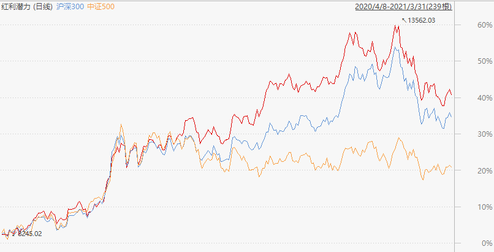

### 以‘红利’之名、行质量之实，做全村最具‘潜力’的仔

我喜欢指数基金产品是因为：其编制规则透明且具备自我新陈代谢功能，我们在研究一个指数编制规则的同时，也是在学习一种选股策略。在通过ETF等指数产品参与权益市场投资的同时，如果可以学习借鉴优秀指数的编制规则，那也能帮助自身形成一些较好的选股策略。

在单边行情下思考优化选股策略的人会很少，反正大家都是一窝蜂的抱团买买买，在那种几乎买啥都能赚钱的行情里容易让人飘。可惜春节后股市行情突然来了个大转弯，大伙先是一脸懵圈，等稍微缓过神来后，老老实实思考该如何选股的人又多了起来。就我而言最近来问如何选股或行业的人变多了，这也是为什么我突然有这感慨，以及为什么写下这篇文章。

熟悉我的人都知道我是很偏爱红利系列指数基金的，每周一我文章里公布的估值表中仅有的四个指数之一就是中证红利。‘红利’也算是最为大家所熟知的Smart beta 因子了，红利系列的产品也是总规模最大、更容易被大家接受的，毕竟分红这个行为对普通投资者来说很直白易懂，且持续稳定分红可以佐证企业利润的真实性。反观成长、价值、低波这些产品的规模就小很多，而质量、动量、基本面等策略的产品就更小了。红利家族的产品不止规模大，数量也是很丰富的，我每次看到有新出的红利指数都会多关注下相关，今天要讲的这个指数应该是红利系列里最有潜力的一个：**中证红利潜力指数（H30089）**。

我们先看下中证指数官网给的定义：中证红利潜力指数从沪深市场中选取**每股收益、每股未分配利润、净资产收益率**等指标的综合排名靠前的 50 只上市公司证券作为指数样本，以反映沪深市场上市公司中**分红预期大、分红能力强**的上市公司证券的整体表现。

中证红利潜力指数成份股的选取规则概括为：1、连续3年分红且当年分红比例不低于30%；2、近一年日均总市值和日均成交额都需排名前80%；3、以每股收益、每股未分配利润、净资产收益率，这三个指标等权重排序取综合排名前50的个股。

这里可以很明显的看到中证红利潜力指数不同于狭义上的红利指数，因为它没有突出强调现金股息率。我们在编制规则中发现该指数选择成份股的时候，现金分红只是一个前置条件，仅需超过年度净利润的30%。这个规则的设置更像是为了剔除那些虽然ROE较高，却很铁公鸡的公司。于此同时新加入的三个考核点，尤其是净资产收益率（ROE）会给这个指数的选股带来质的飞跃，至此我们就可以解释本文题目中的：**以‘红利’之名、行质量之实，做全村最具‘潜力’的仔。**

透过以上这些指数规则，我们理论上可以选取出一批愿意长期稳定分红的公司。而且他们具备较高的每股收益，账上又有很多未分配利润（这个也是体现了未来稳定分红的潜力）。除了愿意每年分个30%以上的现金红利外，还极大可能用剩余的钱去继续扩大企业生产，最后叠加企业高ROE属性，就会进入一个很好的良性循环内，让企业发展更好、让股东有更多的收益。那我们看下选出来的前十权重股是不是真的如此？

这十个权重股是不是个个都让你赏心悦目啊？因为他们都是高ROE企业的典型，每年分红呢也不是那种扣扣索索的姿态。而且你会发现由于中证红利潜力只有50只成份股，所以前十大权重股就占了超66%的比重（前3名合计33.89%）。大家都知道对于差不多类型的指数，如果前十权重能很集中，会比几乎分散的指数要更优秀。所以中证红利潜力指数这样的编制规则下选出来的成份股业绩也是很优秀的（下图分别是近一年中证红利潜力指数与沪深300、中证500、中证红利、上证红利同期业绩对比）：

通过上面两幅业绩对比图，我们看到红利潜力有点沪深300增强的影子，它还大幅度跑赢的同期中证500指数。与传统红利系列的指数对比可以看出，在叠加了质量因子后的红利潜力威力是不容小觑的，同期业绩远超那些单纯注重股息率的传统红利指数。与此同时我需要提醒下大家的是：介于中证红利潜力指数选的都是高ROE企业，所以是更适合长期持有的产品，经过春节后的这段时间大盘调整，我觉得这类长期优质的资产是可以关注起来了。

> 小结

通过对中证红利潜力指数的学习，也让我自己对红利因子的使用有了更深层的理解。我们的投资就应该如红利潜力指数那样，不要单纯地局限于低估值和股息分红，对于高ROE的企业也需要充分的考虑，选择高质量的企业与其一起成长。

当然所有的指数研究最后都要落实到具体的产品上来，这样我们才能在实战中赚到钱。中证红利潜力指数还是比较低调的，对应的场内标的也就只有一家：**山证红利ETF（515570）**，有兴趣的朋友可以关注下这位有‘潜力’的仔。

