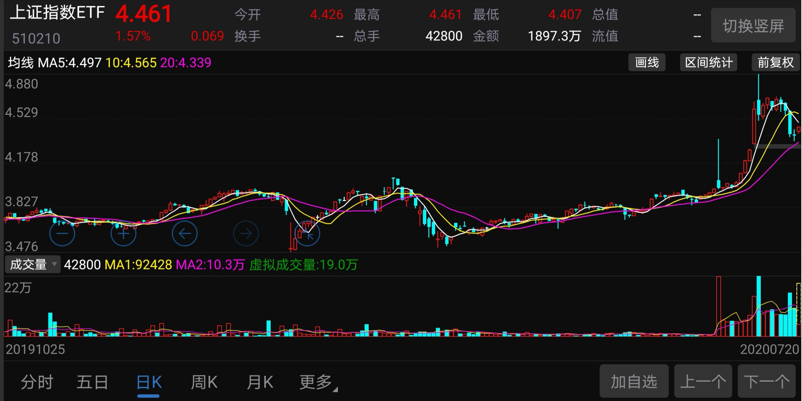

### 如何摆脱‘赚了指数却不赚钱’？

截止7月16日收盘，A股已经连续9个交易日成交量突破1.5万亿了。我觉得这个量级的交易量持续了9天，从气势上已经形成了很明显的牛市氛围了，但如我一直强调的：**以当前的交易量，如果再能突破3500点且站稳，那么浩浩荡荡的牛市就来了！**

那有一些新手就问了：这3500点是什么意思啊？

因为历史原因，上交所的市值总量要远大于深交所，所以我们平时口中说的大盘一般就是指上证综合指数，简称【上证综指】：上证综合指数的样本股是全部上市股票，包括A股和B股，从总体上反映了上海证券交易所上市股票价格的变动情况，自1991年7月15日起正式发布。

这个被广大股民作为中国股市标尺的指数在今年迎来大改，这是指数成立30年来的首次。优化后投资价值有效提升，指数未来表现更值得期待。编制方案的修改主要包含三个方面（7月22日起实施）：

**（1）指数样本被实施风险警示的股票（ST股），次月将其剔除；**

及时剔除风险警示股这类差生，有利于提升‘学生们’的平均成绩，也使得指数更健康。因为被实施风险警示意味着连续的亏损和极差的流动性，而且流动性极差的个股也不利于指数基金的建仓。

**（2）新股需上市满1年后纳入（日均总市值排名在沪市前10的公司，满3个月后纳入）；**

我们的股市有个特点，每当新股上市就会较长时间的连续涨停，有人也称之为‘数板’。新股上市之初往往价格偏高、估值较高，新股过早的纳入到上证综指当中会有一些不良症状（典型代表就是中石油48元上市后没多久纳入指数，这么多年后还不足5元）。比如随着“新股”变成“老股”，其估值大概率会逐渐回归到行业平均水平，那么就会对上证综指产生一定程度的拖累，而新规则的调整能有效地降低这方面的影响。

**（3）将科创板股票、以及未来上市红筹企业发行的存托凭证（ADR）纳入样本股。**

既然是上证综指，那么科创板作为上证交易所的重要组成部分理应纳入样本。科创板和注册制已经推出，上交所市场的兼容性和代表性大幅提升，未来随着科创板股票纳入到上证综指后，会进一步提升上证综指的代表性。

---

上证综指优化后的代表性和弹性也会进一步提升，投资者可以通过目前全市场唯一的上证综指ETF（510210）、联接基金（100053），就可以直接布局上交所在资本市场上的发展方向、分享我国经济转型带来的成果。同时上证综指作为宽基指数（当前市场最宽的宽基），其分散程度也会高于其他行业或概念指数，抗风险能力也更为突出一些，可以有效地避免个股投资黑天鹅。

在普通人的眼里，上证指数≈A股。如果未来上证综指涨到1万点，你持有的股票不一定涨，但是如果你买了上证综指ETF，那么你也赚到1万点。所以，别再抱怨赚指数不赚钱了，可能只是你的姿势不对。说到投资姿势，我个人对于上证综指的投资姿势主要有如下两种：

**1、目标投：**就是最原始的机械定投，比如每周三买入2000元；然后设定一个止盈目标，如果我通常建议小一点如5%~8%；剩下要做的就是抽空去看看，什么时候达到止盈收益了就清仓卖出，然后进入新一轮的目标投。

- 为什么上证综指适合这个投资策略？

a、一直定投或持有上证综指可能出现来回过山车的情况，所以定投的同时配合目标性的止盈是很有必要的。

b、上证综指能很充分的体现中国的经济，特别是改规则后，长期看这个指数是必然往上走的，所以不埋人的指数就是一个适合定投的指数。

- 上证综指的目标投有哪些特点？

a、因为上证综指是一个相当宽的宽基，所以目标不宜设置过大，可以小步快走设置5%~6%就可以止盈，循环不断即可。

b、基金本身紧跟大盘指数，所以不怕出现赚了指数不赚钱的机会；同时阶段性的及时止盈，所以不怕追高也不怕踏空，稳稳的享受市场的收益。

**2、估值投：**就是在指数（这里也可以等价于中国股市）低估的时候定投买入，在估值变高的时候再分批卖出。

- 如何界定上证综指估值的高低？

a、对于这种宽基我一般使用PE（市盈率）的百分位进行相对估值，当PE百分位低于20%的时候我就认为上证综指进入了低估区间，当PE百分位高于50%的时候我就认为指数进入了高估区间。

b、对于高阶的投资人，或者严谨一点的，还可以配合绝对估值，比如PE低于12就算低估、高于16算高估。当然不同人可以有自己的阈值边界，只要自己认可就行。

- 在低估值时如何操作、在高估时如何止盈？

a、在指数低估区间进行定投买入，如果PE百分位低于10%（或配合绝对估值也处于低估）的时候建议加倍定投，在底部区间要坚守只买不卖不动摇。

b、在指数进入高估区间后，可以逐步卖出（类似于定投的反向操作），建议当百分位突破70%的时候可把剩余份额分成10等份，然后加速逐步清仓卖出（熟练的老司机也可以结合趋势打法，等破势时一次性清仓）。

---

> 小结

要想摆脱‘赚了指数不赚钱’的魔咒，那么通过买卖上证综指ETF（510210）、联接基金（100053）来参加权益投资是一个不错的方式。随着指数编制规则的优化，上证综指以及其对应的ETF也定会越来越好，而且上证综指ETF相对于指数这么多年已经产生了超过23%的超额收益（对比上文两张K线图也是很明显感受到ETF带来的超额收益）。基金本身的超额收益再加上我上面与大家分享的两种适合上证综指的投资‘姿势’，那么最终大概率可以做到‘不仅赚了指数，还比指数赚得更多’，所以这就非常适合初级或中低风险投资人，最后祝大家能赚得稳稳地幸福！

 #牛市来了借基布局#