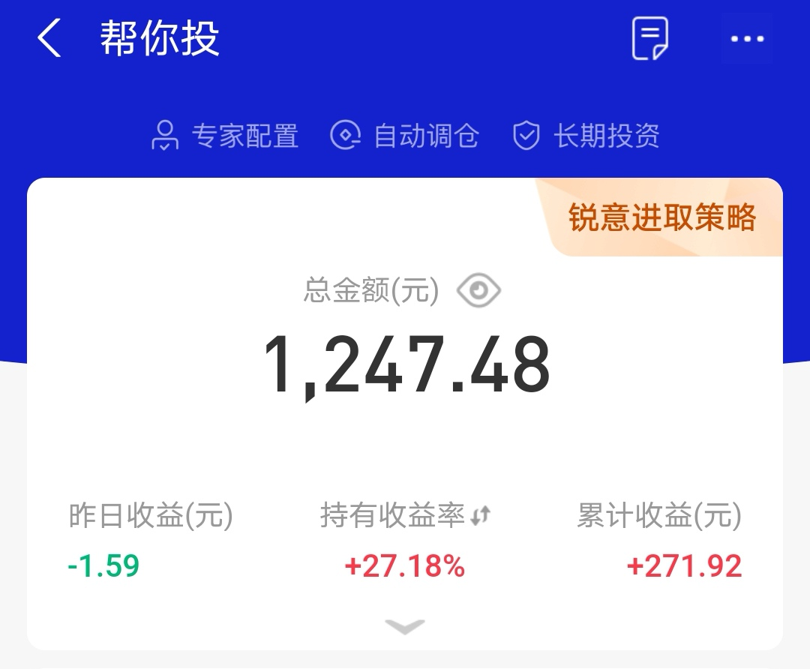
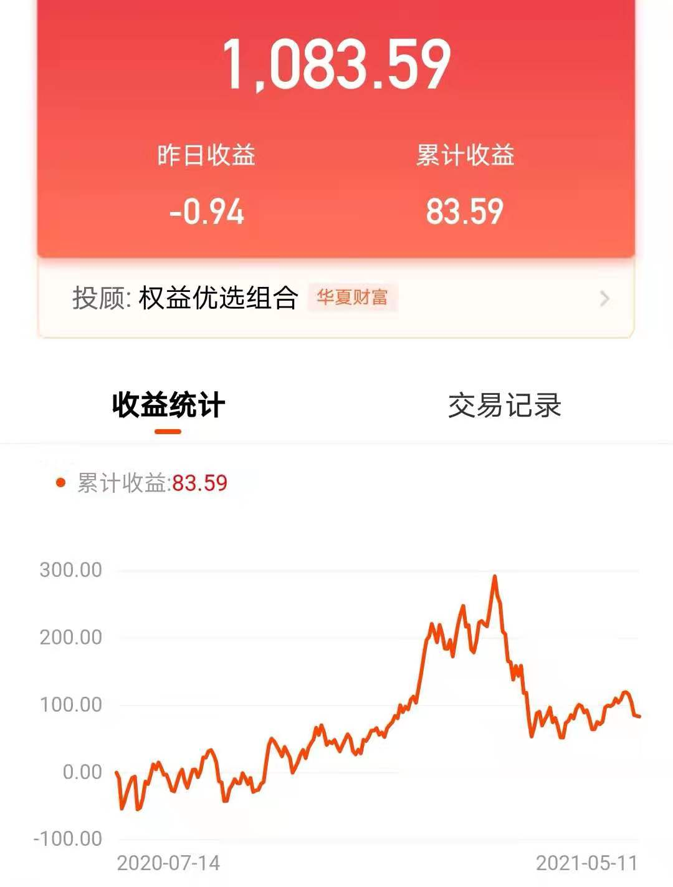
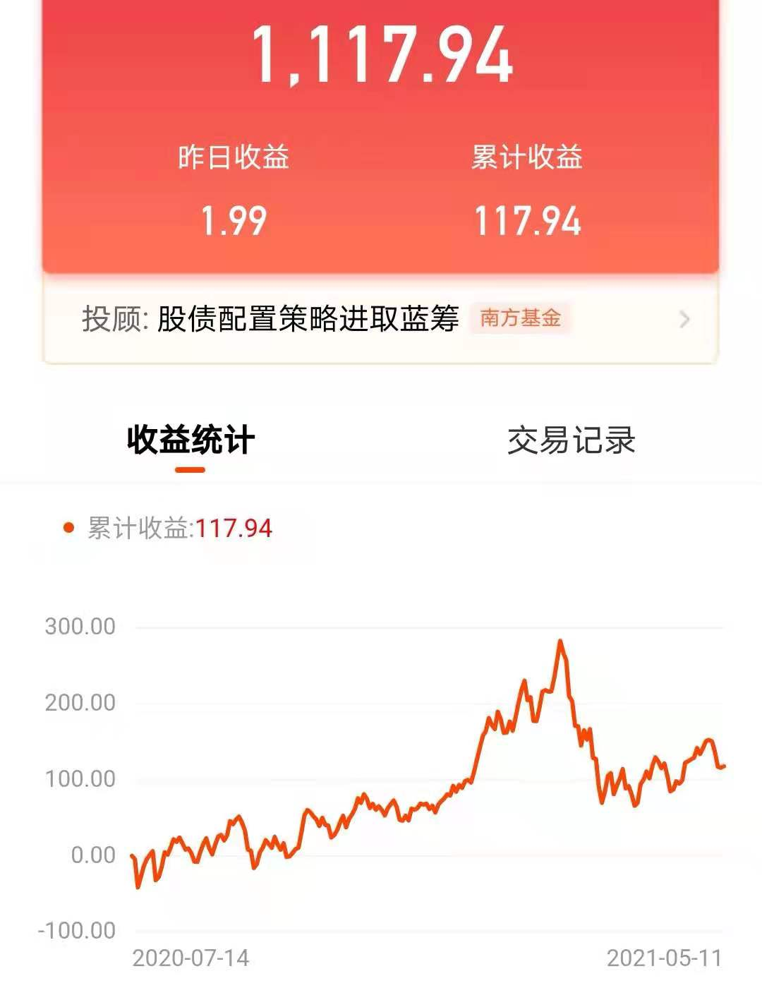
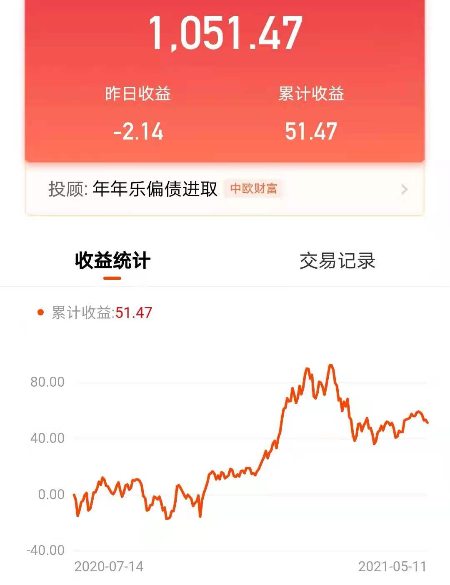
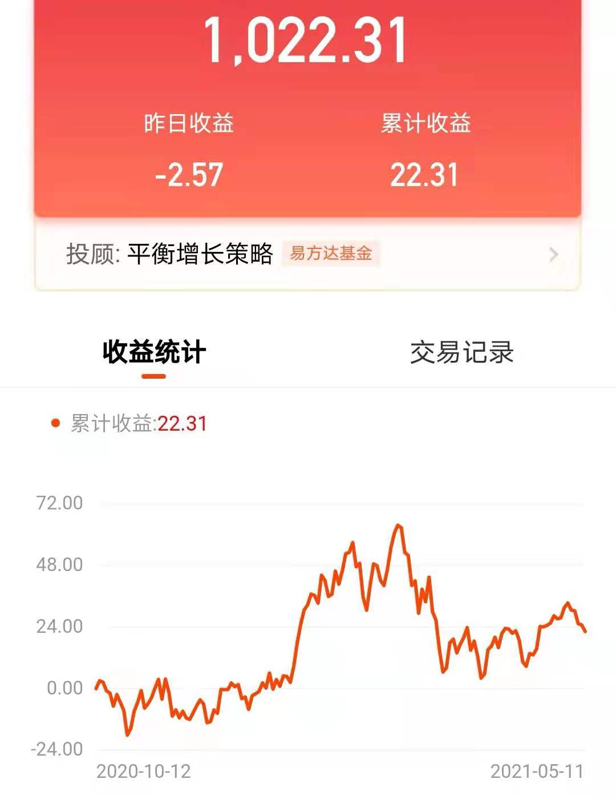
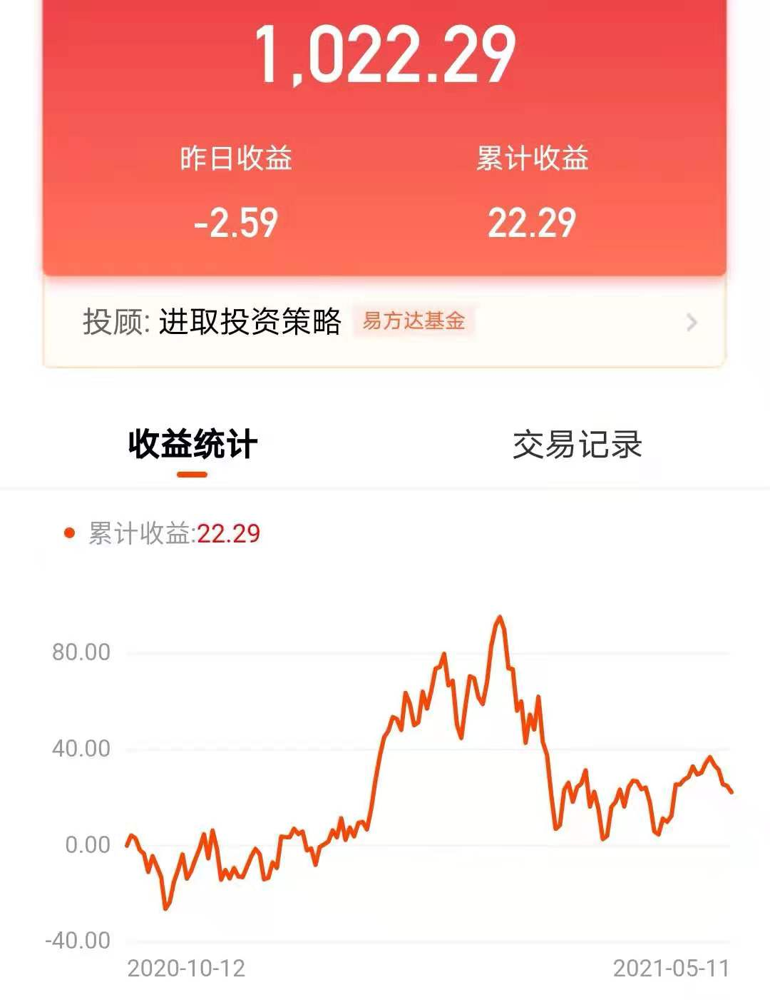
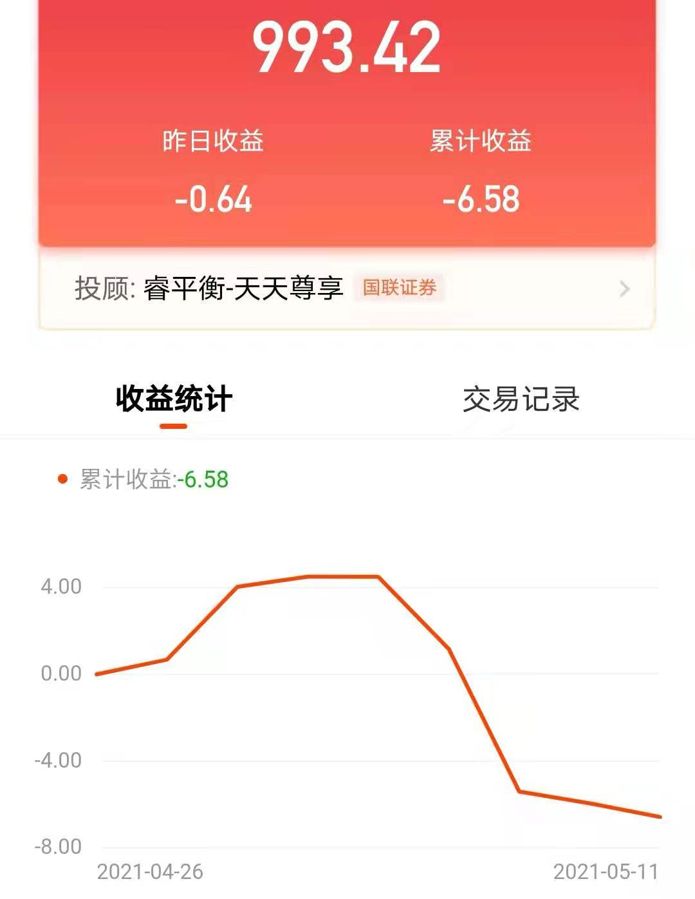
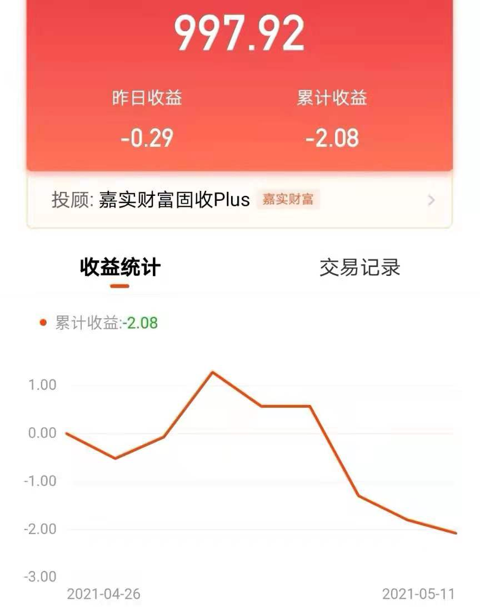

### 多家基金投顾产品实盘测评

基金投顾这个事物在它发放第一批牌照的时候我就一直有关注，因为这个事物设计的理念还是很好的：**投前精准匹配、投中全权委托、投后投教陪伴。**而且我一直想探究基金投顾对投资者的实际帮助，**相对于基金公司的官方组合以及自媒体大V自建组合的差异有哪些？**

本着**只有参与进来才能真实的关注到产品的优劣、才能有发言权**，所以我先后买了不少体验仓来研究各家的投顾产品。但因为产品总体数量太多，我只能做到常见投顾服务机构基本覆盖（原则上一家机构买1~2个产品体验下），下面先罗列下我近年来购买的产品明细（排序先后仅以购买时间为依据）：

> 1、【先锋领航-帮你投】

购买时间：2020年4月5日（收盘后）；

购买平台：支付宝；

持有收益率：27.18%（截止2021年5月11日）；

产品策略细分：锐意进取策略；

投顾服务费率：0.5%/年；

最新仓位配比：股票类基金80.19%、固收类基金19.81%；

整体感受：这是我购买的第一个投顾产品，所以后期的关注也会更多一点。先锋领航的投顾业绩直观上还可以，特别是投资过程中的陪伴投教服务非常好。陪伴这块除了定期‘资产报告’外还有‘投资理念’和‘热点播报’，其中季度资产报告我都会有阅读，每次的账户调仓报告我也会仔细阅读（印象深刻的是11月12日的时候把 易方达中小盘混合 从11.21%降到0.04%，多出来的仓位新增了9.95%的华夏恒生ETF联接 ， 这个还是蛮好的）。对于投资新手我觉得即便你不买，读一下先锋领航的‘投资理念’模块的文章也是不错的，图文并茂且行文较中肯，每篇不长读起来也不累。

> 2、【华夏财富-查理智投】

购买时间：2020年7月13日（收盘后）；

购买平台：天天基金；

持有收益率：8.359%（截止2021年5月11日）；

产品策略细分：权益优选组合；

投顾服务费率：0.5%/年；

最新仓位配比：股票型基金22.57%、货币型基金4.8%、混合型基金：72.63%；

整体感受：这是我在天天基金买的最早的三个产品之一，产品运行效果中规中矩，每月和季末都有投顾报告。调仓频率基本上是每个季度一次，算是比较勤快的了，但值得注意的是该投顾产品减持易方达中小盘时已经是2021年的3月10日了。有特色的是华夏投顾偶尔会开一些直播，以此形式和投资人做到投后的陪伴

> 3、【南方基金-司南投顾】

购买时间：2020年7月13日（收盘后）；

购买平台：天天基金；

持有收益率：11.794%（截止2021年5月11日）；

产品策略细分：股债配置策略进取蓝筹；

投顾服务费率：0.5%/年；

最新仓位配比：股票型基金10.93%、货币型基金1.75%、混合型基金：87.32%；

整体感受：这是我在天天基金买的最早的三个产品之一，这个产品比较其他的是我买了后就没调整过仓位，至少我从去年三季度报告开始就没见成分基金比例有所变动。权益资产占比和同期的华夏产品差不多，但收益要好不少，且没有瞎折腾仓位，我也不知道是运气好还是就是实力的表现。今年2月开始也有每月好几次的投顾直播，我会持续关注

> 4、【中欧财富-水滴投顾】

购买时间：2020年7月13日（收盘后）；

购买平台：天天基金；

持有收益率：5.147%（截止2021年5月11日）；

产品策略细分：年年乐偏债进取；

投顾服务费率：0.45%/年；

最新仓位配比：股票型基金4.67%、货币型基金5.09%、混合型基金：59.49%、债券型基金30.75%；

整体感受：这是我在天天基金买的最早的三个产品之一，去年下半年至今仅在2021年2月4日调仓了一次（主要是降低权益仓位、增加一些债券仓位），调仓频率很舒适。对于投顾产品的业绩，我觉得对于这样的权益仓位占比，已经算是可以的了。

> 5、【易方达-基金投顾】

购买时间：2020年10月10日；

购买平台：天天基金；

持有收益率：2.231%（截止2021年5月11日）；

产品策略细分：平衡增长策略；

投顾服务费率：0.4%/年；

最新仓位配比：股票型基金3.83%、货币型基金5.04%、混合型基金：42.29%、债券型基金48.84%；

> 6、【易方达-基金投顾】

购买时间：2020年10月10日；

购买平台：天天基金；

持有收益率：2.229%（截止2021年5月11日）；

产品策略细分：进取投资策略；

投顾服务费率：0.5%/年；

最新仓位配比：股票型基金8.57%、货币型基金5.29%、混合型基金：54.13%、债券型基金32.01%；

整体感受：易方达是我唯一目前还持有2个产品的投顾机构，我选的两个都是权益比重不高的，且在去年10月才买入，总体收益还过得去。但是两个产品都看得出易方达的调仓频率略高，半年内有了三次的调整，但同时易方达的‘投顾课堂’也是陪伴最勤快的，这个很好。

> 7、【国联证券-睿平衡】
购买时间：2021年4月25日（收盘后）；

购买平台：天天基金；

持有收益率：-0.658%（截止2021年5月11日）；

产品策略细分：天天尊享；

投顾服务费率：0.6%/年；

最新仓位配比：股票型基金1.87%、货币型基金1.03%、混合型基金：42.58%、债券型基金54.52%；

整体感受：这是我买的第一只券商旗下的基金投顾产品，虽然权益资产占比不足一半，但依然收费0.6%一年，但这一点我就觉得不是很厚道。何况产品收益为负，虽然购买时间不长，也有最近大行情的因素在。还有就是投后陪伴服务几乎没有，叠加前面说的收费贵、业绩差，总得来说我不是很喜欢这家的产品。

> 8、【嘉实财富-嘉实财富固收plus】
购买时间：2021年4月25日（收盘后）；

购买平台：天天基金；

持有收益率：-0.208%（截止2021年5月11日）；

产品策略细分：财富固收plus；

投顾服务费率：0.3%/年；

最新仓位配比：货币型基金2.01%、混合型基金：23.67%、债券型基金74.32%；

整体感受：这是我买的投顾产品里唯一个完全没有股票类基金的，这点其实在产品名字上就有体现，毕竟叫固收+ 嘛。可是让我略疑问的是：新买的固收＋就正好遇到了下跌？是我运气太好了？

> 小结

我买的投顾产品都罗列出来了，但有一款是已经清仓了，具体的可以看我之前写的文章：《嘉实基金的这款投顾产品有收智商税之嫌》、《每次点开都想吐槽的一款投顾产品》

即便如此也没浇灭我对基金投顾产品的兴趣，我后面也一直在有购买体验不同的产品，我想将来依然会有兴趣去尝试。何况我也不认为一个产品的不好，就表明这个投顾机构的不好，更不能说明背后相关基金公司或券商机构的不好。

今年我看到蛋卷基金也开放了基金投顾的入口，支付宝也不再只推自家投顾产品了。上面也说了，我很愿意去买一些新的产品来体验尝试，这种互联网渠道的推进是非常便利于年轻人的购买。

最后我要说明下，除非直观上就能够感受到不好的几款产品外，我都给与了较为正面的评价。也没有很明确的给我自己买的这些产品做个排序，因为各产品的风险配比完全不同，盲目的做排序是不负责的表现。我只能尽量把客观数据和实战业绩展现给大家看，我觉得能在全权委托的情况下，有一定的正向收益就是一个不错的事情。至于那些明显不行的产品我建议大家敬而远之，或者寻找一些更优秀且便利的替代品

