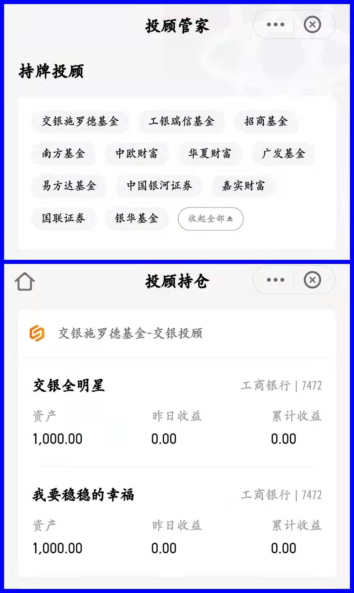
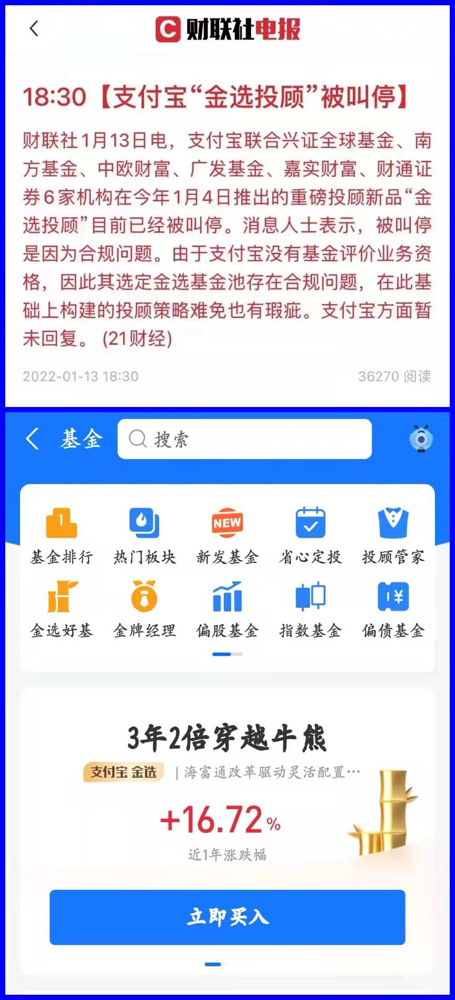
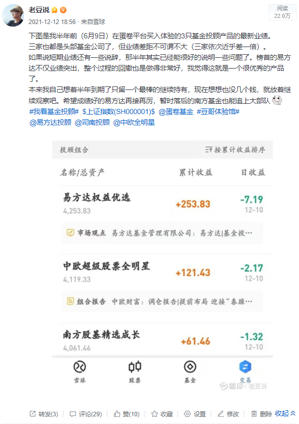
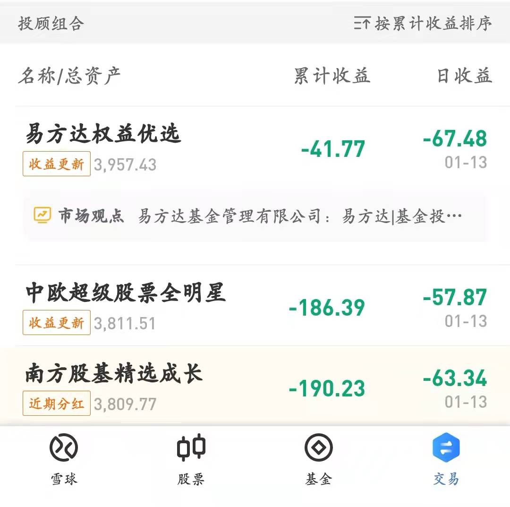

### 对基金投顾的几个近期观察

> 元旦后基金投顾持牌机构加速上架各平台

大V组合被叫停后，各基金投顾持牌机构也加速动起来了。近2周各基金销售平台密集上架了各家的投顾产品，以天天基金为例已经有多达12家：**易方达基金、华夏财富、南方基金、中欧财富、嘉实财富、国联证券、**银河证券、**广发基金、**招商基金、银华基金、交银施罗德基金（支付宝平台除了加粗机构再加一个中金财富；蛋卷基金目前只有易方达、南方、中欧三家）。

其实这个与大量先前已获得投顾牌照的机构近期纷纷获准展业有关，通常持牌机构与第三方销售机构的系统对接需要一点时间。如果算上在自有平台展业的投顾机构，那么最近两周可谓是井喷式的。

天天基金上的每家机构我都至少买一只产品体验下，今天买的是交银的两只老面孔，**持仓是投顾里罕见的自家基金产品。**其中“交银全明星”持仓均为交银的基金（年投顾费1%），“我要稳稳的幸福”里有两只是中银基金的混合基金（年投顾费0.25%），我心想交银这么玩和之前的自家组合有何区别？**就区别在多了个投顾费？！**

> 支付宝热闹非凡的“金选投顾”被叫停

元旦期间大家打开支付宝就会看到满屏幕的【金选投顾】预热宣传，2021年入选支付宝金选基金经理在2022年大面积翻车，相关的吐槽声音也在基金产品评论区频繁出现。但尝到了甜头的支付宝依然今年推出了金选投顾，最新消息该项目已经被叫停。据悉，因为支付宝没有基金评价业务资格，其选定金选基金池存在合规问题。

按道理基金投顾产品的基金备选库应由持牌基金自主完成筛选，但‘金选投顾’是在支付宝的金选基金内选择，也就是说支付宝框定了6家投顾机构的基金备选库，这显然就不合规了。但我刚才看了下支付宝，金选基金依然在首页有展示，所以**我的理解是：平台方你可以自己给基金打标签，但你不能干涉基金投顾产品的基金备选池。**

还有说句得罪人的话，投顾做得最早的几家也不全参与了支付宝的金选投顾，很大可能是他们也意识到了这个项目可能涉嫌违规的情况。这种细节也能看出这些投顾机构是否那么急切地追求销售规模，绑定支付宝就是锁定了巨大的流量池，即便是头部基金公司又有几家能抵抗这种诱惑呢？**对于懂得克制且爱惜自身羽毛的机构我心里肯定是给与加分的。**

> 基金投顾产品也需要严格做好适当性管理

**基金投顾的本意是改变现有基金销售的模式，帮助大家解决怎么选基、学会长期持有，但现在看来还是任重道远，**且这种现状会在2022年的“混战”中进一步加深。基金投顾产品在宣传的时候通常会强调“一站式委托”，但大家也别忘了要做好“适当性管理”，这里的“大家”不仅指持牌机构、销售平台，也包括我们普通投资者。

我说的这个适当性管理不仅仅是选购产品时给客户几个“粗粒度”的选择题，因为很多时候投资者对于收益和风险的认知还是很不充分的。就比如说**机构问你能承受最大的亏损是多少？你说15%的亏损，可投资者没想到这15%的亏损可能一个月就给你“达标”了！**所以我也刚说了投资者教育是个任重而道远的事，今年央视也出了《基金》的纪录片，交易所和头部的几家基金公司也都在努力做着，希望能更好吧。

最后举个我自己的例子，上个月我还发帖说在雪球上买的三只投顾产品半年了收益总体都还可以，谁曾想也就一个月时间全部亏损严重。（下图1为一个月前的帖子、图2为今日最新产品市值）

