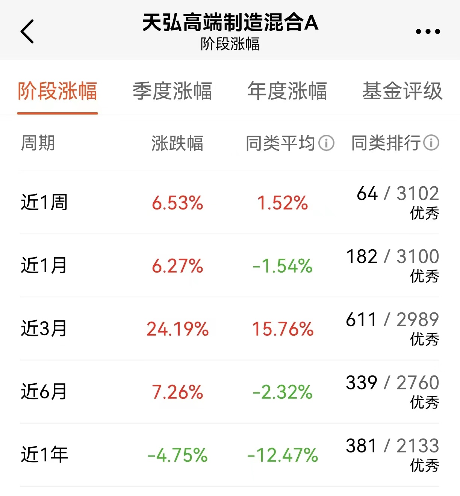

### 宝岛被围后，我重新梳理了下军工

8月以来询问我如何看待军工板块的小伙伴又多了起来，因众所周知的近期热门事件大家又开始对军工有了较高的关注，那我干脆把大家问得比较多问题简单整理汇总下。

> 军工属后周期行业，为匹配经济发展将会持续增长

国防建设的必要性大家应该都懂，近期宝岛的问题再次凸显了我国军工行业需求的刚性。军工是典型的后周期行业，当一个国家的经济发展到一定阶段后，对于军工的需求就会尤为强烈。

这军工需求就有点像家里的防盗门，以前家里穷的时候别说防盗门了，木门上挂着的铁锁都不一定很牢靠。那会大家庭院也不怎么围起来，能用个竹篱笆都算是条件不错的了，养条中华田园犬看家的基本都是大户了。家徒四壁的时候人们很少会考虑装防盗门的事，因为你也没有啥可保护的嘛。后来日子越过越好，大家就开始陆续装上了防盗门，有些“万元户”都试着把院子单独围起来了。

改革开放让中国经济腾飞了起来，2021年中国GDP已经超过了欧盟所有国家的总和，成为了真正意义上的全球第二大经济体。去年我们GDP占美国GDP比例也已超75%，这个是历史上没出现过的，当年的日本和苏联也都没达到过这个比例，这种坐火箭一般的飞速发展在40年前大家是想也不敢想的。

与此同时稍有遗憾的是我们军工支出只占了GDP的1.3%，而北约国家约定的及格线是2%，中国人财富积累的速度确实很迅猛，但同时也暴露出我们军工国防这个短板将在未来很长一段时间内去努力追赶。过往的40年中国在“以经济建设为中心”的纲领下蓬勃发展，现在我们粮仓颇足是时候把“防盗门”装起来了，这也是投资军工板块的最根本逻辑之一。

> 军工研制周期长，近几年恰好处于型号放量集中期

所有的工业产品都有个研制周期，而军工行业因其特殊性研制周期通常十年起步。正如上面比喻的，人们什么时候才会有很强烈装防盗门的动力？通常是不再家徒四壁，且经历过被偷盗（或者差点被偷盗）时才会警醒。

回顾历史发现我们国家在上世纪90年代末也发生了非常糟糕的事件，在感到憋屈的同时也提醒我们国防军工还存在较大不足，这就促使中国想要赶紧把自己的军工短板给补上。所以你看到在2015年后，陆陆续续的有一些新型号放量出来，而从2020年左右开始我们就进入了一个型号放量的集中期。我们近几年有很多新的武器装备投产，部分大杀器已经比美国厉害了，这些大多都是之前设计的，只是恰好这个时间点投产。

这个事情呢就很好地体现了军工行业研制周期长的特性，同时新型武器装备的陆续投产也给我们的国防建设在供给端提供了有力保障，能很好的满足当下我们国家对武器装备的需求。

> 十多年的市场化改革后，使得军工产品定价更合理

军工产品是一个to G的业务，在那个效率相对落后和体系不太完善的年代，军工行业根本没有市场化。特殊的历史阶段让军工企业无法相对合理的给产品定价，这会进一步使得行业更加低效与落后，甚至可能在当时都谈不上什么军工行业。

好在随着行业十多年的市场化改革，你现在再去找军工企业买产品会发现产品的性价比高了很多，价格也不再是虚高的状态。理性的来说，一个定价相对合理的行业环境才能进一步推动其自身发展前进，这些变革后的军工行业在2000年后也从初创期进入了一个成长期。

在当下相对健康的行业氛围下，未来很长一段时间都能有不错的持续增长，也一定会涌入很多新的公司。作为我们投资者就可能发觉不少新的投资机会，对于整个二级市场来说，其实是一段非常不错的黄金期。

> 从本国配置到走向军贸，从装备升级到下沉民用

除了第一部分提到的“家富后要装防盗门”这个基本逻辑，军工在当下以及未来还有什么可以想象的空间？我认为走向军贸和下沉民用市场都是较为明确的点。

不管你是不是认同，逆全球化的进程早已打开，那么全球各地区对军用设备的新增与升级需求都会持续。你看美国的军工股它每年的业绩增长很稳定、分红也高、市值也在稳步增长，这后面的主要逻辑就是美国军工行业的军贸逻辑。我们国家的军工行业未来在满足了本国配置的需求后，军贸这个方向也是具备想象空间的。

军工行业的技术下沉到民用市场其实也是很好理解的，我们现在生活的很多高新技术背后都有军工技术的影子，覆盖的行业也很多，比如民航、商业航天、电子通信、汽车、家电、机械制造等。以航空航天制造为例，中国在全球前五大制造业里面的市场份额都在40%以上，而航天航空作为第六大制造业中国份额只有不到5%，这里伴随着中国军工行业的发展未来我认为会有很大的想象空间。

当然这两个方向的延伸更多的是长期逻辑，但这种可预见的长期逻辑也会在行业估值中有所体现。

> 行业特性注定军工估值难捉摸

军工企业因为行业特殊性，很多订单、技术等信息都是涉密的，那么这就很考验投资人对财务报表数据的挖掘与分析能力，最好还能长期地专注于这个行业，因此我觉得军工行业的投资主动基金在基金经理的专业选股之下具备更佳的效益。

有些朋友会说军工行业的主机厂估值都好高啊？其实这是因为在军品定价机制改革之前是审价模式，这就导致了主机厂最多包邮5%的利润率。这个历史原因就是为什么我们能看但所有的上市公司主机厂净利润都没超过5%的。好在这个已经在慢慢改善了，只是这个改变提现到公司账面上还有一段时间，因为这个军工定价机制改革是新老划分的，而老产品的淘汰是个循序渐进的过程，但总得来说改善趋势已显现。但如果你抛开主机厂，那原材料、电子元器件、零部件加工等企业的利润率基本都能到百分之三四十，高的可以有百分之八九十。

另外如果你跟其他景气赛道比，会发觉军工行业一个最大优势就是低估值。我们看历史分位数会发现：新能源跌了那么多依然在历史分位数的百分之八九十，而军工行业底部反弹了这么多依然不到百分位的25% 。看看这估值再想想上面我们说的这些长期投资逻辑的支撑，这价格是不是挺美丽，也算是成长板块里少数仍算便宜的行业了。 

退一步讲，即便军工行业维持现有的估值水平，那军工的预期收益就是行业本身的利润增速，那这增速是多少呢？过去的两年基本在10%~30%之间，以当下环境看未来很长一段时间内大概率还是能保持这个利润增速的，甚至跟高。

> 小结

战争肯定是军工行业一个非常强的隐含预期，最近演习的多个“首次”以及多项突破都预示着未来我军备战需求将更加紧迫，高强度实战化演练将趋于常态化。军工长线逻辑可以看得很长，短线又能较好的兑现行业景气度，这是个非常难得的赛道。

军工目前在我国是不缺需求的，供给端的供应已逐渐跟上，行业的市场化也是日趋完善。上面也说了，对于军工板块的投资我还是更倾向于主动型主题基金，其中天弘基金的天弘高端制造（A类:012568/C类:012569）我自己关注的多一点。虽然基金名字叫高端制造，但在成立之初就界定了该产品主要投资军工领域的方向，我们看成份股行业占比也能很好的印证这个。天弘高端制造混合的各阶段业绩均优于同类平均，在同类排行也稳定在头部队列，对军工行业有兴趣的小伙伴可以多多关注下哈。

