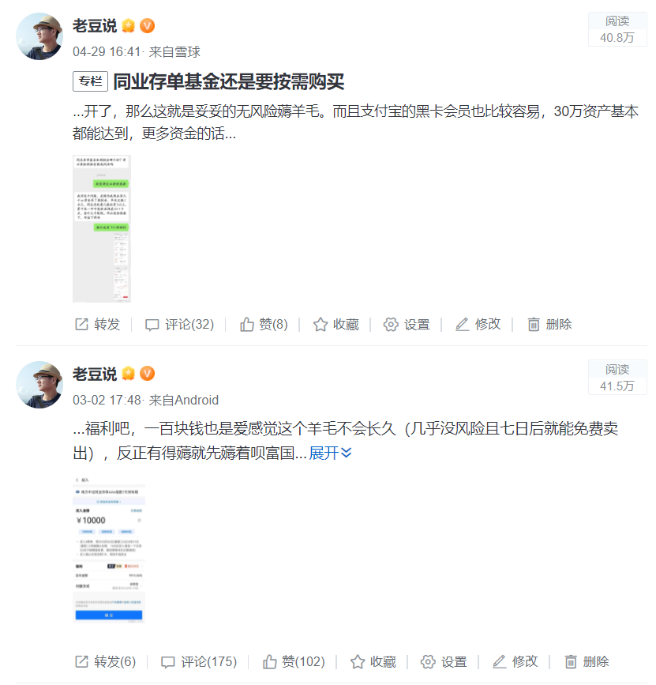
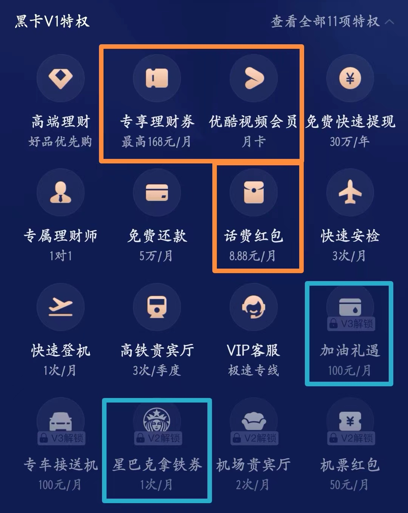
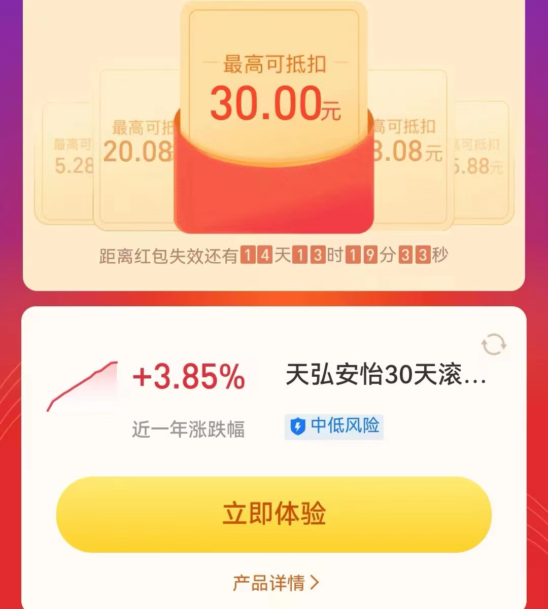

### C类指基仿“T+0”薅某宝羊毛

>> 前情提要

三月初和四月底我都有发帖子提醒大家可以薅支付宝“财富黑卡”专享理财券的羊毛（详见下图），这个月很多小伙伴在下面留言5月貌似不可行了？那今天我就给大家讲个更稳定的玩法。

支付宝理财分达800分后即可解锁财富黑卡V1（资产要求约30万），V1会员能每月获得多项福利特权，比较实用的有8.88元话费券、优酷会员月卡、理财券168元礼包（25*4+30+38）等。V2会员还有星巴克一杯，V3会员还有加油红包100元 ，更详尽全面的财富黑卡会员权益可参看下图。

作为基金博主我主要讲的是这个168元的理财券礼包如何较实在的使用，在前几个月是可以购买同业存单基金来抵扣理财券的（主要是4张25元的）。5月开始好多小伙伴给我留言说：买同业存单基金不能用券了，这“漏洞”貌似已被堵上。其实我不认为这是什么无意间的漏洞，如今同业存单基金第三批都已经出来了，前面的那几只也因经常触及百亿上限而限购。今年这样的行情稳健类产品肯定会相对好卖些，在需求大于供给的情况下，各方补贴的动力肯定是会缩减的，所以现在不能用了也是可以预见的。

>>羊毛升级

支付宝这类基金抵扣券也由来已久，本意就是鼓励基民在自家平台上购买产品。如果你恰巧有买基金的需求，那么我觉得支付宝是个综合体验不错的平台（防止杠精我补充下：我们要有甄别的购买基金，且不要仅仅为了羊毛而刻意购买基金）。

小伙伴们说5月开始同业存单基金的玩法不行了，我说那就试试**“伪T+0指基C薅羊毛券大法 ”**。本大法的好处是可选标的较多，操作风险相对可控，长期可行性强。虽然这个方法有一些小的前提条件，但我认为是比较稳妥且适合广大普通基民的策略，做得好一年到头也能薅到不少羊毛，算是我们普通基民的特有“优势”之一吧。

>操作思路：

对已持有的底仓基金在同日，做相同金额的卖出和买入操作，最终实现在持有份额和现金不变的情况下使用掉了基金抵扣券。

>注意事项：

基于上面的操作思路，我们要做到尽可能减少损耗的薅羊毛，底仓选择还需注意这几点：

1、底仓基金最好满足申购免费、持有7日后赎回免费，这样可以减少申赎费用的损耗、提升资金的运转效率；

2、底仓基金应该是你认可的、长期看涨、当前低估的产品，要记住我们是来薅羊毛的，千万不要为了这点羊毛而刻意买那些当前严重高估、未来又很难有行情的基金。

>操作流程：

1、买入底仓基金，25元羊毛券的使用门槛是1W，建仓亦可使用抵扣券。

2、等待7天持有后就可以再买入1W该基金，并同时卖出原有的底仓份额。

3、循环1、2步以完成薅羊毛，底仓可等产品高估时清仓卖出，并另选底仓标的。

注：每月会有4张25元抵扣券，如果你只打算操作1W ，那正好完成4周的循环（1W本金一年可以薅1200元，算是非常诱人的一笔超额收益，我起初准备以此起一个“惊叹体标题党”，后觉不是我风格就作罢）。但如果你觉得麻烦其实可以建仓4W，然后每月初直接一次操作（1W*4）即可，也不用每周挂念这事。

>实盘演示

根据上面提到的几点注意事项，结合当前的估值状况我选择的是**天弘中证全指证券公司ETF联接C（008591）**。天弘券商联接C不仅申购免费、7日赎回免费，且每年管理费、托管费、销售服务费分别只有0.5%、0.1%、0.2%，这综合费率算是业界良心了，也是天弘基金指数系列产品的一个共性。

基于当下估值以及对行业的认知，我想券商指数产品是属于买了不怕套、晚上睡得着觉的基金之一。等后期A股整体恢复后，券商行情定然不会缺席，到时候再回头看你会发现这套完整流程走下来，薅羊毛只是小福利，完成了一次优质地低卖高卖才是大肉。

我5月16日买了1W底仓，然后在5月24日执行了一次“伪T+0”的同日卖出买入（其实23日就可以操作，只是我那天忙忘了）。这里也顺便表扬下支付宝的用户体验，买入的时候会提示你持有多少天以上买A类更划算；并且在卖出时会给你精准地估算卖出份额所需手续费。可以看到我们本次的申赎都是免费的，所以是比较完美的一次羊毛套利（详见下图）。

另外对于30元的那张优惠券我也发现有薅一薅的价值（38元那张性价比不高就不做推荐了），可买入**天弘安怡30天滚动持有短债债券（012265）**，抵扣券门槛是3W，买入短债基金后持有30天（记得勾选自动到期赎回）即可，等于每个月3W的短债基金增加了30元固定收益，我认为也是个蛮实在的一个福利。

>>再次强调

最后再强调下：薅羊毛只是锦上添花之举，切莫为了羊毛而羊毛。我这次把操作整理出来也是免得一个个重复地回答大家，后面有人再问起我就直接一个链接甩过去。当然如果你身边的朋友也想薅一下羊毛，而你恰好又没时间细说，可以把本文分享给你的小伙伴们哦。