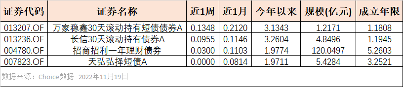
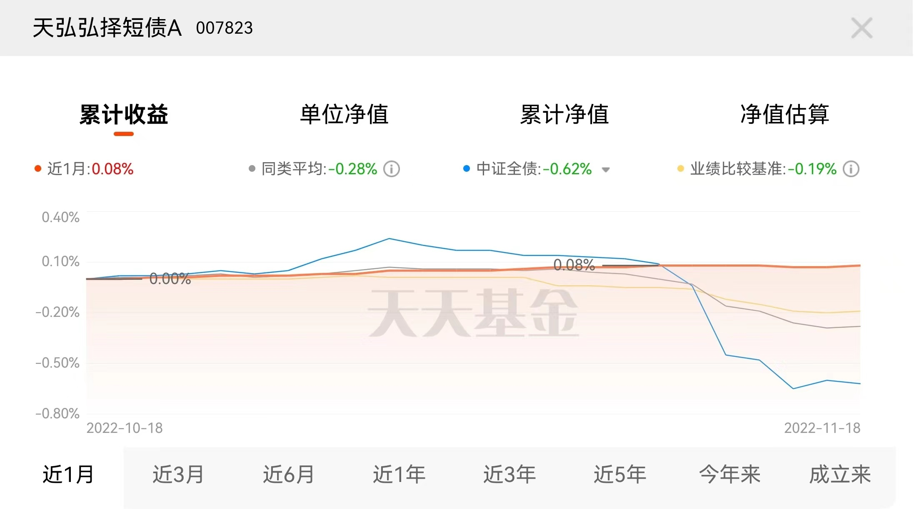

### 退潮找泳裤，债基风暴下看谁更耐跌！

这周基金圈比较大的两个事是：**证监会发布个人养老金基金名录（129只）和个人养老金基金销售机构名录（37家）；众多债券基金（含银行理财产品）近期回撤较大。**这两条新闻背后都有低风险投资者的身影，他们大多有着稳定的工作，对权益投资可能不是很懂，对投资风险也是厌恶的。

他们买债券基金就是想赚一点点稳定的收益，货币基金这两年收益率持续下滑，所以选择迁移到债券基金中来，可这些人哪想到债券市场居然还有这么大的集体回撤。或许买过权益基金的人可能觉得这点亏损没啥，但是对于低风险投资者来说他们的购买金额通常会较大，那么实际亏损额度也往往不小，再叠加他们的“风险厌恶”特质，你就能体会到这种令人糟心的感受了。
另外本周《脱口秀大会5》也结束了，总冠军呼兰在决赛里的一句话很应景：“本来人家没想裸泳，可泳裤不是被潮水带走了吗？” 基于本周的大事件，再顺着呼兰的这句台词，我们来看看债基风暴之下有哪些产品是值得关注的。

因为我们主要讨论的是那些货基迁移到债基的小伙伴，所以本文的谈论以短期纯债基金为主。下图是本周没亏钱的短期纯债，具体筛选标准是：**本周收益>=0、近1个月和今年收益>0、成立大于1年、规模大于1亿的短期纯债基金。**
 

有人说怎么才4个产品啊？其实要不是我把筛选条件放宽松那就得全军覆没了，现在大家能体会到这周债券基金市场有多么血雨腥风了吧。而且你再仔细看看前面三只是有至少30天持有期的产品，真正正宗的短债基金就剩天弘基金的**天弘弘泽短债**了。

看着这“稳如狗”的净值曲线是不有点心动了？在大家准备买之前我还是想和大家聊聊下面三个问题：这次债券市场怎么了？抗住下跌的基金有哪些特质？我们该如何面对这次债券下跌？

- 这次债券市场怎么了？

大家印象中收益稳健的债券市场上周遭遇了下跌行情，而经历了上周末有关防控和地产的相关政策消息后本周债券进入了加速调整阶段（近1个月中证全债收益率为 -0.62% 主要就是本周“贡献”的）。直至央行持续往市场投放资金，监管机构和媒体也纷纷发生安抚市场情绪后，债市抛售潮（恐慌卖出-> 券值下跌-> 产品亏损-> 客户赎回-> 继续卖出）才稍微有所缓和。

债券市场的波动以前也有，但为什么这次大家的反映这么大？我觉得主要还是持有债券（含债券基金、银行理财等间接持有）的人变多了，大家的持仓天然地决定了各自的立场。资管新规正式落地后保本基金很多流向了债券基金，另外今年股市又极其难做，很多人不得不把资金切换到一些稳健资产上来，但货币基金的收益又持续下滑，那么短债基金就成了不少股民们的避风港。

- 抗住下跌的基金有哪些特质？

很多人是冲着短期纯债基金的“避风港”属性来的，但债券基金要比货币基金复杂得多，即便这次债市系统性下跌依然有小部分产品抗住了回撤 ，那它们通常具备哪些特质呢？

1、持仓债券的短期修复：受益于防疫和地产政策的调整，前期哀嚎遍野的地产债价格在11月得到了大幅度修复，对于持有这类债券的债基就能抗住本轮的系统性下跌了。但这类产品之前有多不容易估计只有持有人才能体会，何况这种单一行业的债券价格大幅修复并不具备可持续性。

2、超短债策略：我们平时光说短债基金，其实细分一点还有中短债和超短债，所谓的“短”、“中短”、“超短”主要是债基持有债券久期的区别。简单说就是久期越短波动越小（对应的下跌风险也更小），但超短债策略的副作用是基金的长期受益稍显不足，而且像这次全品种、全期限杀跌的情况下也是效果较小。

3、国债期货对冲：这个顾名思义就是运用相关债券期货去对冲可能出现的意外下跌风险，但这个对基金经理的要求就很高了，如果运用不好会适得其反，何况这种对冲策略本身也是有成本的。

4、较高仓位利率债：针对这次主要因流动性导致的系统性下跌，如果债券基金持有较多的利率债就能很好的抗住这波下跌。因为利率债的流动性要比信用债好很多，当市场对抛售预期高度一致的时候就会加速实现这个预期，那么机构就会优先抛售流行性弱的信用债（抢跑）。最后体现到市场表现上就是利率债多的债基净值会更稳，但这个策略的弊端和超短债策略类似，就是平时产品的长期收益偏弱。

5、控制机构占比：我个人向来不是很建议大家买入机构持有占比过大的基金（不仅限于债基），在这种泥沙俱下的行情下机构持有人容易大额赎回，这种操作对普通持有人往往是带有伤害性的。而个人持有者为主的产品，持有人结构分散、交易趋同性较低，这对躲避赎回冲击有极大的帮助。这一特性上表中的4个产品都具备，天弘弘泽短债高达60多亿的规模（含A、C类），但由于天弘基金强大的互联网渠道，产品的实际持有人占比里机构只有1.75%（2022年中报）。另外3只是有一定持有期限的产品，固定的持有期限会限制机构对资金流动性的掌控，所以机构也不太喜欢这类产品。

- 我们该如何面对这次债券下跌？

我想大家最关心的还是面对这种债券的普跌我们该怎么办？首先上面也提到了，央妈已经在持续向市场投放资金了，监管层和媒体也在安抚市场情绪，等踩踏情绪缓和后净值会得到一定层度修复的。随着市场拥挤度的下降，债券市场整体偏贵的状态还会持续一段时间，相对而言我觉得短债获机构配置的热度更大，而且产品久期的下降会给基民带来更好的流动性和安全性。

我的建议是非必要勿需急于赎回，债基里面可以多关注一些抗跌性较强的产品，而这次的“退潮”就是一个很好的观察机会。当然更重要的还是我们基民通过这次事件能有所感悟：在理财产品都净值化的年代，中国已经几乎没有什么“绝对保本”的资产了，适应这种变化的投资意识升级才是我们本次下跌中更大的收获。

