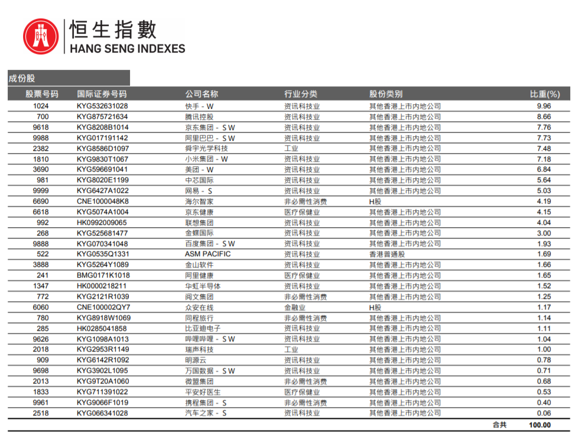

### 写在恒生科技单日暴涨22.2%后

2021年大家讨论最多的板块应该就是“碳中和”与“中概股”，一个是赚到飞起、另一个是跌到麻木。平时交流中也有不少朋友让我聊聊中概板块，去年下半年大家几乎每周都在热议中概股（不少自媒体群里也是聊中概的话题热度最高）。一来我是觉得大家讲得都不错，自己也想不到需要补充什么；二来也不是很想蹭这些个热度，即便这次提笔写恒生科技也是故意等“单日暴涨22.2%”的热度过去后才开始。当然不可否认，还有一个原因就是我比较懒，所以大家要是对恒生科技指数有兴趣，那么可以接着往下读。

> 恒生科技是一个什么样的指数？

恒生科技指数刚出来时就被称为“港版纳斯达克”，是不是很熟悉的味道？A股的创业板指和科创50也都是这么自诩的，除映衬了纳斯达克的成功外，我们也隐约能看出港股在近几年流动性困境下很希望能集结一批优质科技公司供投资者选择（港交所对生物医药企业上市条件的放宽也是如此）。

恒⽣科技指数由恒⽣指数有限公司编制，选取了最⼤的30家与科技主题⾼度相关的香港上市公司，行业限定在⼯业、非必需性消费业、医疗保健业、⾦融业或资讯科技业，业务范围需与精选科技主题⾼度相关，比如云端、数码、电⼦商贸、⾦融科技或互联⽹等。说人话就是：恒生科技指数试图纳入众多最优秀的中国互联网企业；另外用一句话试图讲清它和中概互联有什么区别：恒生科技指数成份股均来自港股且个股权重上限仅为8% 。具体到个股你会发现除了大家天天在用的腾讯、阿里、京东、美团等互联网巨头外，国内三大互联网医疗也是齐聚在内：京东健康、阿里健康、平安好医生。（2月最新成份股列表如下图）

> 恒生科技指数的特点有哪些？

**1、指数弹性较大。** 正如本文标题说的，3月16日恒生科技指数涨了22.2%，这就非常惊人了。当然这一特性是由其成份股决定的，是一个相对中性的特性。

**2、拥有快速纳入机制。** 在恒生科技的成分股里我们能看到一些上市时间没多久的公司就顺利被纳入了（科技公司瞬息万变，纳入晚个一年半载就可能完全不一样了），与之形成鲜明对比的是我们的宁德时代在创业板上市后那么久才被纳入指数（当然最新的创业板指编制规则也做了相关的调整）。

**3、便于大陆投资者配置。** 虽然现在港股通买卖港股还算方便，但当前的港股通标规则没法覆盖京东、阿里、百度这类二次上市的个股。而这类个股占恒生科技指数约30%的量，有了恒生科技指数及其对应基金产品大家就能比较容易的进行配置相关资产了。

**4、更省QDII额度、不惧退市风险。** 恒生科技指数的成份股都是港股，大部分可以通过沪港通通道完成交易，但剩余的约30%额度就需要通过QDII来投了。因此恒生科技相对于其他中概指数会更省基金公司的QDII额度，也不容易出现额度紧缺时的限购。同时由于成份股均在港股上市，企业在面对美国方面的刁难时就不太会受被迫退市风险的干扰。

> 恒生科技的当下位置与后期展望

恒生科技指数里的这些个成份股在2021年基本都经历了惨绝人寰的“鞭挞”，它们大多是主营业务在大陆，却在港股上市（或美股上市后回港二次上市），因此大陆监管的变动、港股流动性的松紧、美国的制裁刁难都会影响到指数的走向（常言道：美股跌、港股跟着跌；A股跌、港股也跟着跌）。比如互联网教育政策的实施、滴滴海量数据的安全问题、美国找茬的潜在退市名单、微信支付的合规性问题、美团作为平台方又该如何处理好店主和骑手之间的收入...

如果说上面这些干扰项“折磨”得中国互联网企业头疼脑涨，那么唯一的好消息就是这些利空都已经比较真实的体现在了股价里，甚至连同投资者情绪上的那份恐慌也已映射到了股价上。这也是为什么在副总理讲话后恒生科技能连续多日暴涨，甚至出现了单日22.2%的上涨幅度，这是典型的超跌错杀之后市场信心得到提振下的报复性反弹（两天涨了约30%）。这次讲话就是及时地释放出了信号，表明上面依然会呵护民营企业，今后一段时间在反垄断法政策的实施路径上会适度放宽些。

这里也要说明下，现在我们的很多投资者的信心是非常脆弱的，一点点的利空、利好信息都可能激起千层浪，进而引发市场的暴跌暴涨。有时候一个行业或者一家企业被内部约谈或外部刁难，那么随即整个恒生科技概念板块都会应声下跌。这就好比一个很老的脑经急转弯：树上有10只鸟，猎人开枪打死了一只，问树上还有几只鸟？答案是：其他9只也早已飞跑了。

另外通常来说政策底的出现不代表股价会立马扶摇直上，市场信心的再次构建是需要一定时间的，而股价行情的上涨还需要基本面数据等因素的多方配合。坦率地说，我认为至少近两年内是很难再回到2021年2月齐喊“夺下港股定价权”时的高点了（长期看大方向依然是上涨），这就是现实，也希望大家心里有这么个预期。

那说了那么多，肯定会有小伙伴问：作为普通投资者又该如何操作呢？我认为机会是跌出来的，只要你认可当下政策底已显现，并且有着较长时间的底部区间缓慢上行的心理准备，那么我认为是时候慢慢地定投起来了。具体的对标产品我觉得天弘基金的**天弘恒生科技指数A（012348）**是一个不错的选择，天弘基金的指数产品是值得信赖的，我也一直很欣赏其亲民的费率，近几年无论是产品数量还是产品规模都有稳步上升，这些均体现出了基民们的认可。

> 小结

虽然近期国内部分地区疫情仍有抬头趋势、海外地缘冲突也是有点出乎意料。但千万不能忽视我国今年GDP力争达到5.5%的决心（关键年份，懂得都懂），以及不可否认2022年的全球经济会进一步复苏。外加恒生科技指数在近一年的下行之后，已跌出了值得买入的价格，站在一个理性的均值回归角度上看，我认为当下的天弘恒生科技指数A是具有一定吸引力的，逐步定投等待复苏是一个不错的策略。