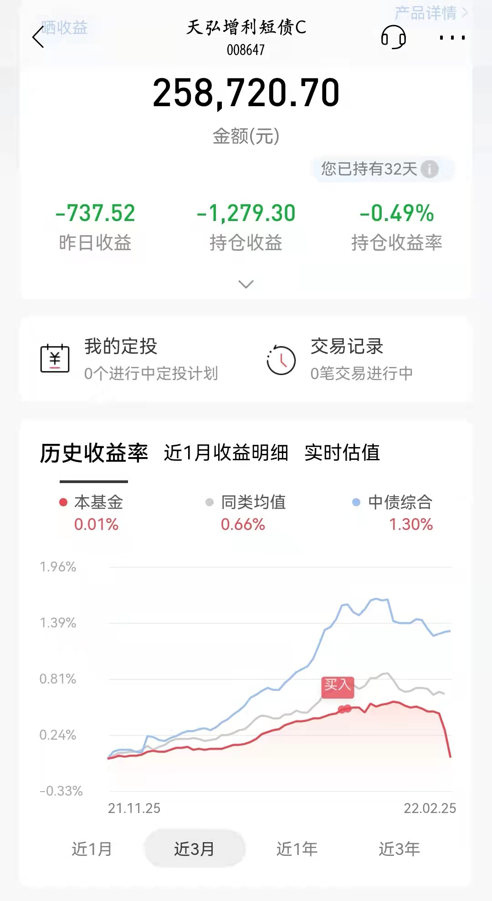
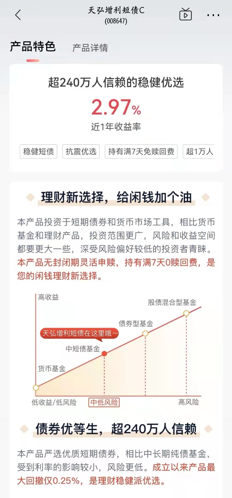
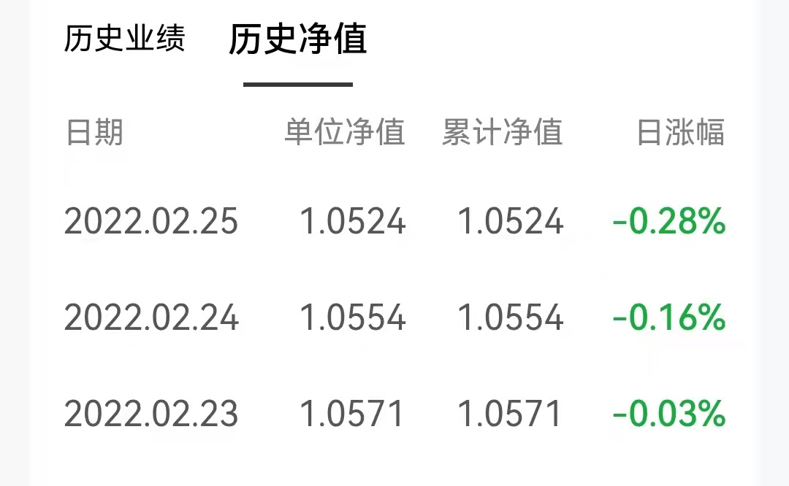
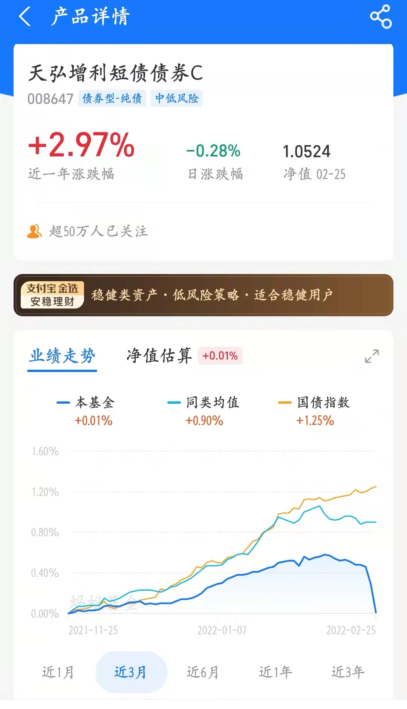
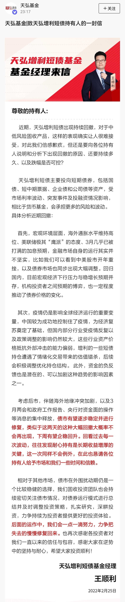
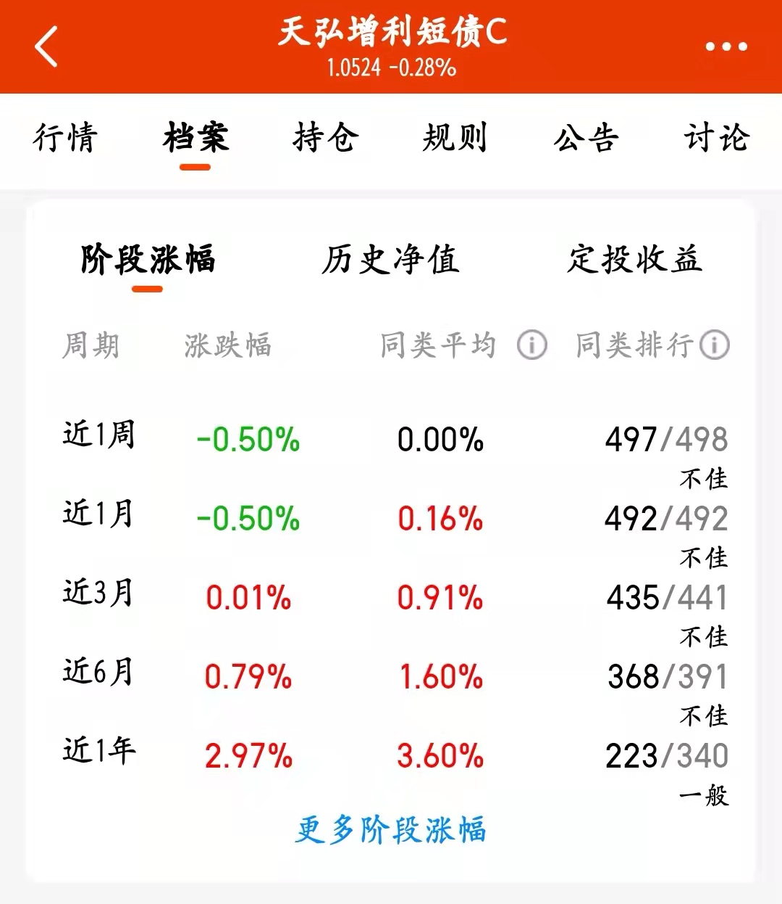

### 我被宣称历史回撤仅0.25%的债基坑了

**简单说就是：**我买了招商银行在“基金”板块“固收专区”推荐的天弘增利短债C 共计26万，该基金在招行宣传的特色是产品历史回撤仅0.25%，属于理财稳健派优选。然而我持有的这32天持仓收益率为-0.49%，最近三个交易日净值涨跌分别是-0.03%、-0.16%、-0.28%(截至2月25日)。

附图1：本人在招行持有的天弘增利短债C的仓位截图

附图2：天弘增利短债C在招行的宣传页面

附图3：天弘增利短债C近三日净值变动

附图4：我在2月10日文章里提到持有天弘增利短债C 《大过年的，买点固收+吧》

附图5：支付宝给天弘增利短债C的标签也是“支付宝·金选”-安稳理财

附图6：天弘增利短债C基金经理王顺利迫于业绩压力在招行和支付宝等平台写信致歉

附图7：天弘增利短债C最新阶段性业绩排名（春节后的跌幅让其稳拿垫底）

----- 我是一条气愤的分割线 -----

贴了一堆图，下面说说我对这只基金气愤在哪吧？

**1、以低回撤为宣传点，却给出了断崖式暴跌的业绩。**有人会说这近一周跌幅0.5%算什么？确实这个跌幅本身是没什么，但是作为一个纯债基金这已经算是暴跌了。而且这只基金在招行和支付宝等主流平台的销量还是不错的，推广力度也是不小，最新的规模显示也有123.7亿元(A\C类共计、四季度末），要知道该基金2021年中报数据显示就有高达249.86万持有人且当时规模才65.76亿元（可想而知现在的持有人更多，也足矣体现支付宝等互联网平台的销售能力）。

因为买入者对不同类别的产品预期波动是不同的，这就会影响基民购买时的仓位比例差异。你看我附图4中列的，如果我知道是含有权益资产的偏债混合基（景顺长城景颐双利A和易方达稳健收益A），我的买入金额都是5万。而且即便现在这两只也是亏损状态，但我没那么激动，因为这在我的购买预期内的。顺带说一句，天弘增利亏损比景颐双利还大，要知道景颐双利可是含股票17.08%的固收+ 基金呀。

**2、盲信平台推荐，决策过于草率。**虽说我当时买这50万产品主要也就是体验下传说中的招行服务，但如今看来在选基上还是过于草率。首先我知道招行APP内有这个固收+推荐板块是我的金葵花理财经理告诉我的，我粗略的看了下基金的推介页面后，也就没细想（我想着短债基金持仓都是短久期的债券，波动和风险都是很小，想着都是比较同质化的就没多细看）。

当然除了抱怨平台的“唯利是图”和金葵花理财经理也不过如此外，选基不利主要责任还是我自己（成年人要对自己的投资负责），即便这点亏损于我而言不是啥事，但这次教训是深刻的。（另外就是怪我偷懒了，同质化的短债基金即便我不会选，也应该分散几只买，不然也就没这事了）

**3、基金经理致持有人信有狡辩之嫌。**年后业绩暴跌，估计是迫于渠道等方面的压力，基金经理王顺利在周五晚写了封致持有人信。基金经理说因为海外地缘冲突等原因才暴跌，容我大胆的揣测下，你持仓踩雷了就直说，如果你不好意思说那也别乱甩这种锅（常识告诉我，外围的突发风险对所有短债基金都是几乎平等的，为什么就你的产品出现了暴跌？这显然是无法说服我的）。

举个例子，天弘增利持有“荣隽09优”4,977.50万元（12月31日数据），占该产品发行量的7.94%，而该标的在2月11日近期首次出现“估值大幅偏离”预警，且其中债隐含评级由AA-调整至A，2月15日其中债隐含评级由A调整至BBB+，2月21日其中债隐含评级由BBB+调整至BB+，2月22日其中债隐含评级由BB+调整至B（以上数据来自choice）。顺带说下持有“荣隽09优”的基金还有新华纯债添利债券和新华安享惠金定期债券（分别持有995.5万元）。

再举个例子，天弘增利持有“龙控09优”4,992.50万元（12月31日数据），占该产品发行量的6.36%，而在1月18日该标的的中债隐含评级由AA调整至AA-，2月24日其中债隐含评级由AA-调整至A+。顺带说下持有“龙控09优”的基金还有安信宏盈18个月持有混合、中银添利债券、财通安瑞短债、中银智享债券、中银通利债券、安信瑞鸿中短债、安信资管瑞元添利、安信资管瑞盈3个月滚动持有债（以上数据来自choice）。

我也留意了这只基金在招行和支付宝等平台讨论区下的评论，反正是各种问候基金经理的言语。看得出虽然跌幅绝对值不大，但因为是稳健产品，大家的购买量总得来说还是较大的，所以大家的气愤也就可以理解了。

> 小结

反正事已至此，我也是无可奈何，后面肯定也是先跑为敬，顺带实名羡慕下@基民柠檬 前辈在22日已经提前撤退了。

然后我自己心里对于天弘基金的固收团队拉黑一次（持仓集中、爱买烂债的基金经理要远离），债券持仓踩雷是次要的，踩雷后的不坦诚让我不是很舒服，现在市面上的基金那么多，我们下次选债券基金可以绕着点走。

最后就是对于基金销售平台推荐的产品，大家真的要擦亮眼睛！