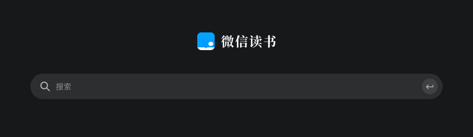

### 或将是腾讯帝国的又一利器

**“微信读书——让阅读不再孤独“**，这个是微信读书官网的一句标语。也看得出腾讯对微信读书的定位：**基于微信关系链的腾讯官方阅读应用**。

我发现经常有群里发布组建读书小队领无限阅读卡活动链接，还有什么答题活动等一堆分享福利。问了几个微信读书的老用户，他们说只要你想用，现在这些活动足够支撑你日常的免费阅读，至少短期看是这样的。微信强大的传播能力加上大量免费的优质电子书可以阅读，微信读书的用户数呈爆发式增长。

说起电子书大家第一个想到的应该是kindle,因为亚马逊以书库最全，历史最悠久而著称。kindle的电子墨阅读设备确实体验不错，在这电子诱惑泛滥的年代，还能给大家提供一个纯粹安静的阅读氛围。

因此国内就有很多效仿者，当当网和京东都有电子书商城和电子阅读器，和亚马逊一样都有手机端的APP。亚马逊后来还推出了PC版本的软件，去年又出了mac版的kindle软件，京东也有电脑端的阅读软件，但体验不如亚马逊。还有一家我没用过，但也有一定用户的叫掌阅iReader，据说口碑不错，性价比挺高。

今天主要讲讲亚马逊和腾讯（kindle和微信读书），我自己近几年都不怎么买纸质书了（除非没电子版或者这类书不适合电子版的阅读）。一个是因为我们获取信息的方式变得多样化了，所以书的阅读坦言肯定少了很多，而且纸质书又比较占地方，看完后堆放是个问题。我书房面积就那么一点，再近几年我女儿的书不断入侵后，我的书已经被压缩到角落了，甚至有一些又重新买了对应的电子书，我就打包运回老家去了。

为什么我今天想写这篇文章？早上挤地铁的时候，微信读书APP推送了一本书给我：《窗边的小豆豆》，而且是微信‘独家首发’。我在想为什么微信会推送这个给我？我之前买过这本纸质书，后来想再读一遍好给女儿讲睡前故事。但纸质的携带不便，我就在kindle上搜索没找到电子书，搜了京东阅读和微信读书都没有，有时候下班回来地铁上拿着一本粉色封面的书看，真的略尴尬。

我估计当时微信读书记录了谁搜索过，当搜索量到了一定值就去找出版商谈书的电子化，书出来后优先推送曾经检索过的用户（精准推送）。我觉得这个挺好，现在电纸书的覆盖率还不算高，腾讯能通过数据分析有针对性的逐步电子化，我觉得真的不错。之前总是觉得kindle的书库比微信全，现在微信也有独家首发的好书了，这就是我想写下这篇和大家聊聊的触发点。

最近半年发现身边微信读书的用户越来越多，前不久我还发现微信读书也出电脑版本，可以通过扫码后在浏览器阅读，实现了跨屏同步阅读。但毕竟是基于浏览器的阅读，用户体验上比kindle的电脑版软件要差一点，不知道后期会不会也出微信读书的电脑版软件。

仔细观察你会发现微信读书可能因没有历史包袱，所以整体设计更年轻化、互联网化。

- 通过不断的朋友分享获得免费读书卡，快速获取大量年轻用户。

- 接连不断的活动送免费阅读卡，进一步培养用户习惯和粘性。

- 有听书功能，有些人喜欢听书，对此是个不错的选择。

- 增加了很多特有的社交模块，比如读书排行、朋友在读、读书小队、朋友的想法、打通公众号...

你是不是这手法有点熟悉，当年微信刚出来的时候 也是举全腾讯之力，很多腾讯系小工具都加入到微信内，我记得有：邮件推送、漂流瓶...

然后再说回独家发售电子书，这让我想到的是QQ音乐在版权之争中占尽了优势。要知道在5年前QQ音乐的市场占有率还是很一般的，最多算是腾讯抑制对手（网易云音乐、虾米音乐）的一个布局。但现在你想听周杰伦的歌只能在QQ音乐，不得不去安装QQ音乐，还必须买会员，不然只能听一小段。

微信读书瞄准了现在以及未来的电子书市场，我觉得没毛病。其实腾讯早期也有过抑制亚马逊等书商的产品--QQ阅读，该软件现在依然还在运营但是没微信读书受众多。QQ阅读我在早些年我还安装过，没有给我很深的印象，但是最近的微信读书显然要感觉好很多。

**微信读书反超kindle是早晚的事，在微信这个庞大的社交群体之上，任何事物的构建都会事半功倍**。我觉得微信读书的用户体验还算不错，我也问了几个同事，还有其中有个是产品经理，他也是微信读书的重度用户，还付费买了会员。我说不是有很多免费的活动嘛？他说天天要看的，一直分享这些活动太麻烦，一年也没几个钱，就付费支持下咯。

但愿：**微信读书能成为腾讯帝国的又一利器**