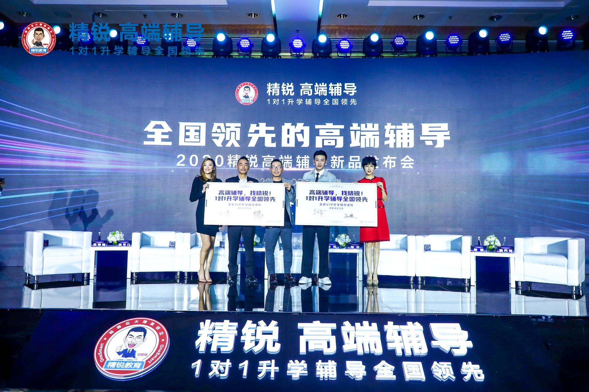
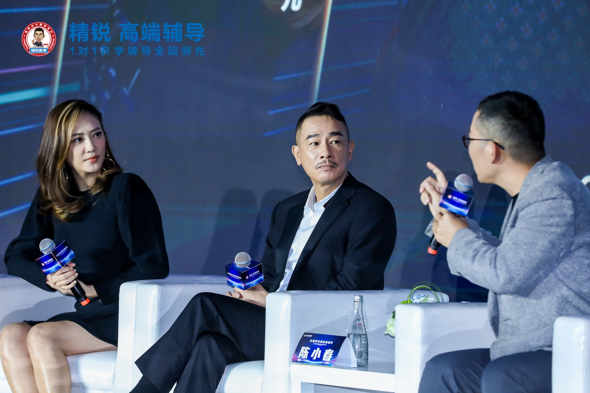
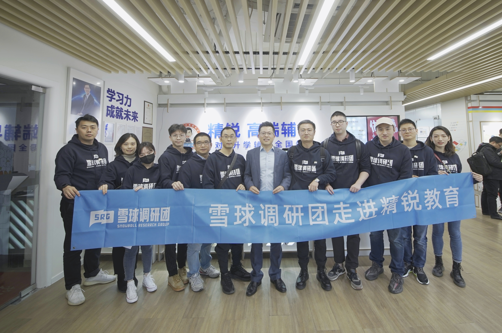

### 不会教、没时间、教不会，该怎么办？

12月2日有幸去精锐教育参加了一次调研活动，上午参观了地处长寿路的精锐教育普陀亚新中心校区，并与精锐教育的CFO等人进行了一些沟通；下午去半岛酒店参加了精锐教育的新品发布会，也看到了陈小春、应采儿、陆毅、鲍蕾四位明星家长。整个过程也是收获颇多，我就把自己的一些感受和感想记录下吧。

 

> 校区参观感受

我女儿豆豆今年已经上大班了，家门口也有精锐教育的校区，可能是我孩子年纪还小，平日留意的只有精锐的‘至慧学堂’这个系列。所以这次去亚新校区参观后，还是有很多出乎我的意料之外的认知，我不知道是现在的孩子都是这么补习冲刺了，还是上海的学生以前也是这样的？

精锐教育主打1v1教学模式，可以看到1v1的教室略显狭小，目测每间不超过一平米，隔间内有一块白板、一张小桌子和两把椅子，这个小隔间不单是学生上课的场所，也是老师们备课的办公地点。但这次新品发布会的VIP产品所对应的教室就大不少，桌子也大了很多，椅子有三把且坐下后周边间隙会很宽敞，房间内还有一个可视频的电视。当然精锐教育给最新的VIP课程定价也更贵，是传统1v1课程的约1.8倍。同时我们也可以通过教室数量的分布了解到：在未来一段时间内，存量的1V3和现有的1V1以及新推的VIP课程都会共存。

> 与CFO等人的沟通

1、对于企业将来的成长是众多调研人员比较关心的，多人从不同角度发出了相关的疑问。精锐方面的解答是：精锐教育1v1课程的主要目标客户是中国**前20大城市的中产以上家庭里的那些中、高考冲刺学生**。具体看精锐现在的学员数与整个市场的潜在客户数（中国最大的50个城市约有150万K12的孩子）来说，所谓的天花板问题根本不存在。随着大城市生活水平的提升，将来会有更多的家长们有能力、有意愿为孩子拥有更好的1v1教育服务而买单。再对于产品这块是，超大城市会基于产品和服务升级带来的红利保持稳定增长，而普通大城市就着眼于品牌在当地站稳后的新店拓客。

2、因为1v1辅导的特殊性，很多嘉宾都问到了关于**教师流失率以及相应的客源带走**的疑惑。精锐方面的解答是：单个老师同时服务的学生大概为9~11人，而且大多为要中、高考的学生，平均报课时间也就9个月。一个老师即便把手里的学生都带走了也会很快就消耗完，何况学生也很难全部带走。因为家长们选择精锐教育的初衷，很大程度就是看中了精锐的品牌实力，而不是单单某个老师。当然问答期间亚新中心店的店长也有提到，精锐对于九星以上的教师也是有股权激励的，这是校方对优秀教师的一种认可和嘉奖。同时精锐也表明：老师队伍的供给不是问题，留住年轻的优秀老师才是关键，因为这种教学模式对老师来说也是很高压的一种工作状态。精锐称他们给到老师的待遇比市场平均水平高50%，并且很注重老师教学成就感的培养，一方面是教学技能和评级的提升，另一方面是授课学生取得优异成绩后的满足感。

3、精锐教育在在线教育方面的占比很小，但在疫情期间收购了一家较成熟的在线教育机构，借助于其在线平台和技术，让部分学员在疫情期间依旧可以较高效的完成学习任务。这方面和精锐对待加盟和直营的态度类似，整个精锐品牌都是全直营，但CFO也提到在部分二三线城市会入股少量的中小型教育机构，那些机构里部分存在有加盟模式的，但也只仅限于财务投资。这点我认同精锐的做法，对于一个走高端辅导课程路线的教育机构，坚持直营和坚持线下面对面辅导是极其重要的。家长都愿意担负这么高的学费，就是希望能获得精准的辅导效果，而前面说的**线下真人和直营质保是基础**。

> 新品发布会

 

 

精锐教育下午的新品发布会是在半岛酒店，发布会的规格还是可以的，包括明星家长的到来也将发布会推向了高潮。精锐教育给自己的定位就是高端教育辅导，这个定位不是演化而来，而是这个品牌诞生的时候就如此了。那如上面讲到精锐教育的客户主要还是中产以上的家庭，那他们面对子女教育问题的时候有哪些痛点呢？

- **不会教**：即便父母都是受过高等教育的，但现实就是小学三年级以上的课程你很难会教了，就更别说自身教育程度一般的家长们了。

- **没时间**：精锐教育主要布局中国前20大城市，这些城市的父母工作压力也是普遍极大的，在生活工作之余真的很难有稳定的时间再来辅导孩子的学业了。

- **教不好**：抛开上面的两点，即便家长自己会、也能硬挤出时间辅导孩子，但这种学科短板补齐、中高考冲刺辅导是需要很强的专业性的，要真的教好是极难的。

抛开上面三点，其实还有一个很重要的问题：**家长角色限制**。因为父母这个角色就注定了很难在这类教学上帮到孩子，这个点我觉得只有做过家长的成年人才能体会到。那种恨铁不成钢的无奈，想责备又怕打击孩子学习积极性和自卑问题，不吼出来又容易憋出内伤。每当孩子好不容易完成作业睡觉后，自己作为父母却躺着久久不能入睡，甚至有时会诧异自己的子女为什么会这般榆木？

只要你背负着这份‘枷锁’去辅导孩子，那最终的效果肯定是很糟糕的。而专业的老师就不一样，除了角色上的无负担外，学生面对老师的威严自然比面对父母要好的多得多。关键专业的老师同时也是一位合格的心理辅导员，如若孩子学习上的不足是和家庭环境有关，那这时候老师的开导或许就能从底层上解决问题。

> 小结

我觉得精锐教育这种主打个性化教育服务是可行的，中国一线城市对高端K12一对一服务的需求也是会越来越大的。精锐教育通过不断地升级产品，以此来提供更优质的服务给学员们，从而赢得消费者的认可，这套逻辑也是能说得通的。但精锐教育的定位就注定了会极度依赖线下教学，上半年疫情的影响已经体现在股价上了，那么后疫情时代呢？毕竟疫情正切切实实的改变着人们的衣食住行！

最后还是要感谢雪球网提供了这次调研的机会，希望后面可以有更多类似学习的机会。

 

