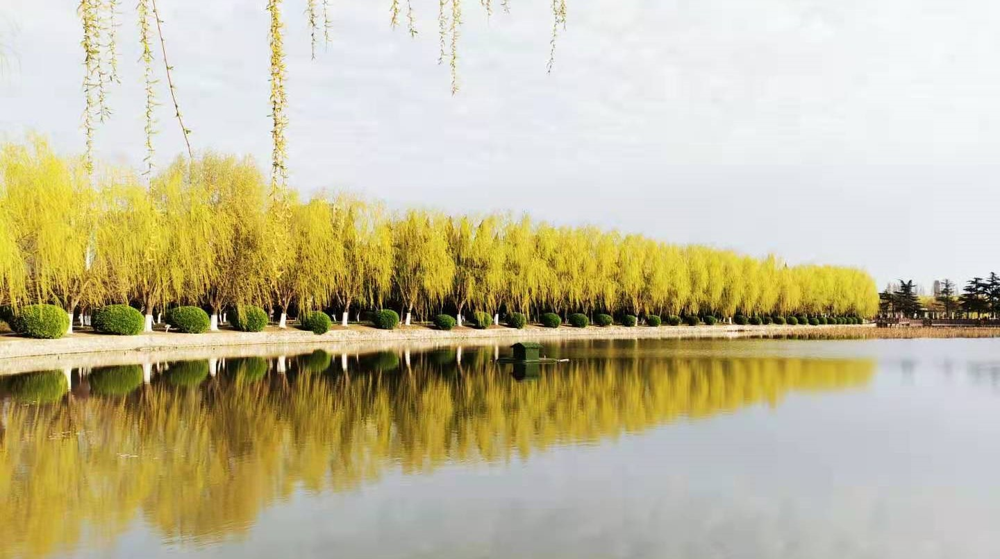
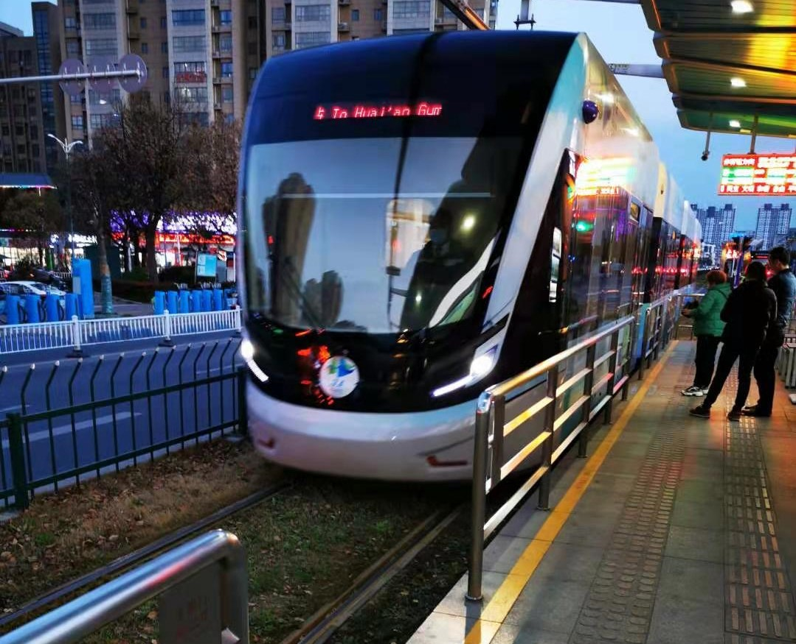
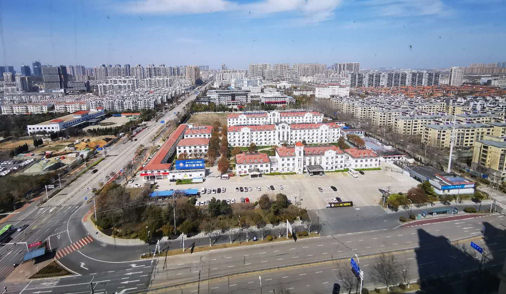
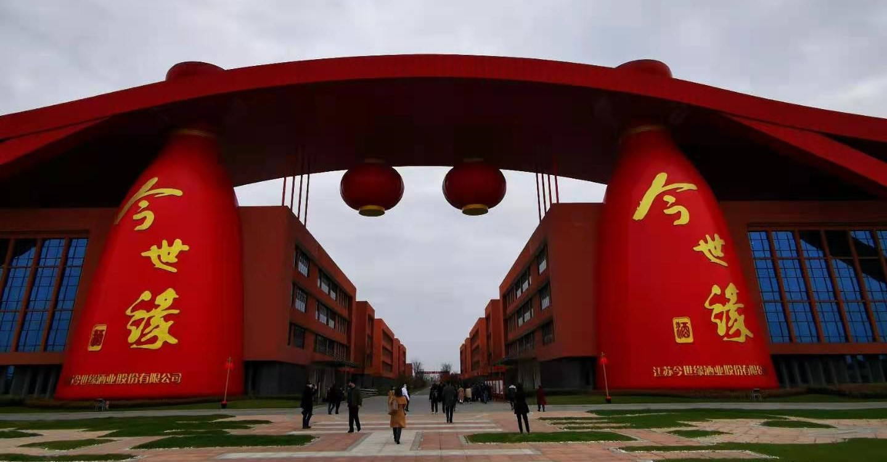
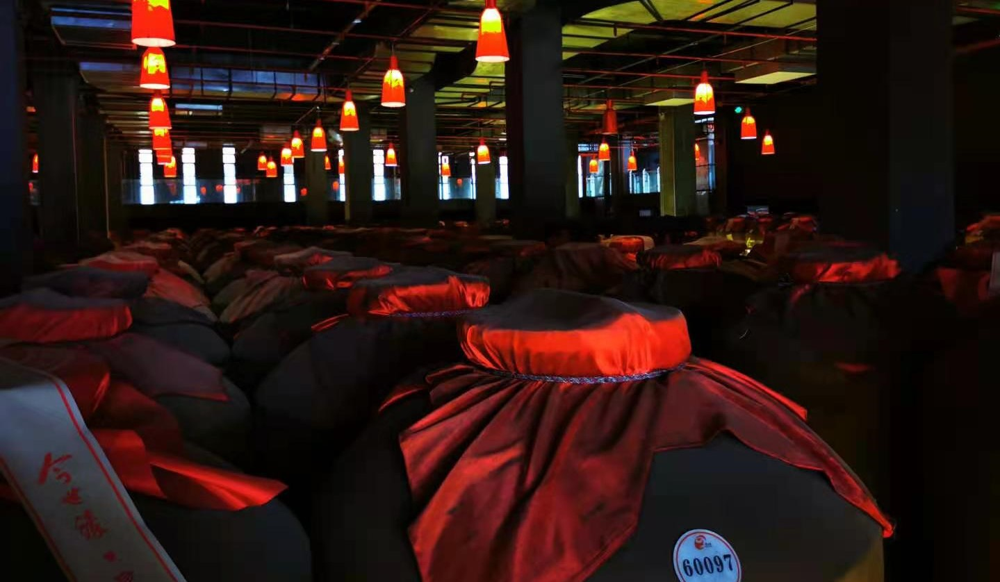
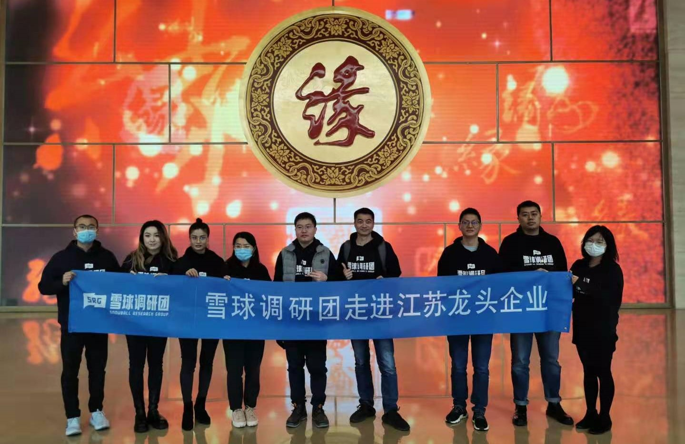

### 开门见缘、抬头见囍

说来惭愧，我身为江苏人以前都没来过淮安，这次来也是随雪球调研团参观今世缘。我想这次分三块来分享下此行的所见所闻所想，分别是：淮安游玩见闻（仅对企业有兴趣的可以跳过这一部分）、今世缘调研行程记录、今世缘活动后的一些感想。

> 淮安游玩见闻

为什么要先聊淮安的游玩见闻呢？因为白酒这个东西还是很有地域性的，这种地域性往往与酒厂所在的地理位置以及风土人情有所关联，为此我到了淮安后抽了大半天时间在外面溜达了下。下面就我的一些所见所闻与大家做个分享：

**1、旅游景点略显匮乏。**最广为人知的应该就是总理故居了，其余的好像还真没有啥想去的欲望。而且坦率的说故居和纪念馆也基本上是文字式景点，看完有些感触，但也就这样吧。好像江苏的很多地级市都会有这个旅游景点匮乏的问题，我去过的城市里面景点还蛮多且可以玩几天的有：南京、苏州、无锡、徐州（没被我列出来的也仅可能是我没怎么去过）。太阳落山那会我正好从纪念馆出来，看到池塘边的一排垂柳在夕阳的映射下格外漂亮。

**2、交通工具的多样化体验。**淮安暂时没有地铁，但是有一条市内有轨电车。我打车去故居的时候听出租车司机抱怨：造价很高浪费老百姓钱；车速太慢运载效率很低；占用市区很多优质且稀缺路段的道路资源；每个路口都要安排人员进行疏导，人力维护成本极高；交汇路口车辆必须避让其优先通行。我听着也觉得蛮有道理，所以回去的时候我特意选择这个交通工具体验下，一句话概括就是出租车司机讲得对。我上大学那会去盐城找同学玩，那时候体验过盐城的BRT（快速公交系统），现在很多没有地铁的城市搞这些个替代品我是能理解的，但是淮安这个真的还远不足BRT来得效率高。城市交通建设很重要，我们应该优先考虑运载效率，因为这才是很多城市修建地铁的本质：高效延伸城市半径。

**3、城市人口密度不大。**淮安我是第一次来，比我预想的人口密度要低很多。起初我以为是酒店附近略偏僻，后来去市区一看也没有太多好转。年轻常住人口流失是很多中小城市的问题，我们南通也是大批年轻人都挤到了上海、苏州、南京等更发达的城市，因为那里有更多的机会和生活便利。面对一线城市的各种“抢人”政策，二三线城市有时候真的很无奈，年轻人才的大量流失就意味着这个城市未来的发展前景会很稀薄。

> 今世缘参观记事

到了厂区（高沟）后一下车就是扑面而来的酒香味，不是平时喝到成品酒的那种气味，有点像腐乳的感觉，同行调研过多家酒企的朋友说每家都这味道。因为这次活动是有江苏省证监局和江苏省证券业协会参加，还有一些券商（东海、华泰、东吴、国联、南京证券）的投资者参与，所以流程上还是很标准化的。各级领导发言、企业高管介绍，投资者互动问答这些环节，问答环节也是中规中矩，好在我们雪球调研团后面有了一个多小时小范围单独问答的机会，这个还是不错的。包括后来晚上吃饭的时候，讨论问题的氛围就更轻松了些，那些中规中矩的内容我就不再累述了（已经有别的大V做了记录），另外大家也可以观看当时的活动直播，我就着重讲一讲在整个参观调研过程中的一些感受认知吧（部分不方便发的只能删除了）：

1、今世缘的浓香型酒属于淮派浓香，与五粮液这样的川派浓香有所不同，今世缘的浓香酒定位是“淡雅”。

2、国缘V9作为今世缘的最高端产品属于酱香型白酒，这个也略不同于茅台的酱香型，今世缘酱香酒的定位是“清雅”。

3、今世缘一直致力于省内白酒市场的深耕，在面对兄弟公司洋河的时候，会有意无意的避开了对方的价格区间，在对标的同时又做到了差异化。

4、今世缘在南京市场的成功是天时、地利、人和的结合，但每个地级市的差异性很强，所以对于不同城市的商业化团队需要有针对性的调整。

5、今世缘对于收购其他酒企的态度是：不强求、不主动、不排斥、可互动。

6、今世缘在外省的推进主要还是依托本地经销商，在省内采用深度协销的厂商合作模式。

> 今世缘活动感受

我们中国人在新中国成立后饮用白酒的偏好其实一直在变化着，最早是清香型为主，后面沿袭到了浓香型白酒，现在已经发展到了酱香型为盛。为什么会这样？今世缘董秘王卫东先生给出了一种解释：建国初白酒还是很稀缺的，那时候出酒率最高的清香型酒最受欢迎；随着改革开放的发展，生活水平的提升后对饮酒的香气要求有了要求，这时候浓香型的白酒就开始大举占领市场；进入新世纪后饮酒时对口感的追求又上了一个层次，这也导致了酱香型茅台成了万千宠爱。同时王卫东先生还指出：现在的年轻人开始更注重饮酒后的体验，简单说就是第二天醒来会不会很难受？这个趋势对于走清雅、淡雅为路线的今世缘来说是一个机会。

最后还是感谢雪球调研团的这次组织，让我们能近距离的参观上市公司，收获颇多。

