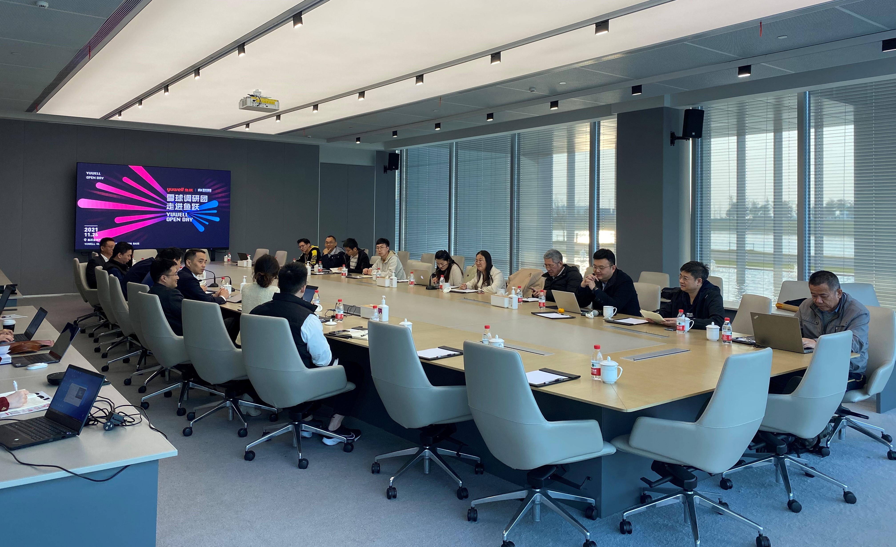

### 清晰赛道规划，抓准“银发经济”

人们往往只有在经历过一些事情后，才能对某些概念有更深入的理解。就拿我国老龄化进程加速后的“银发经济”市场机遇来说，这么一个耳熟能详的理念我在双亲即将步入退休年龄才深切体会到就在你我身边。比第七次全国人口普查那些冷冰冰的数字更让我惊叹老龄化到来的，是自己老母亲的高血压，是丈母娘的高血糖，是爷爷辈的亲戚渐渐离开了我们。

我从小是农村长大的，深知村里的老一辈人遇到大病基本上就不治了。也时常哀叹，**即便是改革开放40多年后的今天，村民们基本上也没有每年体检的意识和条件。**当然还是要感谢改革开放这40多年祖国的繁荣发展，农民有了最基本的新农保，我父母那代人的健康意识已经显著提高，我这种生长在改革开放春风里的85后对自己及家人的健康还是非常在意的。

说个具体的小事大家就都能明白了：我爷爷辈有三高病症的人其实也不少，但基本上都是不倒下不轻易去医院的；到我爸妈这一代就会有一些体检意识，如果已经查出有三高症状了也会比较积极地就医和用药，并定期检测血糖、血压、血脂等情况（即便有时候会懒得测，但在子女督促下基本上也会很好的坚持下来）；我们这代就更不用说了，每年的职工体检是标配，甚至不少员工也愿意自己加一点费用针对性地加一些体检项目。

所以**作为投资者我非常在意一些老年人长期慢性疾病的相关产品，随着人均寿命的增长、百姓健康意识的增强，这个市场现在以及将来都是一片光明。**在得知雪球调研团有走进鱼跃医疗的活动后，我第一时间就报名，在此也感谢调研团的组织，下面就我上周在走进鱼跃医疗后的一些感想和大家做个分享。

> 明确呼吸、血糖、感控三大核心赛道

鱼跃医疗相较于三诺生物（血糖）和九安医疗（血压）它的产品布局显然更全面，虽然鱼跃的制氧机已经是世界前列了，但你会发现鱼跃的家用血压计和血糖仪甚至连体温计都有不错的市场占比，所以在这样的背景之下鱼跃强调三大赛道的战略是有必要的。

其中血糖这块今年5月刚收购了浙江凯立特50.993%的股权，这一步棋使得鱼跃在拥有了传统血糖仪之下又切入到了连续动态血糖监测（CGM）领域。与BGM 不同，CGM 监测的是细胞间体液中的葡萄糖含量，通过24 小时连续监测获得身体葡萄糖水平的趋势数据，提供更加全面的血糖信息。这就可以发现易被传统检测方法忽略的高血糖和低血糖，亦有助于更精确地调整用药改善血糖水平。这个CGM技术研发是需要想当长时间的，对于现在的鱼跃来说，直接控股一家已有成熟产品的公司也是比较“经济”的一个解决方案，要知道国内血糖仪领头羊三诺生物为此也研发了很久，且其研发成效也是较为缓慢。

我妈曾经做过24小时连续监测的血压，要去医院装一个血压监测设备带回去，然后第二天去医院拆下读取数据（这个全天候的数据对诊断高血压更精准）。这主要是因为血糖、血压这类数据是会随着一天的作息有较大波动的，我们常说的血糖是指早晨空腹血糖值，对于糖尿病患者频繁扎手指确实体验不太好（我老婆怀孕期间糖耐测试数据稍微有点异常，住院观察三天那会她每天要被扎好几次手指，至少我本人是极讨厌扎针的）。将来伴随着连续动态血糖监测仪的普及，可以在家就能完成连续监测血糖，现在比较成熟的技术已经可以做到14天以上。

连续动态血糖监测的市场前景还是很乐观的，但同时我们也看到这块市场主要是以雅培为首的外资品牌所占据（2020年国内CGM市场雅培一家就占了80%，美敦力以及其他国产品牌占剩下的20%）。想来也辛酸，即便国内已经有圣美迪诺、美奇医疗、普林斯顿、移宇科技、凯利特这些产品获批，但目前依然无法撬动雅培这股外资品牌市场。

而鱼跃医疗的感控这块主要就是2016年和2018年两次收购的上海中优医药，中优医药产品主要为手部与皮肤消毒产品，以及其他器械的消毒产品（据我观察中优旗下的洁芙柔免洗消毒洗手液在上海的医院内是相当普及）。2020 年，由于对消毒感控产品的需求快速飙升，子公司中优医药实现营收9.57 亿元，同比增长53.13%；为母公司贡献利润2.62 亿元，同比增长64.71%。

新冠疫情让大家强化了勤洗手的好习惯，也给中优医药的利润带来了转折。在后疫情时代“洁芙柔”不仅在医院占据很高的市场份额，在线上平台也销量领先，淘宝该产品月销1 万+（这里插一句，在小吴总加入到鱼跃医疗后就一直大力推进线上销售，也确有成效）。随着人们消毒意识的增强，公司感控产品凭借其本身的品牌优势应该可以继续维持在此领域的优势地位。

最后呼吸机这块，呼吸治疗解决方案板块是鱼跃历年来重点布局的板块。2020 年受全球新冠疫情肆虐的影响，制氧机与呼吸机作为重点抗疫产品需求激增。鱼跃的呼吸产品知名度显著提升，制氧板块收入大幅上升，去年实现营收22.60 亿元，同比增长84.08%。我国当前家用呼吸机市场规模仍处于发展阶段，随着慢性呼吸疾病患者数量的增加、销售渠道的优化以及居民健康管理意识的增强，渗透率有望进一步提升。而鱼跃医疗在制氧机生产领域，作为行业标杆势必将引领行业更好的发展。

但是中国医用呼吸机市场存在和血糖仪类似的局面：外资品牌占主导地位。飞利浦占34.6%、瑞思迈占32.5%，后面才是国内的怡和嘉业占6.1%与鱼跃医疗占4.6%。好在鱼跃呼吸机产品还可以依靠高性价比和渠道优势进一步提升在客户群中的渗透率，这块业务业绩也值得持续关注。

> 要做“格力”还是“美的”？

上面我们提到鱼跃医疗貌似覆盖的面很广，除了前面说的三大主赛道其实还有轮椅、眼科器械、血压仪、体温计、针灸针等。这就与九安医疗、三诺生物走上了不同的道路，而且三诺为获得CGM的“核心技术”是自己动手研发的，而鱼跃又是买买买的熟练操作。

说到这大家是不是脑海里浮现出了“格力”、“美的”两家企业，我不知道大家更喜欢哪种模式？反正家电行业我选择持有美的，而医疗器械我是鱼跃和三诺都有一点点仓位。另外我们也不能忽略，正因为鱼跃具备更全面丰富的产品线，才使得其市值要比九安和三诺大很多。

其实仔细看你会发现，鱼跃和美的还是有不少相似之处的。比如都是从家族企业成长起来的，都是从初级产品起家慢慢做大，依托大势进一步做大做强，产品的技术壁垒不算很高但有较好的家用性价比，陪伴着我们家庭生活的方方面面。

> 聊聊这次走进鱼跃的一些感受

鱼跃作为我们江苏的上市企业，其实早在疫情之前我就有一定的关注。这次去的是镇江丹阳的鱼跃全球生产基地（就在高速口边上，交通非常便利），见到了85后董事长+90后董秘+年轻化高管团队。这个调研接待规格是蛮有诚意的，大家问得问题也得到了最大程度的解答，大家对于在小吴总带领下的鱼跃医疗总体上还是很满意的。

期间我们参观了客服中心、多个生产线车间、网络销售直播间、多个仪器数据测试实验室，整个生产基地的环境也是非常的棒，讲解员也坦言在这里上班员工们幸福感都很高。

生产基地的自动化程度也做得挺好，但从进一步降本增效的角度还是有更上一层楼的空间，部分环节还是可以继续缩减工人密度。期间 @米来大道  老师吃饭时和我说的一句感觉挺对的，大意如下：鱼跃主要做的是医疗器械，不仅是为了降本增效，也因为要兼顾海外市场，那么高度机械自动化必然更可靠，海内外市场也会更认可。

调研另一个的有趣之处在于你不仅可以走进企业看看一些财报之外的细节，也能接触到不同类型的投资者，多一点学习和见闻总归是好的。最后感谢鱼跃的此次接待，也感谢雪球调研团的组织。

相关利益申明：本人发布文章此刻持有文中提到的鱼跃医疗、三诺生物、美的集团，故本文难免有“屁股决定脑袋”之嫌，文中所有观点仅供参考。投资有风险，入市需谨慎。

