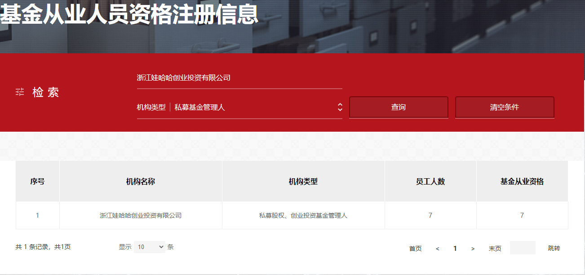
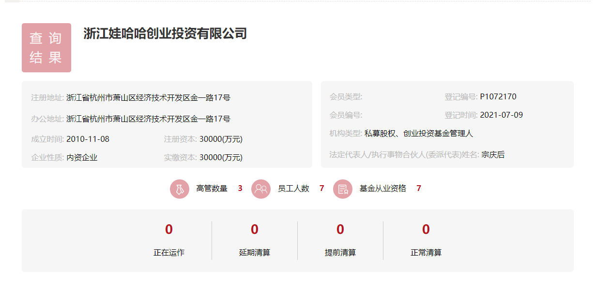

### 卷！宗庆后这把年纪仍获基金从业资格

上周五我还发帖说9月份的基金从业考试报名要延后了，当时还有朋友下面留意问我这个考试有没年龄限制？我说应该没有，毕竟 @持有封基 老师今年也去考试并通过了。

更卷的是已经75岁的娃哈哈创始人宗庆后，在基金业协会官网公示中可见其已获得基金从业资格（资格认定），所以看看企业家前辈，我们还有什么理由不努力。

然后好奇心驱使我顺手查了下相关信息后发现：宗庆后所挂靠的机构是“浙江娃哈哈创业投资有限公司”；基金业协会给它的分类是“私募股权、创业投资基金管理人”；该机构一共7位从业人员，仅宗庆后一人为男性员工。

浙江娃哈哈创业投资有限公司其实早在2010年11月就注册了，但基金业协会备案通过时间是上个月（2021-07-09），法人代表宗庆后、注册实缴资本3亿元、员工7位（均持基金从业资格）。

通过爱企查可见该公司股东为杭州娃哈哈宏振投资有限公司（90%）和宗庆后老婆施幼珍（10%），经营范围：股权投资；创业投资（限投资未上市企业）；私募股权投资基金管理、创业投资基金管理服务（须在中国证券投资基金业协会完成登记备案后方可从事经营活动）；自有资金投资的资产管理服务；企业管理咨询；信息咨询服务（不含许可类信息咨询服务）；企业管理(除依法须经批准的项目外，凭营业执照依法自主开展经营活动)。

近十年浙江娃哈哈创业投资有限公司除设立分公司进行投资外，公司多是参与投资分公司设立进行投资，也作为出资方间接参与其他基金的投资，涉足领域包括人工智能、新零售等，但十年来一直没有以私募管理人的身份介入创投。根据相关规定，浙江娃哈哈创业投资有限公司这次协会备案后成功后，需要在半年内发行产品，后续可以再关注下相关动向。

