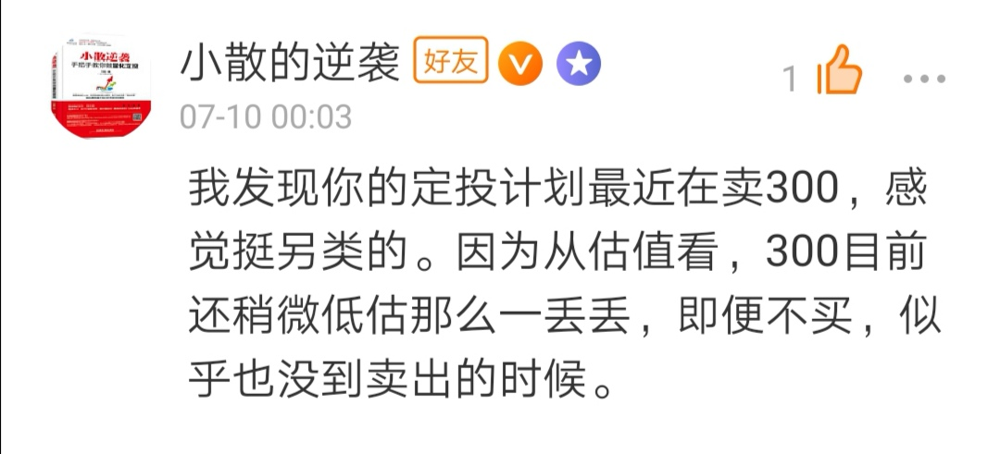

### 为什么我现在还在卖出沪深 300 指数

本文起因于雪球上 @小散的逆袭 给我的一段留言：

我当即做了较长的回复，今天想着趁这机会再展开说说，因为也有别的朋友问过我类似的问题。

我认为要做一个合格的投资者，先学会知行合一是非常有必要的。我们在考虑是不是该卖，得卖多少的时候？先去想想当初依据什么买的，现在到了当初设定的卖点或者卖出条件了吗？

所以我现在卖出沪深 300 就是和我当初制定的策略以及我采用的估值纬度有关。很久以前也专门写文章讲过我的定投的理念，此刻让我们一起简单回顾下我的定投策略以及估值维度，正好也是对自己过往的一个校正。

因为我对财报是天然的不信任，我大 A 股的财报更是良莠不齐。所以我倾向于指数化投资，规避非系统性风险；又通过相对估值，即 pe 或 pb 的历史百分位去衡量是否低估，把财务修饰的弊端降到最低。

顺带说下我的百分位取的是全量，不像有些人估值的时候选择近 3,5,10 年这种。为什么？因为存在即合理，有些人会说我大 A 因为历史原因，太早的数据没有可比性。我认为任何一个存在都是合理的，只要当时指数规则也是如此，我们不该人工去筛选，不然就违背了被动投资的基本理念了。如果有人反驳这个点，我就问：你是选 3 年数据好？还是选 10 年？为啥？

再说我的买点和卖点吧，因为我比较保守，所以 20%买入，10%加倍买入，20%-30% 为持有，30%卖一份，40%卖两份，50%开始把剩余份额按 10 个周期卖出清仓。

不要问我凭啥这么界定买卖点，因为任性。

不要和我说我卖得太早，以中证 500 为例子，我已经买入得足够多了，到时候我就怕来不及慢慢的卖。因为历史规律 50%以上的速度是非常快的，可能也就 1-3 个月的时间，这也是为啥最后 50%就开始 10 等份清仓了。

现如今仔细想想我也不是什么价值投资派，价值投资是买入后，你觉得它以后还会有更多的价值体现出来，或者说现在投资物身上有很多没被别人发觉的价值点。

而我呢？只是在赚取市场**波动的差价**。如果你问我什么是交易中肯定存在的？那肯定是波动！

那我们再总结下我们这种赚差价薅羊毛的策略有哪些前提，有哪些注意点？

-   投资标的须具有永久性或类永久性（沪深 300、中证 500）
-   交易成本尽可能的低（低费用指数基金）
-   用闲散的钱去定投
-   具备稳定的现金流
