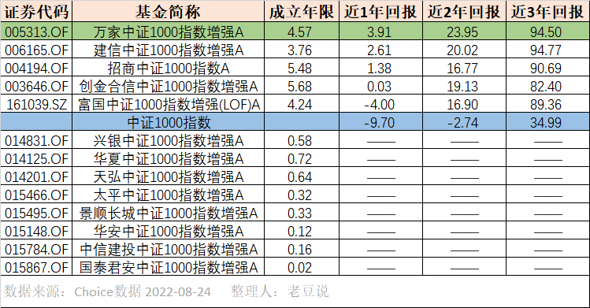
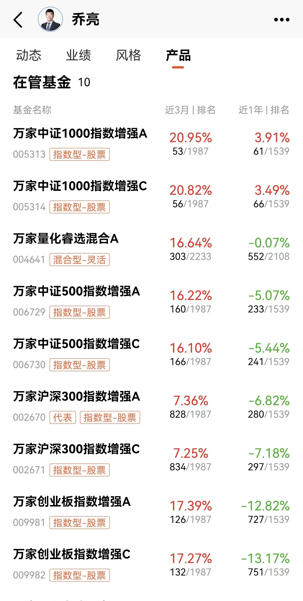

### 中证1000很对量化模型的胃口

上周五有幸参加了雪球基金调研团的第一期--万家中证1000指数增强（乔亮），我听后感觉有不少收获，想来还是与大家做个简短分享。

众所周知今年宽基指数里的头等大事就是中证1000指数股指期货和期权在发布征求意见稿一个月后的7月22日挂牌交易，中证1000指数期货期权的推出为健全和完善股票市场稳定机制做出了重大贡献。而且不同于以往的是，这次中证1000的股指期货期权是同时推出的（沪深300的期货和期权相隔9年、中证500的期权到现在还没推出），不仅体现了监管层对于此次产品推出后能平稳运行的信心，也透露出国家想对于中小微（专精特新）企业通过股市再融资支持的迫切。

中证1000股指期货期权推出后各家相关ETF真是卷出了天际，从募集到上市各种厮杀。新出的四家（易方达、广发、富国、汇添富）是各显神通，老三家里出了躺平的华泰柏瑞，华夏和南方也是干得热火朝天。但你要是把时间线拨回6月底前，会发现中证1000指数相关产品的规模都不算很大，而且更多的还是场外指数增强基金，毕竟中证1000是主流宽基里最好做增强的指数了。所以这次中证1000股指期货期权的推出不仅助推了相关场内ETF的行情，也是给到了舞台让更多基民看到中证1000指数增强基金的闪光点，其中不乏有很多业绩出彩的产品，譬如本次调研的主角--万家中证1000增强。

> 中证1000做指数增强产品的优势

有一定投资经验的朋友都知道中证500增强肯定要比沪深300好做，而沪深300增强又比上证50要好做得多。还有人说中证1000是最好做增强产品的宽基指数了，那我们就来盘点下具体有哪些优势。

首先从成分股来看，中证1000的成分股具有数量多、市值小、行业与风格分散、机构覆盖率偏低等特点，这些特性就很对量化模型们的胃口，经过量化后的超额收益空间也会更大。量化模型通常会根据一些指标对个股进行高效分析，投资标的的广度就是量化策略的优势，这也是为什么上面说中证1000指数要比沪深300等宽基更容易做出效益。

再展开说就是，我们常见的量化策略分为：发现并交易预期差、基于市场变化反应的量价交易策略。与沪深300和中证500指数比，中证1000的机构覆盖率无论是成分股的个数占比还是单只股票覆盖机构的数量都要少很多，这就给市场资金发现并交易基本面预期差带来更多可能。而此次中证1000期货期权的推出也促使相关个股的流动性得以提升，再降低指数波动率的同时也更利于实现有效价格的发现。另外量价策略其实就是依托于交易者面对市场变化时反应不足或反应过度的短线高频交易策略，而中证1000的行业与风格比较广泛，外加参与该指数成分股的投资者类型众多，这些都会提升量化模型的有效性。

而且中证1000不会存在沪深300那种个别个股权重过高的问题(中证1000个股最大权重0.62%、沪深300个股最大权重6.09%)，指数增强产品需要基于指数本身的增强，那么个股的权重过大就会使得组合调整空间就小很多，进而降低了量化模型的有效性。总得来说中证1000指数成分股数量多、市值小、行业与风格分散、机构覆盖率偏低等特点非常适合做指数增强产品。

> 中证1000指数增强基金的危与机

中证100指数适合做增强产品这个事上面一段已经阐述了，而衍生品的推出让市场对中证1000指数的关注度明显提升，吸引了更多资金的注入后，对应的产品也开始向主流靠拢了。下面我们再聊聊股指期货期权推出后对中证1000指数增强产品的危与机。

1、降低市场波动。衍生品的推出有利于降低市场的波动性，当市场预期高度一致时如果没有衍生品的对冲，那么市场就很容易暴涨暴跌；

2、发现有效价格。期货期权的参与者交易的目的其实很多元，这就有助于扩展市场的定价维度，让市场能更为有效和稳定；

3、丰富投资策略。虽然中证1000的超额收益容易做，但其自身的波动性也非常大，那现在有了衍生品后可以通过一些策略使得投资者专注于股票超额收益的投资，规避开对于向下波动的“厌恶”。

说完了机遇，我们再聊聊随着中证1000相关产品受到高度关注后，大家对于未来的一些担心吧。我归纳了下大家主要有两大困扰：随着越来越多资金的流入，中证1000的量化基金是否面临同质化压力？另外就是大家对于策略容量的担忧。

我们先说量化策略同质化压力，虽然说大家基本都是靠量化来增强收益，但其实各家的阿尔法因子事不同的。就好比两个奥赛金牌得主，一个是数学金牌、一个是物理金牌，两者不会有直接的冲突。另外公募和私募的行业特性也决定了两者量化的维度是不一样的，公募量化偏向于以基本面为主赚取的是长期增长的超额收益，而私募更多的是高频量价策略赚取的是交易者面对市场变化时反应不足或反应过度的钱。

接着是策略容量的问题，本文主要讨论的是公募的量化，而公募量化上面也说了，主要是基于基本面的策略，那么换手率其实不会很高，也就意味着资金承载量其实远没到天花板（反而相关私募需要注意这个问题）。然后你细想下，这个容量的上升其实也不全是坏事，当越来越多的投资者参与到这个市场来后，很多α收益就会慢慢转化成β收益。

另外我要指出的是，与其担心策略容量问题，不然多关注下策略有效期变短的问题。随着数据获取越来越方便、数据处理手段也越为丰富，这就导致单一量化策略的有限期在慢慢变短。伴随而来的是交易拥挤度的提高和新有效策略发现的难度在增加。当然这个问题是量化人逃不开的难题，也很考验基金经理对策略的日常管理。

> 万家中证1000增强的历史业绩

万家中证1000增强业绩大幅跑赢中证1000指数基准，且在同类中近1年、近2年、近3年业绩均遥遥领先。基金经理乔亮在管的五只产品（AC类合并）的历史业绩排名都很靠前，量化产品能持续的跑出好成绩是非常不容易的，上面也说了，这很考验基金经理对策略的日常管理。

> 小结

感谢中证1000股指期货期权的推出，不仅让机构多了些新的交易策略，也让更广大的投资者有了更为丰富的选择。这次除了新发的相关ETF们打得火热，也把存量的中证1000场外指数增强基金们推到了聚光灯下，也就有了这次万家基金的调研团活动，在学习的同时也看到了不少优秀量化指增产品。