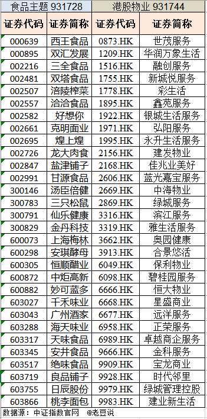

### 地产不行了，那物业指数可还行？

今天中证指数官网宣布了3个新指数（2021年8月12日正式发布）：中证碳中和债券指数、中证香港物业管理与服务主题指数和中证食品主题指数。我比较在意的是**中证香港物业管理与服务主题指数和中证食品主题指数**，那我们就简单的来看下这两个指数吧。

> 中证香港物业管理与服务主题指数

详细的指数编制方案可以前往官方查看，简单概括就是：在中证香港 300 指数的样本中选取 30 只业务涉及**物业管理服务、社区增值服务和非业主增值服务**等领域的成份股。市值加权且单一权重不超15%、前5大权重不超过60%，每半年调整一次成份股。（最新成份股详见下图）

大家都知道这几年国家是下了决心去落实“房住不炒”，客观地说现在全国绝大部分的房价确实几乎没有暴涨的情况了。再看看这两年A股的地产板块，毫无悬念地稳坐“三傻”榜榜首。

另外今年愈演愈烈的恒大资金链极可能断裂问题，简单概括下就是杠杆太高，**本来想着可以借壳回A股继续问股民“借钱”**。哪知道上面就是卡住不松手（大家想想A股有多少年没上新的地产公司了！），现实就是高杠杆的债务必将会加剧连锁反应。

在这种大背景下地产公司习惯性把部分业务剥离出来去港股上市，当然恒大这种PPT造车就太玄幻了，更多的是**把较为优质的物业业务拆分去港股上市**，比如：绿城服务、融创服务、保利物业、碧桂园服务、恒大物业（恒大真是能圈钱的一个都不放过）、宝龙商业等等。

我觉得相对房地产来说，在“后地产时代”物业管理还是可以看一看的。现在中证指数公司出了这个相关指数，就可以方便大家投资港股物业公司了，我后续也会关注下哪些基金公司会申报这类产品。

> 中证食品主题指数

详细的指数编制方案可以前往官方查看，简单概括就是：在中证全指指数的样本中选取 30 只业务涉及**肉制品、食用油、调味品和休闲食品**等领域的成份股。额外需要近一年日均成交金额排名位于样本空间前 90%，近一年净利润为正。市值加权且单一权重不超15%、前5大权重不超过60%，每半年调整一次成份股。（最新成份股详见上图）

我们都知道热门指数会有很多基金公司抢着发产品（比如前不久的9家双创50ETF齐发），但其实不同指数公司之间也会出很多类似的指数（比如中证新能车指数与国证新能车指数），更夸张的是中证指数公司自己也会发很多高度相似的指数（比如中证新能源汽车产业指数与中证新能源汽车指数）。总得来说就是基金公司申请基金比较容易，而指数公司发布指数更是没啥成本，**一个事物容易得到就通常伴随着“泛滥”**。

说回这个食品主题指数，我看到名字就估摸着是剔除白酒的食品指数，再一个就是联想到了之前华夏基金和华宝基金发行的细分食品ETF。近3年消费板块真是牛气冲天，所以相关指数以及指数产品就百花齐放了。我看过成份股后感觉还行，虽然没有了白酒，但这些企业还是值得关注的，外加成份股数量上限仅为30也是蛮合理的设定。但我估摸着基金公司对这个指数相关产品的申报不会太热情（毕竟白酒才是yyds），反正指数公司里僵尸的指数多如牛毛。