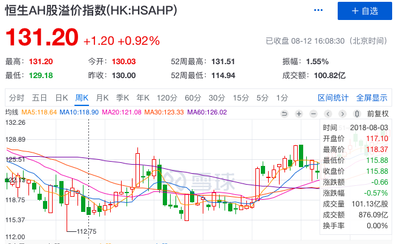
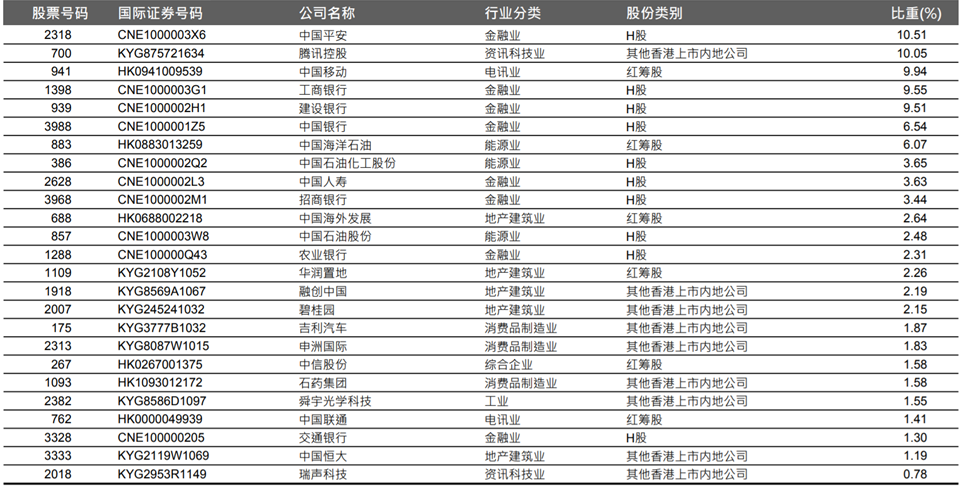
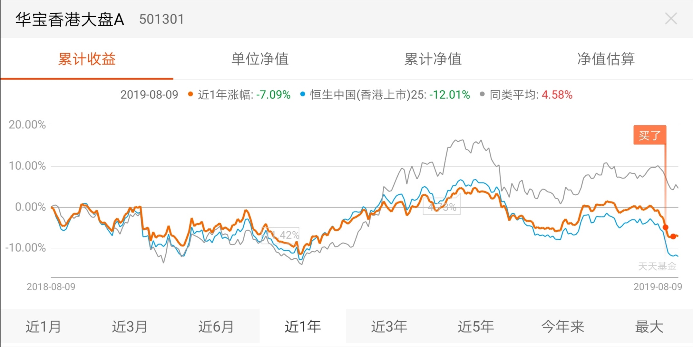

### 找一个安全垫够厚的大盘基埋伏起来

市场跌破 2800 点后整个市场的价值渐渐浮出水面了，只要你对中国经济的未来不是特别悲观，仔细的挑选、耐心的持有，时间定会给我们一份美丽的答卷的。

但我向来是风险厌恶者，我们总是缺乏安全感，需要寻找更安定持有的标的。好在我们运气不错，我一直观察的某个指标最近进入了一个很有利于投资人的范围：恒生 AH 股溢价指数(HK:HSAHP)。

恒生 AH 股溢价指数主要用于追踪在内地和香港两地同时上市的股票（即 A+H 股）的价格差异。通俗点说就是：AH 溢价值越大时，A 股相对于 H 股越贵。所以根据历史区间经验，该指数<110 则建议买入 A 股，该指数>130 则建议买入 H 股。

这里顺手介绍下为什么 AH 会存在差价：

-   投资人主体的差异：A 股散户为主，而港股以机构投资者为主。散户为主的市场活跃度一般较高，容易产生溢价，而机构投资者相对散户更理性，给股票的估值更低。

-   交易过程税费差异：港股分红等环节是需要纳税的，这也使得港股比 A 股稍微便宜一些。

-   国际化程度的差异：港股市场相对大陆更为国际化，当市场出现异动时国际机构投资人更容易从港股撤出，这就使得港股估值相对 A 股更低。好在这个趋势在减弱，大陆正在渐渐拿回港股的定价权。

从上面我们知道了当 AH 溢价指数突破 130 的时候应该选择 H 股而非对应的 A 股。但是现实情况我们即将面临几个问题：

-   如何选择 H 股
-   没有港股账户
-   没有达到开通沪港通权限的要求

好，我们现在就去寻找应对策略。由定义得知，我们这个指标监测的是 AH 股差价，我们赚钱的依据就是 AH 差价会收敛，所以很显然我们当前的投资标的就是 H 股。但对于很多投资朋友来说，港股还是很陌生的，如何选择很困难。怎么办？聪明的朋友应该知道了我要说指数投资了，而且港股指数基金的投资可以顺带解决了第二和第三个问题。

那么什么指数比较适合呢？-- 「恒生中国（香港上市）25 指数」（HSFML25）

HSFML25 指数成份股由 H 股、红筹股和中资民营股市值最大的 25 只股票组成，代表着香港上市中国超大市值企业的情况。我们来看下这个指数的成分股就清楚了：

除了较大比重的中国大陆银行股外，还有大家喜欢的以腾讯（占 10.05%）为代表的互联网巨头，有以碧桂园、融创、恒大等代表的地产股，还有收购了沃尔沃的吉利汽车等。

我想这 25 家企业几乎都是耳熟能详的优秀企业，同样的股权在香港买约便宜 30%，何况现在即便相对不便宜的 A 股也很低估了。这一切打通后就符合我题目说的，找到了一只安全垫足够厚的大盘基，剩下的就是买入后埋伏起来。**我们可以预见不久的将来不但可以赚取 A 股回暖后的价值修复，还能赚取 AH 差价收敛的双重利润。**

最后就是代码公布时间，该指数对应的基金是：华宝香港大盘 A（501301）。我们看下图发现该基金还大幅跑赢了指数，这就让我再次安心了，我自己也在前不久先下手为强了。再告诉大家一个小经验：一般 AH 差价超过 130，2~3 个月便会收敛。

