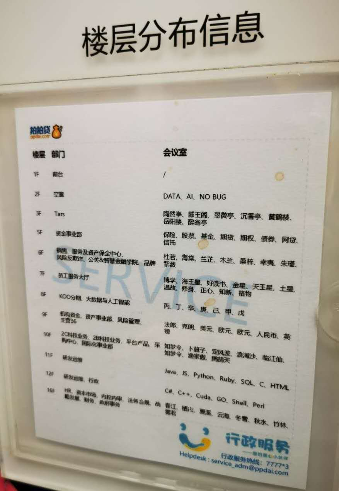
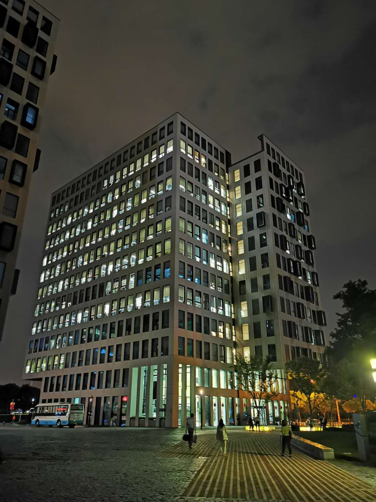
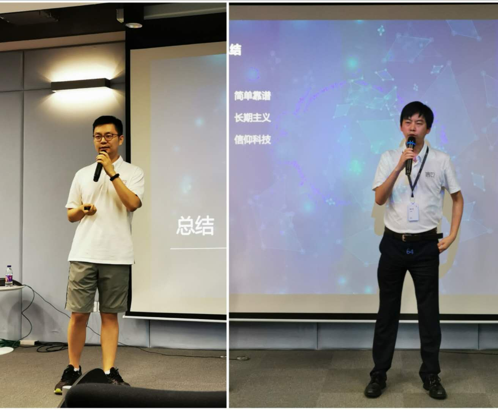

### 走进信也科技：科技，让金融更美好！

9月9日我有幸在雪球调研团的带领下去参观了信也科技，我知道这个名字大家可能有点陌生，但如果我说‘拍拍贷’那听过的朋友就会多很多。2019年11月拍拍贷集团更名为信也科技集团，在纽交所的股票代码也从‘PPDF’改成‘FINV’。信也科技是2017年11月在美国上市的，刚上市2年就更名信也科技主要还是想转型、想摆脱原先P2P的印记。

我本人也是拍拍贷的老用户了，累积在上面收了10万元的利息，后来监管收紧、平台利率也一降再降，我也就渐渐退出来了。我刚又去翻了下我以前的文章，在2018年2月和7月我分别提到三个网贷产品（陆金所平安产险背书的8.4%系列产品、小赢科技众安保险背书的系列产品、拍拍贷的散标里面的赔标）可以适当投一点，以此来获取比银行理财更丰厚的稳健收益。而且随着后来监管的收紧，我在2019年4月文章里指出对于拍拍贷不再续投，已经投入的也不急着赎回，自然到期即可，再后来的事实也证明了所有的赔标都是本息安全的。

当然说到与信也科技的渊源，还有一个事情。我在2017年底的时候有过跳槽的想法，而当时如日中天的拍拍贷也在我考虑的范围内，只可惜我住在宝山顾村而拍拍贷在浦东张江。这个通勤距离太吓人了，单程地铁需要100+分钟，而且软件行业总得来说加班是常态，这使得我要么在浦东租个房子、要么就拒绝加班。好在后来公司立马给我调整了待遇，跳槽的想法也就这么压了下去。

所以这次走进信也科技的活动我第一时间就报名了。我是带着一些期许，也带着一些疑问去的，我想看看拍拍贷转型后的信也科技现状如何？集团对自己未来的道路是否明确？这些方向是否能带来新的增长点？下面就给大家讲讲我这次信也之行的所见所闻所感吧。

这次企业调研活动信也科技的管理层几乎都出场了，上午有首席执行官-章峰、风险副总裁-刘畅、市场部负责人-郑轶，下午有大数据与AI团队副总裁-陈磊、高级副总裁-徐佳圆、首席技术官&首席产品官-王玉翔、首席数据官&国际业务负责人-顾鸣、财富管理业务负责人-郑麟，最后压轴的还有总裁-李铁铮、董事长-顾少丰。宣讲的高管那么多，一整天下来的信息量也是很大，但考虑到篇幅我就只选取几个我认为比较有用的信息点写一下。

1、公司管理层都很年轻，但作为互联网企业我觉得这个也很正常，我个人是不太喜欢‘暮气’很重的企业的。

2、前不久推出15.4%的民间借贷新规红线暂不影响信也科技的助贷业务，因为对应的持牌机构暂不属于此次的监管范围。同时信也新推的产品已经严格按照15.4%的红线要求去设计，这是一个很好的预先处理，同时也说明了信也对资金成本可以进一步下降的信心。

3、信也科技的资金来源主要是银行，有一小部分是信托及消费金融。当前的资金成本约8.8%，后期的趋势是进一步降低。

4、科技赋能金融，在智能机器人语音系统接入后，1~3天逾期主要由‘智牛’系统去催收，催收效率提升后的最大变化就是：入催人数几乎减少了一半。

5、在于持牌机构（主要是银行）的合作中，信也科技推客、银行进行二次筛选，入选率一般高达70~90%，与部分小银行（不具备足够的研发实力）合作的时候还会把风控模型部署到银行端。

6、信也科技对于坏账不会打包出售，而是全程由自己的人员去催收。这个也能看出信也科技对自己风控模型的信心，也使得信也会把风控时刻高悬于心。

7、信也科技在P2P转型的过程中，对于少量未到期的资产运用公司自有资金进行了回购，这个同样体现了信也对自己的魔镜风控系统的信心。

8、信也科技的几大科技产品：风控系统-魔镜、自动化投放管理系统-章鱼、智能语音系统-智牛。

9、坦率的讲，我是调研前又重新查了一些信也的资料才知道信也科技还有海外业务，而且做的还可以。业务范围主要是东南亚的国家，信也对海外业务国家选取的解释是：人口密度较大、离中国也近、人员偏年轻化、国家还处于持续的发展中。

10、信也科技暂无基金代销牌照、也无保险代销牌照，所以拍拍贷财富版APP更名“羚羊财富”后虽然有基金的导客业务，但资金规模不大，主要还是在银行固收产品这块。

11、信也的利润还可以，所以管理层对于过低定价的美股执行回购。在今年5月~8月24日回购了1510万股，IPO至今总回购已花费1.11亿美元，接近此前制定的1.2亿美元股票回购计划总授权金额上限，因此董事会又批准8月24日起再增加0.6亿美元继续用于回购股票。这么实诚的回购既体现了公司现金的充沛也让我们看到董事会对信也的未来还是很有信心的。

12、在问及是否有回港股或科创板的计划时，信也给与了否定。我以为主要是因为公司经营的业务不适合国内上市，但我细想蚂蚁集团和京东数科都准备在科创板上市了，进一步聊下来感觉就是即便可以回国了，公司董事会也没有很强的回国上市的意愿。

---

去参观企业我喜欢看一些细节，可能是有趣的、也可能是企业不一定想让你看到的。但这些都是可以更全面的认识企业的信息点，所以我再罗列几个我看到的细节或者是信息点吧。

1、虽然去年11月公司就更名为信也科技了，但现在已经是2020年9月了，公司很多细节处仍然残留着‘拍拍贷’的印记。比如大厅陈列的‘拍拍贷’文化衫，再比如电梯里张贴有拍拍贷字样的楼层分部信息（办公区域的名字命名也很互联网风格）。

2、公司内随处可见的：**科技，让金融更美好！**这句标语是我在信也科技见到最频繁的一句话，让我想起了顾总说的：信仰科技！

3、既然信也给自己的定义是科技公司，外加我也是个程序员，那么研发人员的楼层我有兴趣看一看。研发楼层人坐的还算宽敞，人员也不是很忙碌，感觉工作强度不大。

4、我去的几个楼层的走廊公共区域都是不开灯的，难道是提倡低碳环保？

5、果然是互联网科技公司，我们走的时候已经近9点了，整栋大楼还是灯火通明。

6、李铁铮总裁一身休闲打扮让我这个程序员见了还是很舒适的，手上也没什么昂贵的手表，只有一个简单的小米手环，我不知道别人怎么看，反正我觉得挺好的。顾少丰董事长真的很‘腼腆’，说话也是比较实诚的：简单靠谱、长期主义、信仰科技。他和李总都是交大出身，李总学的是土木工程。

---

信也科技从拍拍贷的转型还算顺利，至少存活了下来。正如李铁铮总裁说的：这次转型的困难放在13年的信也科技成长史上还不是最难的一次。可能是领导层一贯低调的作风，也可能是前期转型需要适度低调，信也科技的很多变动总是默默的执行。

虽然信也科技是在美国上市，但如今中概股的小股东中很多就是大陆的投资人。我觉得虽然股价主要还是依赖于公司业绩，但是对于交易规模不大的股票适度的宣传自己是很有必要的，对股价也有提振作用。（9月11日信也科技股价1.65美元，成交量50万股左右）

这次走入信也科技的活动就是一个很好的尝试，酒香不怕巷子深的年代可能已经过去了。对于信也科技我会持续关注，也希望信也科技能开启新的美好征程！

申明：本文写成的前10个交易日及后10个交易日均不会买卖信也科技的股票（成文于2020年9月14日）
