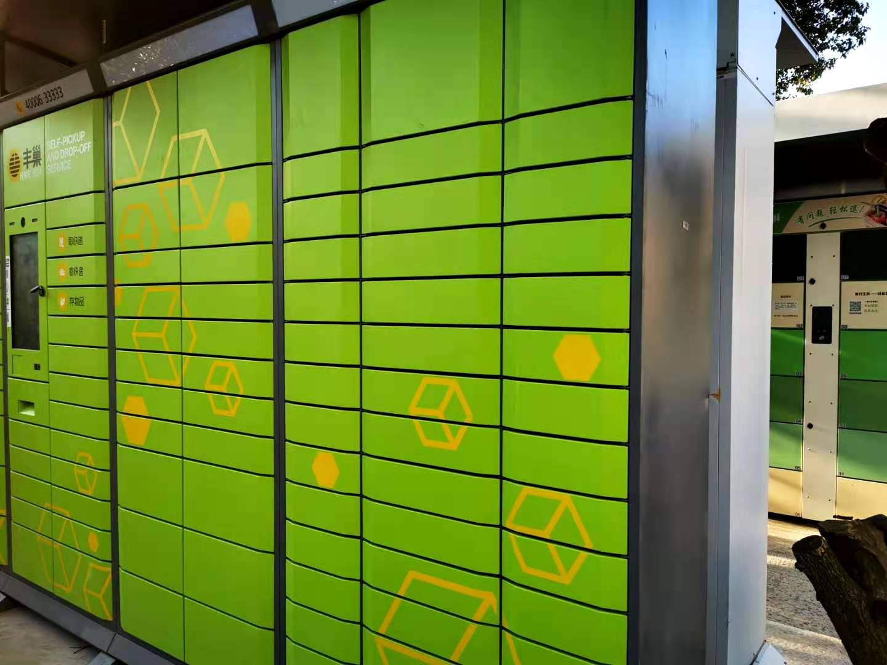
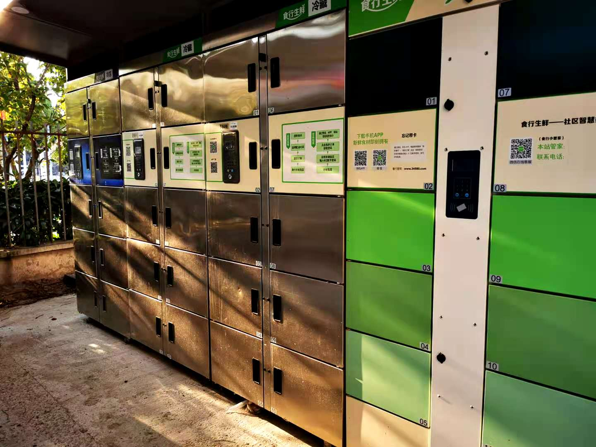
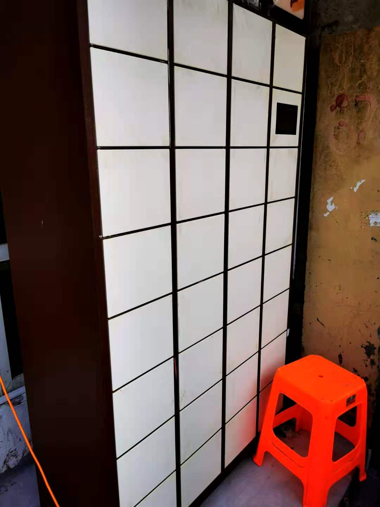
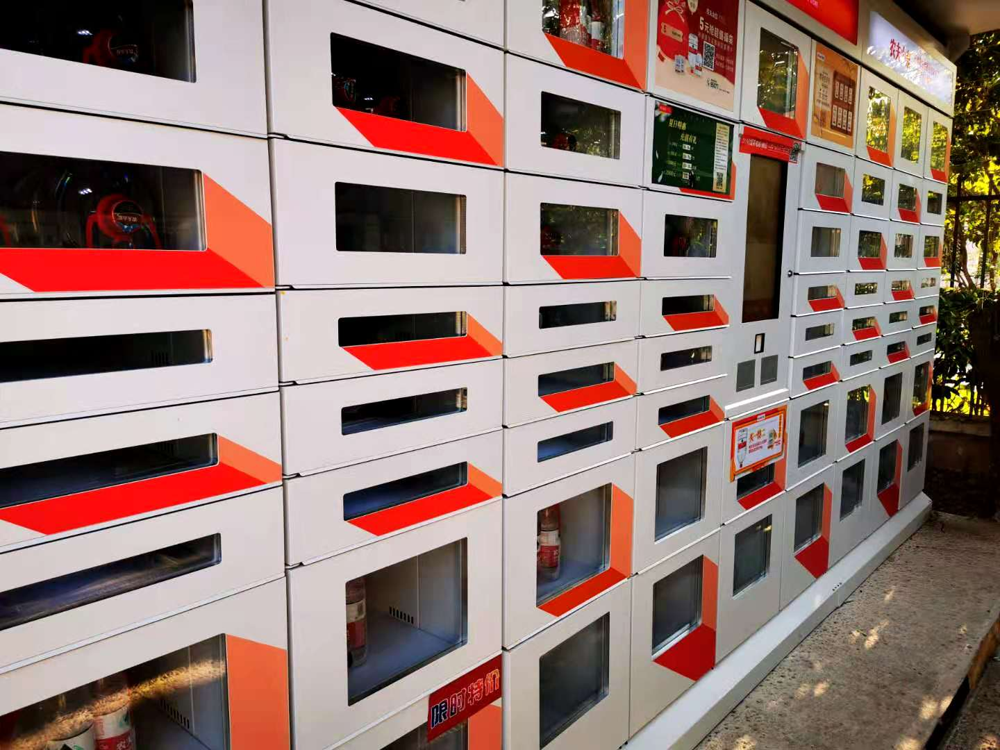
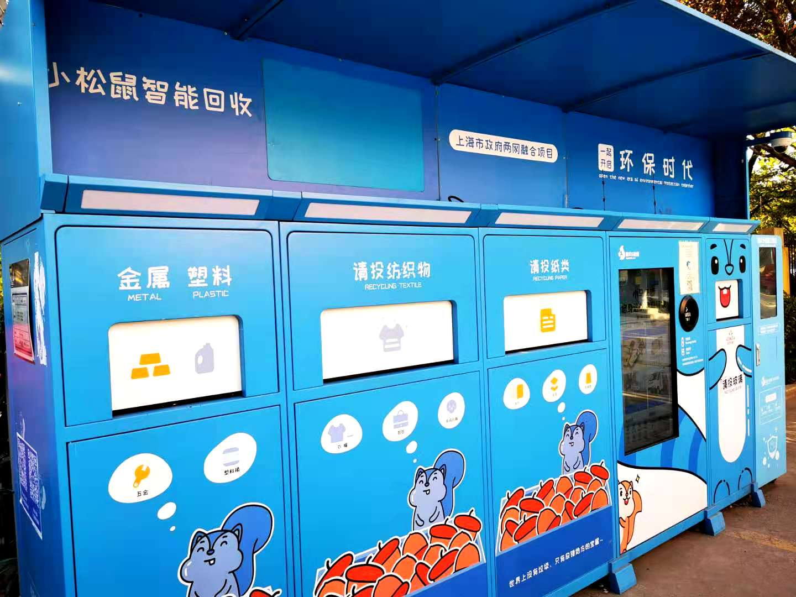

### 最后一公里的柜子算不算新经济？

我们在A股里投资能学到很多‘高大上’的词汇。前几年流行的**漂亮50、核心资产、做多中国、自主可控**等等，最近又流行起来什么**顺周期、新经济**这些词汇。那么今天这篇文章就结合我们小区生活中的一些体验，看看这玩意算不算新经济？

互联网公司的自助柜子近几年一直在持续的铺入各个小区，前几年还是就近的两个小区共用一套柜子，今年开始是每个小区都铺设了自己的柜子，而且商家数目和种类也越来越多。

最常见的就是快递柜子（丰巢），还有买菜柜子（食行生鲜），有买蛋糕的柜子（21cake），有买水的柜子（农夫山泉），还有垃圾回收的柜子（小松鼠回收）等等。以上列举的仅是我们小区有的，可能有些是部分城市、部分区域特有的柜子，所以我都简单的介绍下：

1、快递柜，典型代表就是丰巢。

由顺丰、申通、中通、韵达等共同搭建的智能快递柜，当然大股东还是顺丰控股。虽然之前丰巢向取件人也开始收费（原本只向快递小哥收费）这个事情闹得很大，但我还是认为丰巢柜的出现很大程度的便利了我们这些早出晚归的上班族，如果你去青年公寓附近看看那真是密密麻麻的丰巢柜。

我相信大家都有过类似的经历，为了周末在家的时候能收到快递，尽量算准了周四或者周五下单。可有时候就是事与愿违，可能是卖家发货慢了，也可能是物流延迟了，派送的时候已经是下周一了。而此时你已经在公司，接到了快递电话后你发现家里没人接收，而快递不愿再跑一次。如果你们小区有代收点（菜鸟驿站等）或者门卫够热心愿意给你寄放在那最好，可有时候就是很烦心，总之就是不便利。

丰巢柜的出现很好的解决了这个问题，你下单前不再需要算着到货的日子，特别是急用下单的时候根本等不到周五再下单哈。而且你会发现丰巢这种非直接接触式的收寄件方式，很大程度上提升了快递派送和揽收的效率。

要知道一个快递员的收入与派件数直接挂钩，所以在有限的时间内派送出去足够多的单子是核心。一家家的送上门，有时候还要电话询问或稍微等待下都是极其影响派件效率的事情，这些人力成本的提升最终都会转嫁到每一个网购的消费者头上。

2、买菜柜子，宝山区这最多是食行生鲜。

现在买菜软件已经很流行了，网上下单送货上门（大多都是2小时内），常见的有叮咚买菜、每日优鲜、盒马生鲜、美团买菜、京东生鲜、天猫超市生鲜等等。但是另外一种互联网买菜模式就是下单后次日统一配送到小区固定的生鲜柜内，我个人觉得这种模式更经济。**批量式配送、自助式取菜**、平价蔬果、每日新鲜，生鲜柜的这些特点可以理解成找到了当下互联网买菜（成本与便利度）的一个均衡点。我自己还是很喜欢这种生鲜柜买菜方式的，同样对于早出晚归的上班族很友好，**即便下班到家已经八九点了，还是可以拿到新鲜的食材给自己明天做一份健康的午餐。**

3、蛋糕、水、废品回收。

蛋糕我们小区用的是21cake的柜子，柜子看着都很小，感觉这个是可能相比较下来是最没效益的柜子。类似这种蛋糕我印象中之前都是有专门的配送员，还要预约配送时间，因为这种蛋糕很容易化，需要配送全程低温。现在蛋糕柜子的出现加快了配送的效率，即便你暂时不在家，也不会因为放在驿站或门口而融化。

农夫山泉的柜子我之前也在短帖提到过，偶尔能看到有人去里面买水，但我习惯在食行生鲜买菜（也有农夫山泉卖），柜子就在农夫山泉的对面。而同样的产品反而比农夫山泉自营的要便宜10%以上，我为什么还要去你自营柜子买呢？我有时候在想这个是不是更大的功效是品牌宣传，毕竟我们郊区的小区里租个柜子收费也不会很贵。

废品回收这个柜子我每天下班都经过都能看到，但从没用过。最近写这文章，然后又在双11期间，家里好几个快递纸箱我就让老婆别急着扔，我要去体验下。前天晚饭后我下楼散步的时候把纸盒扔里面回收了，柜子的回收价格比卖给小区收垃圾的便宜一半都不止，但偶尔体验下还是不错的。

> 小结

我理解的**新经济就是在新模式下的新效率，提升运转效率后能便利于我们的衣食住行。**那么基于这点认知，我认为现在越来越多的自助式柜子也算是一种新经济。

再从身边的柜子往更广阔的市场去延伸，我们发现这些便利柜子的背后是众多“中国新经济龙头”企业：阿里巴巴、腾讯控股、京东、美团点评等。这些“以科技带动消费”的企业涉及到了中国人日常**“衣、食、住、行、娱、康、奢”**的方方面面，而“以科技带动消费”同样是众多科创公司想要成为的目标，这也是新经济的魅力所在。

