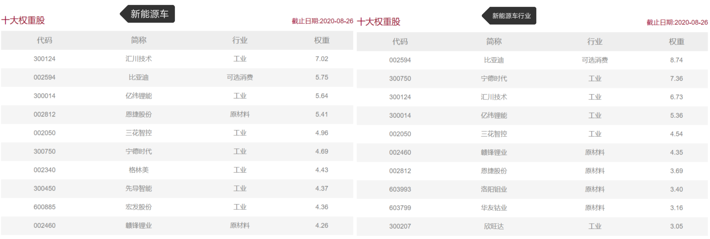
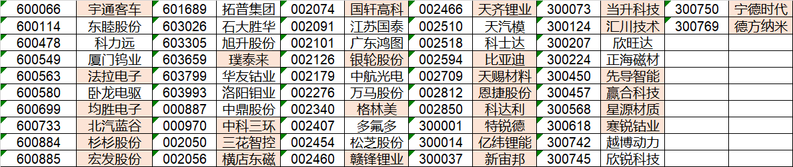
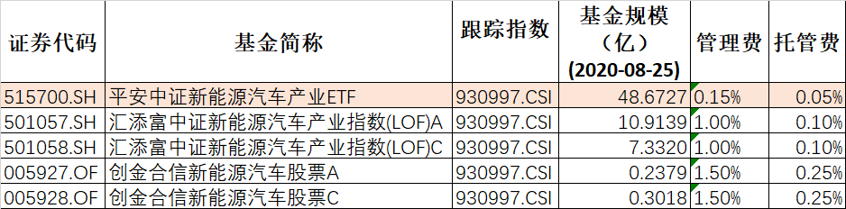
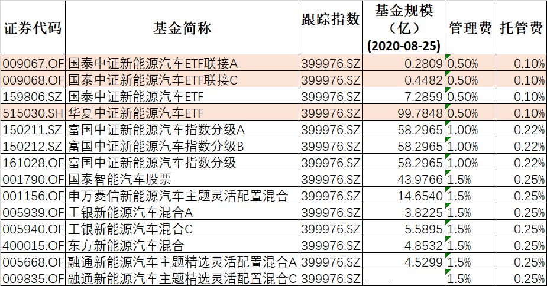

### 有哪些基金主要投资新能源车？

这两年很多行业ETF和主题ETF都是异常的火热，经常在基金论坛里有朋友会问我科技板块买什么基金？芯片半导体买什么基金？前几天还有人又问起了新能源车买什么基金好？我当时给的答案是：“新能源车相关的主要有两个指数，两者略微有点区别，对应的基金分别是华夏的新汽车【515030】和平安的新能车【515700】” [原贴链接](http://guba.eastmoney.com/news,jjspzh,958097447.html)

帖子是那天午饭前回复的，吃饭的时候我就在想这个答案是我很久前脑海里的印象了，最近有没新的指数基金出来？老的基金规模排序是否有变化？所以晚上下班到家，我重新用choice拉了下数据，现在和大家分享下最新的数据，以及我个人对于新能源车相关基金的一些选择建议。（想看结论的直接跳至文末）

新能源车相关的指数主要有：中证新能源汽车产业指数（930997）[编制规则链接](http://www.csindex.com.cn/uploads/indices/detail/files/zh_CN/1334_930997_Index_Methodology_cn.pdf?t=1598240790)、中证新能源汽车指数（399976）[编制规则链接](http://www.csindex.com.cn/uploads/indices/detail/files/zh_CN/320_399976_Index_Methodology_cn.pdf?t=1598240779)。这两个指数都是由中证指数有限公司编制，单从名字上我们就能大概看出两者的区别了，一个是汽车产业、另一个是汽车。官方概要划分如下：

- 中证新能源汽车产业指数：包括新能源整车、充电桩、锂电设备、电机电控、电池材料、电芯电池组、配套设备以及相关上游材料等。

- 中证新能源汽车指数：涉及锂电池、充电桩、新能源整车等业务。

我看过后的理解是新能源汽车指数包含整车以及电池与充电桩，而新能源车产业指数还多了新能源车的配套及上下游材料。这一点我们也可以通过查看两个指数的前十大权重股后很明显的看出来（数据源：中证指数官网）。

在看前十成份股的时候我隐约感觉这个两个指数都对个股权重做了上限设定，去查阅了下规则果然如此，但两个指数略有区别：新能源车产业指数单个样本股的权重不超过8%；新能源车指数单个样本股的权重不超过5% 。

然后我又分别拉取了这两个指数的全部成份股，新能源车指数是30个成份股（我印象中之前是25个，近期有过扩容），新能源车产业指数是52个成份股，通过对比我们看到前者是后者的子集。（详见下图，涂色个股为公有成份股）

上面两个规则放一起就体现出了前十大权重的另一个区别：**个股权重的集中度**。新能源车指数成份股少且个股权重上限只有5%，而新能源车产业指数成份股多且个股权重上限高达8%，这就导致了新能源车指数的个成份股比重很均衡，从前十权重股看近乎等权重，而新能源车产业指数就有很明显的头部靠拢趋势，这个特性差异也让投资人多了一些不同的选择。

说起指数成份股扩容，我又重新比对了两个指数的选股规则后发现：新能源车对成份股数量没有明确的限制，而新能源车产业成份股数量明确了上限是80只。虽然短期看两个指数都没那么快达到80只成份股，但随着新能源车的发展，不排除后期会有差异在此处体现。另外监管新规指出，成份股数量过少还会影响对应指数基金的审批，这个下面还会说到。

最后我们回到开始的问题：**有哪些基金主要投资新能源车？**我用choice查到的数据如下图。

- 主要投资新能源车产业指数的基金列表：

主要投资新能源车产业指数的基金就三个，分别是平安中证新能源汽车产业ETF、汇添富中证新能源汽车产业指数(LOF)、创金合信新能源汽车股票。创金合信的这个规模太小且费率最贵，所以首先剔除了；汇添富的这个呢规模不错，且成立很早（2018年5月），还是LOF基金，场内场外都方便交易；可惜去年底（2019年12月31日）出了一个更优解，就是平安的这个ETF，费率做到了20BP，且规模和流动性都很好，可惜是暂时没有场外联接。**所以对于新能源车产业指数基金的选择：场内选平安中证新能源汽车产业ETF；场外选汇添富中证新能源汽车产业指数(LOF)。**

- 主要投资新能源车指数的基金列表：

主要投资新能源车指数的基金就多了，但是分级基金和混合基金不是我的菜，剔除后就剩下了：华夏中证新能源汽车ETF、国泰中证新能源汽车ETF、国泰中证新能源汽车ETF联接。这个还是很好选择的，场内肯定选择规模和流动性更强的华夏中证新能源汽车ETF，可惜因为监管新规华夏的场外联接没能及时批下来，而且成份股即便扩容了也才30只，所以短期内是看不到可能了。好在国泰的规模也还不错，场外的联接就成了唯一的选择。**概括下就是：场内选华夏中证新能源汽车ETF；场外选国泰中证新能源汽车ETF联接。**

> 总结 

- **中证新能源汽车产业指数：**

1、含整车及电池与充电桩，还多了新能源车的配套及上下游材料。

2、成份股数量上限80只，单只个股权重上限8%，呈现头部集中趋势。

3、场内选平安中证新能源汽车产业ETF，场外选汇添富中证新能源汽车产业指数(LOF)。

- **中证新能源汽车指数：**

1、含整车及电池与充电桩。

2、成份股数量无上限（暂时只有30只），单只个股权重上限5%，近乎等权指数。

3、场内选华夏中证新能源汽车ETF，场外选国泰中证新能源汽车ETF联接。

