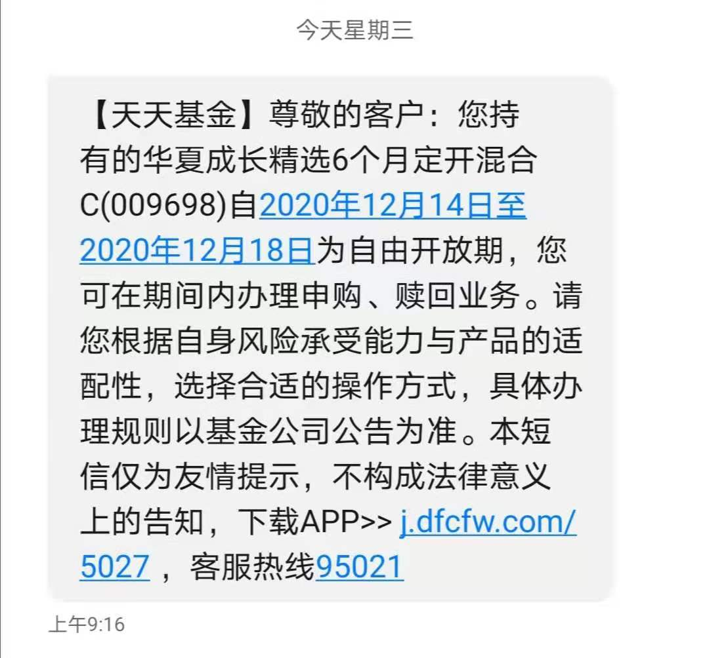
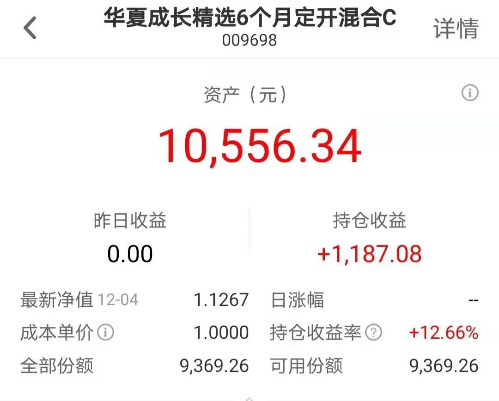
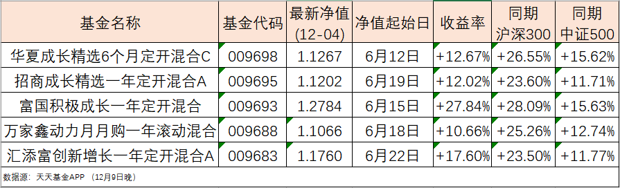

### 还记得半年前的新三板精选层基金不？

昨天（12月9日）早上收到一条基金平台的短信，大意就是提醒我半年前买的华夏成长精选6月定开基金即将进入自由开放期了。说真的今年发了这么多的基金，光‘政策性产品’就有【精选层】、【科创板】、【创业板】等多批次（每类我都买了1~2家体验下），要不是短信提醒我，就差点忘记了当时还买过1万的体验仓位。

当时一共五家基金公司发了新三板精选投资概念基金，分别是：华夏成长精选6个月定开混合C（009698）、招商成长精选一年定开混合A（009695）、富国积极成长一年定开混合（009693）、汇添富创新增长一年定开混合A（009683）、万家鑫动力月月购一年滚动混合（009688）。我自己买了封闭期最短的华夏成长精选，当时还一日售罄后配售，我认购申请了1万，实际认购成功9369.26元。截止12月4日我的华夏成长精选收益1187.08元，收益率为+12.66%，这个收益只能说中规中矩。

那随后我本能的就想看看另外四家产品的收益如何？同期的沪深300和中证500指数涨跌又是如何？我整理了下面这张图表,我们来粗略的分析下五只系列产品的业绩表现。

- 首先因为华夏是6个月的封闭期（其余四个为一年期），所以先单独拿出来看下。粗略的看结果感觉华夏的是第三名，但因为五个产品的净值起始日略有差异，所以还是要结合同期沪深300和中证500的收益比对。虽然招商的比华夏少了0.65%，但同期的沪深300和中证500差异有3~4个点，那我们可以认定华夏的这个产品是同系列里业绩比较弱的一只基了（综合认定第四名）。当然我们也要为华夏说一句，毕竟只有6个月封闭期（还得扣除一个建仓期），基金经理可能考虑到了即将到来的自由开放期，在仓位上可能有了一些调整，所以不排除因此错过了一些阶段性的机会。

- 接着再说说万家这个产品，因为它是唯一月月购滚动类产品。简单说就是每月都有开放期，但是每次买入都必须持有一年。这样就会在中途有资金入场，类似于定投的感觉，会给持仓的收益和亏损做了一个平滑，但因为每月新入资金数量不确定，且这半年时间略短。当然不管怎么说都是万家倒数第一，这个是客观事实，至少对于刚开始第一波认购的投资者来说是五家里跑的最差的，所以我们常说没有对比就没有伤害。

- 最后我们再看其余三家封闭期都是一年的系列产品，单独看这三只就很明朗了。第一名富国、第二名汇添富、第三名招商，富国的第一名毫无争议，甩其余四家好几条马路；第二名汇添富也是有很大的优势；至于第三名的招商刚说了，虽然表面上比华夏低了一点点，但再看下同期市场的沪深300和中证500，就能看出还是招商略胜一筹。

还有需要补充的是，其实当时一共批了6只产品，另外一个是南方创新精选一年定开混合C（009682）。但是它不是与上面5只同时发售的，且净值起始日是7月21日，间隔太久比较起来没有太大意义。当然现在的业绩也是惨目忍睹：最新净值（12月4日）1.0076元，收益率+0.76%，同期沪深300 +7.99%，同期中证500 -1.50%，然后你看下这只基金下面投资人的留言真是骂声一片。

这批基金说是新三板精选层基金，但实际精选层的仓位占比不大（小于15%），更多的还是看基金经理的运作能力。虽然这个排名只是暂时的，但也能很好的看出一些问题，我希望明年6月再来看这几只基金的时候，它们能给投资者带来不一样的排序。

最后提醒下，华夏成长精选6个月定开混合下周（12月14日 ~ 12月18日）就是自由开放期了，如果怕忘记的朋友可以周五收盘后即可申请赎回了。还有在纠结的朋友也要时刻关注净值变化，不同于平时一周更新一次净值，下周的自由开放期期间是每日更新净值的。