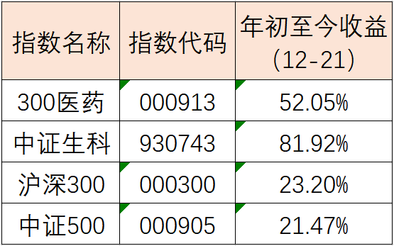
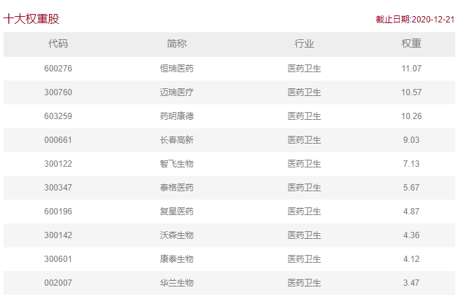
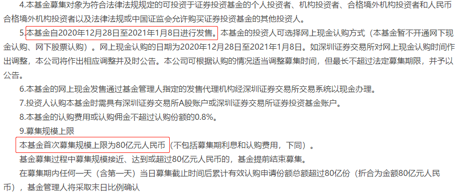

### 反思投资时多问下：有没有更好的选择？

其实我最近也一直在反思今年投资上的得与失，按行业划分消费（食品饮料）、科技（芯片、新能源车）、医药（300医药），这三块是我最大的盈利来源。其中食品饮料这块我前几天也发文说了，虽然最近有不少看空的言论（主要是认为涨太多了），但我个人觉得明年大环境依旧有很多不确定因素存在，经济的全面性复苏也很难短期内就到来，那么食品饮料板块的‘确定性’逻辑我认为依然可以维持。

那今天我想围绕着医药板块聊聊自己的一些看法。关注我免费公开组合【薪火相传】的朋友也知道，我自己今年买的医药标的是易方达基金的沪深300ETF联接基金。因为公开组合标的都是场外基金，所以就选了对应的ETF联接基金，我在场内其实也会同时持有沪深300医药ETF的。截止12月21日收盘，300医药指数收益为+52.05%，医药ETF（对应的ETF）收益为+55.09%，今年有这个业绩我还是很满意的。**但随即而来的就是反思**：去年流行泛科技概念ETF，但今年细分的科技ETF好像跑的业绩更出众，那衍生到医药这块，有没有好的细分医药指数呢？

在开始说最近找到的细分医药指数前，我们先谈谈为什么总觉得今年泛科技、泛医药的基金没有细分的优秀。当然这种比较只是相对的哈，文章开头也说了，科技和医药今年是我盈利的大头。比如泛科技指数会涵盖医药生物、计算机、通信、电子等，这样的指数特性在今年这种典型的结构性行情里会有点不讨巧。**如果几个细分板块不是同步发力，那么就会出现很明显的相互牵制，表现在基金净值上就是区间震荡、增长缓慢等。**当然我还是要再次申明下：不是说泛科技和泛医药不好，我自己一直在买就是最大的认可，甚至我一直把300医药指数作为所有医药类指数的参考标杆。

 

回到前面说的寻找细分医药指数上，我们在回顾总结投资经历的时候，应该要多问下自己：有没有更好的选择？就比如（仅限今年哈）比消费更好的是食品饮料，比食品饮料好的是白酒。我们在医药板块用300医药这种标杆指数打底仓的时候，有没什么更细分的医药类指数去进一步配置呢？最终这个中证生科（930743）成功吸引了我的注意，该指数全称是中证生物科技主题指数，指数选取涉及**基因诊断、生物制药、血液制品及其它人体生物科技**的上市公司作为成份股。

 

我们发现前十大权重股涵盖了疫苗、CXO（面向企业的创新药研发外包服务）、IVD（体外诊断相关产品和服务）、创新药、生物药、血制品等医药板块的景气核心个股，前十大权重总计近70%，成份股的高度集中会突显龙头特性，这也是我们前面那个图表看到的，中证生科指数大幅跑赢了主流宽基和医药板块整体的业绩。

生物科技作为医药板块的重要分支，我国相关产业正逐步摆脱之前“跟随”的状态，甚至已在个别领域有了突破。这都得益于近年来国家的支持与重视，在政策（鼓励创新）、需求（健康意识提升）、技术（从跟随到引领）、资金（多渠道便利融资）的共振下，生物科技行业有了强劲的增长，走出一批优秀的本土企业。现在全球贸易大环境对我们国家不是很有利，我们也一直在尽量不再依赖进口，但国内市场对生物技术产品和服务的依赖不减反增，这就让我们看到了很大的前景。

透过指数去找对应基金产品的时候我发现：中证生科指数对应的产品现在只有汇添富中证生物科技指数(LOF)A/C。我个人对于LOF基金是有点邹眉头的，因为同类别产品费率会高很多（管理费0.75%、托管费0.1%）。这就让我再次脑子里蹦出这句话：**有没有更好的选择？** 我心想这指数还不错，怎么就没有基金公司出ETF呢？

然后我就又用choice 根据跟踪指数去筛选下基金，当我把选择范围扩大成“全部基金（含未成立）”的时候多出了一个基金：**易方达中证生物科技主题ETF（159837）**，场内简称：生物科技。而且让我舒适的是易方达三个字，因为易方达基金近两年出的新基金在费率上从未让我失望过，定睛一看果然如此（管理费0.15%、托管费0.05%）。

 

这不还没成立嘛，那我肯定想知道它什么时候能上呀？基金发售公告显示：本基金自2020年12月28日至2021年1月8日进行发售，网上现金认购的日期亦为2020年12月28日至2021年1月8日。在看发售公告的时候还发现这只ETF首发规模限购80亿，所以你看如今头部的基金公司发个ETF不限购还真不好意思出门和人打招呼。

> 小结

我自己看待医药板块其实和食品饮料差不多，现在这些看空或者吐槽的声音都是说：涨的太急了、价格太贵了。你会发现其实大家还是很认可这些板块的价值的，对消费和医药行业的长期看好是共识，问题就是价格的贵贱嘛。我自己面对这种情况应对策略就是：阶段性止盈，但只要这种共识存在，我就不会停止在这些板块上的持续投入。正好这次是年度投资回顾的一部分，在自我不断的询问‘有没有更好的选择？’中，我们发现了中证生科这个优质的医药指数，在我自己明年的投资中也会多多关注它以及其对应的指数基金。

