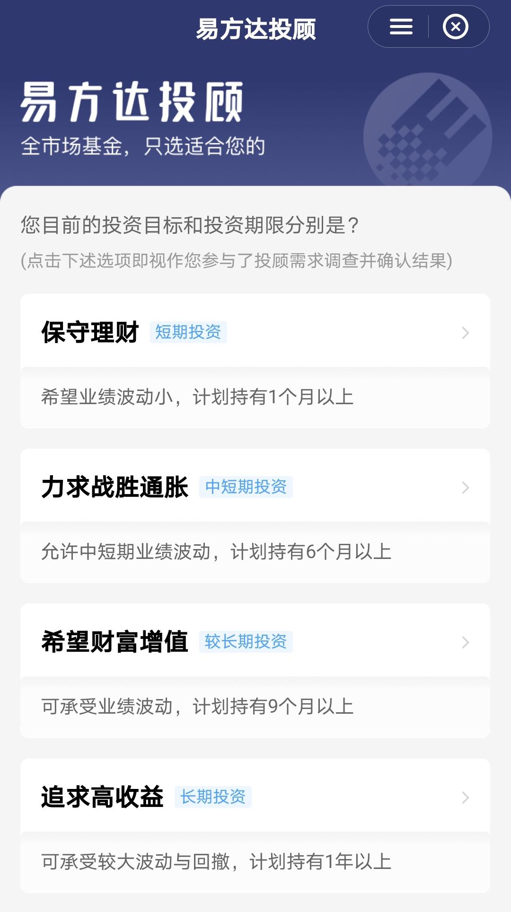
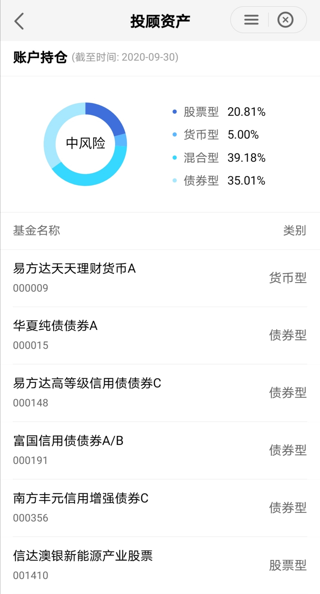

### 基金投顾--大资管时代资产配置新动能

我每周一都会准时发布自己组合【薪火相传】的操作计划，曾经也有朋友问起：你这定投组合适合哪些投资者？我的回答是：有一定基金买卖经验，对基金尤其是指数基金有一些最基本的认知，愿意自己每周跟着我操作一次，最好是上班族这类每月有稳定收入的人群。

那这个问题的反面是什么？**如果我是一个没什么基金投资经验的小白、我也懒得每周跟着组合管理人手动去操作下、又或者我就是当下手里有一笔资金想买点投资产品，这时候我们该怎么选择？**

面对这个问题我以前可能不知道该怎么给大家一个比较好的答案，直到去年10月份基金投资顾问业务试点正式推出后，我终于有了一个普适的答案：可以买一点基金投顾产品。为什么说这个答案还是比较普适的呢？因为一家持牌的基金投顾机构通常都会发布多款不同风格偏好的投顾产品，以易方达投顾在天天基金平台上的产品为例有：保守理财（计划持有1月以上）、力求战胜通胀（计划持有6月以上）、希望财富增值（计划持有9月以上）、追求高收益（计划持有1年以上）。

 

其实现在已经获得基金投顾牌照的机构主要是基金公司和基金代销平台方。代销平台的典型就是支付宝（蚂蚁）与先锋领航合作的‘帮你投’系列；基金公司就是以易方达为首的几个头部基金公司（易方达、华夏、嘉实、南方、中欧）。这些机构的投顾产品我都多多少少有买一点，主要也是想着参与进来，看看这种新的投资模式是否真的能给投资人带来便利和收益。

坦率地说部分公司出的部分产品确实有不足的地方，我前面也有文章单独向大家剖析过，但更多的是我对这种新模式的认可和支持。最直接的好处就是我买的这么多投顾产品都产生了正收益，当然因为选择的风险偏好不一，各个产品的收益情况有多有少。我认为买投顾产品收益不是唯一的衡量标准，**给不同的人群带去了其可接受范围内的风险系数和尽可能多的收益才是基金投顾的可贵之处。**

我们都知道现在很多基金公司也都有自己的组合推出，那这个和基金投顾有什么区别呢？其实我在文章开头就阐述了基金投顾和基金组合的差异点：基金组合是需要用户自己去跟着定期操作的，而基金投顾是一种全权委托的服务模式，用户在做完问卷后买好产品，剩下的就交给投顾机构即可，通俗的说就是提供了一条龙服务。而且我们通过观察可以看到投顾产品和基金组合底层资产都是公募基金，但基金公司给的公开组合大多都是自家产品为主，而基金投顾产品的标的物就极其丰富，且不局限于某家基金公司的产品。

就以我买的这款易方达投顾产品看，当前的持仓股票型20.81%、货币型5%、混合型39.18%、债券型35.01%，在具体持仓这块也不局限于易方达自己的产品，比如有：易方达、华夏、富国、南方、信达，还有截图中没能显示的：博时、工银、泓德、国泰、创金、广发、海富通、交银、平安等产品。你会感受到机构**不再以卖自家产品为出发点，而是想着选取更好的产品服务好投资人，这种服务动机的改变也是我对这种新模式看好的点之一**。

 

还有就是投顾会有更多针对性的服务报告，每个季度都会有很详实的产品运行情况报告，**一方面是告诉客户，投顾服务机构在过去一段时间帮大家做了哪些操作，对应的业绩又是如何，另一方面还会给大家讲讲未来投资的一些趋势和可能需要的注意点。**有些机构的产品甚至每个月都会有产品服务报告，甚至在一些极端行情的时候还会发布一些文章来告诉投资者发生了什么？以及我们该如何应对。这种定期和不定期结合的全方位的报告服务会让我们投资人感到一丝安全，当然你要是懒得看且够信任投顾机构也可以直接忽略，但我还是建议大家可以选择性的看看这类报告，对你的投资成长有一定的帮助。

当然真的把投顾服务做好也不是一件那么容易的事情，以易方达为例。易方达针对基金投顾的四个核心要素：产品、策略、服务、客户，分别设置了投资业务、基金研究、投顾业务、市场业务、金融科技、系统运营这六大职能部门，与传统的销售部门功能性隔离，形成一个平行于公司投资、市场和中后台之外的全新业务条线。这种新业务线的独立既体现了易方达对于投顾业务的重视度，也有利于基金投顾业务更加独立地开展。

我们看到上面其中一块叫‘金融科技’，我想说的是：要做好投顾服务的话，金融科技是不可或缺的。现在全市场7千多只产品，只有在金融科技的加持下才能大大拓展研究的深度和广度，给基金产品做到更细致的分类和定量分析。我自己也是程序员出身，所以很相信科技的力量可以给金融带来更多的可能。

基金投顾业务试点一晃已经一年多过去了，在这一年里大家对于投顾业务的关注度和接受度也在不断攀升。易方达基金作为首批获得投顾牌照的机构之一，继9月在天天基金、招行‘招赢通’等4个平台接连上线基金投顾服务后，又将于12月初上线交通银行。**基金投顾业务说到底就是持牌机构在深入研究基金的基础上，构建满足客户各种风险、场景投资需求的一站式投资解决方案。**随着更多持牌机构的入场，以及更多渠道平台的介入，会给普通投资人提供更多的投资可能。这次易方达在交行首批上线的三个策略分别是：货币增强、稳健理财、平衡增长，后期还会根据客户需求的情况，不断增加新的投资策略。有兴趣的朋友可以在交通银行手机APP搜索“易方达投顾”进行签约，体验下不一样的投资感受。