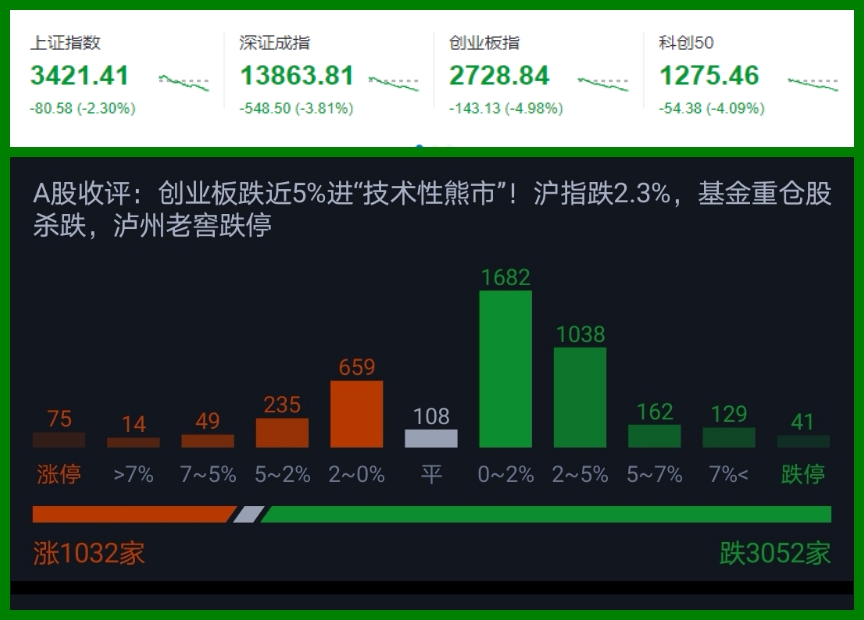
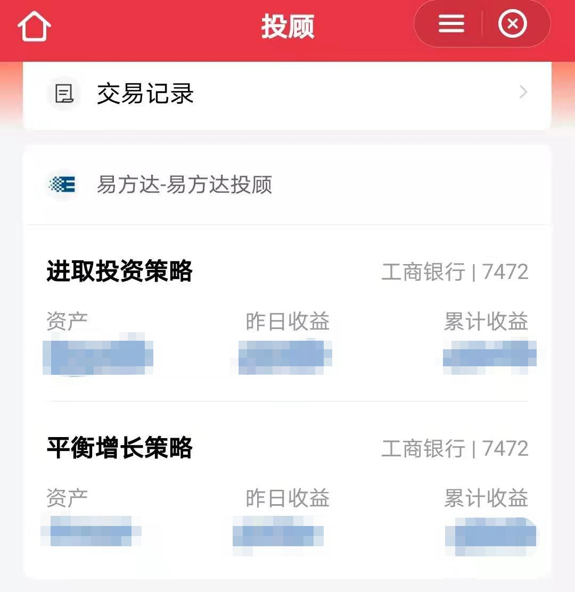
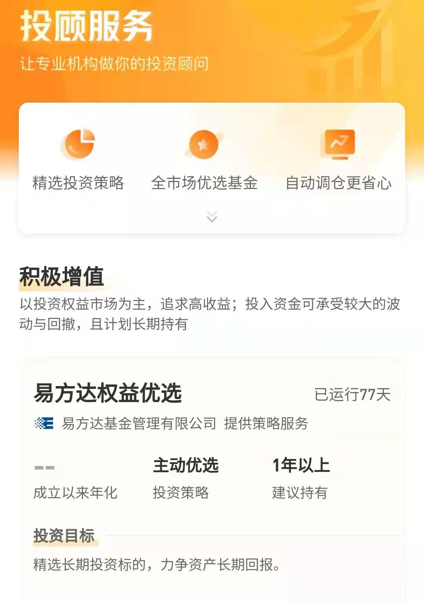

### 给“手痒型”投资者的两个小建议

春节后大盘是一路向下，偶尔还伴随着一两天的短期超跌反弹。本周一（3月8日）更是全线崩溃：上证 -2.3%、深证 -3.81%、创业板指 -4.98%、科创50 -4.09%，甚至市场上讨论风格转换的人越来越多了。这时候大家往往会很躁动，一些不太成熟的投资人就容易被短期的涨跌影响操作。一跌就想卖、一涨又急着追回来，即便暂时忍住了但内心依然是不断地纠结着，这种投资状态通常会影响后续的操作，也容易让正常的工作和学习变得阴晴不定。我把这类人称之为“手痒型”投资者，他们通常热衷于每天看盘，关心股市的涨跌，且自身心情很容易受市场的涨跌而变化，还常伴随着高频或冲动型的买卖操作。

其实这种现象还是蛮普遍的，大家的身边应该也或多或少有一些这样的朋友。最近也常被朋友们问起类似的问题，所以今天就和大家分享两个小妙招，希望你们看后能有所克制，也祝大家都能成为更成熟的投资者。

> 规则前置、少做择时

**交易时段避免频繁盯盘，原则上盘中不宜做重大操作层面的决策。**我们应该养成收盘后再复盘的习惯，复盘后对次日的操作定个计划，当然也不是非要每天都要有个什么决策出来，我个人觉得以每周为周期的复盘较为合理，这也有利于我们在不丢失盘感的前提下降低操作频率，很多时候你回头看会发现很多操作其实是无效的。只要做到了这点就能很好的实现【规则前置】，以此来帮助我们极大程度的减少了冲动交易。并且自然而然地让我们的操作都变得相对理性且逻辑可依，这样就可以很好的规避了一些无端的懊恼或纠结的情绪。

**对于绝大多数投资者，不要轻易尝试择时。**自己经常向同事们推荐一些普通定投或者近两年我常提的目标投策略，其实就是劝诫大家【少做择时】。我一再强调分批建仓、逐步卖出这些操作不会给你带来什么超额收益，但是会让你的投资心态上升好几个台阶，然后时间放长点一看会发现收益还是不错，至少在稳健投资的过程中收获远超银行理财的收益率。

上面两点对于自律性强、执行力高的朋友会有很好的效果，但实际情况是还有不少朋友依然不能很好的做到理性投资。这个其实我们也能理解，毕竟好的投资体系往往是逆人性的，也正因为市场里有不少不理性的“韭菜”，我们A股才有那么高的超额收益。那我们有没别的法子呢？请看下一条！

> 基金投顾、代您调仓

基金投顾就是一种全权委托的投资方式，这个事物的产生就是为了解决大家投资基金上的一些痛点，比如：**人性弱点的追涨杀跌、基金涨了基民却不赚、信息纷杂一顿操作猛如虎**等等。其实我们国家的基金数量已超8000多只（个股数才为其一半），而且每年新基金的增速远大于个股的增速，这也给广大投资者们增加了选择基金的难度。而绝大多数的基民是不看基金季报、半年报、年报的，股民虽然看财报的人也不多但比例还是比基民多，这种情况下普通基民要通过自己做好基金投资确实比较艰难。

基金投顾的持牌机构通过专业团队给普通投资者提供基金投顾服务，他们会对全市场的基金产品和策略做深入研究，定期更新基金备选库，构建基金投资组合策略。然后根据客户的风险偏好等具体情况为客户匹配适合的策略，同时对客户账户进行持续跟踪管理，并结合市场情况适时地为客户进行调仓。

这种全新的投资服务模式是2019年底由监管层推出实行的，基金公司方面有易方达、华夏、嘉实、南方、中欧获得了首批投顾牌照。我自己使用的过程中发现很多服务机构都给与了详实的定期报告服务，一方面是告诉客户，投顾服务机构在过去一段时间帮大家做了哪些操作，对应的业绩又是如何；另一方面还会给大家讲讲未来投资的一些趋势和可能需要的注意点。这点和基金投顾服务背后的严格监管与完善的合规风控体系是分不开的，类似一个贴心的管家在给主人定期汇报资产的运作情况，给投资者们带来了很好的心理预期。

---

下面我们重点讲下**易方达·基金投顾**，上面也提到易方达基金是证监会批准开展基金投顾业务的首批机构。当然真的把投顾服务做好也不是一件那么容易的事情，因此易方达针对基金投顾的四个核心要素：产品、策略、服务、客户，分别设置了投资业务、基金研究、投顾业务、市场业务、金融科技、系统运营这六大职能部门，与传统的销售部门功能性隔离，形成一个平行于公司投资、市场和中后台之外的全新业务条线。这种新业务线的独立既体现了易方达对于投顾业务的重视度，也有利于基金投顾业务更加独立地开展。

在大家最关注的调仓方面易方达也做到了专业、尽职，全年365天不断监控基金资质的变化（优胜劣汰、动态调整产品备选库）、基金交易状态的变更（因基金开放申赎、限额申购等状态变更，及时调整策略成份基金）等情况，并随政策与市场情况变化适时调整策略。围绕约定的目标中枢，对策略进行资产配置比例的调整与优化，让资产组合能得到较好的优化与再平衡。

以易方达投顾在天天基金平台上的产品为例有：保守理财（计划持有1月以上）、力求战胜通胀（计划持有6月以上）、希望财富增值（计划持有9月以上）、追求高收益（计划持有1年以上）、积极挖掘权益机会（计划持有一年半以上）。我自己去年十月初体验了两款是：进取投资策略、平衡增长策略，买完以后我就没怎么管它（偶尔点开看看投顾月报），即便今年行情那么糟心，截止发稿日我的两个易方达产品均是正收益。

近期我有发现在蛋卷基金上也可以看到易方达投顾产品了（详见下图），我就顺手查了易方达投顾的其他渠道：京东金融、交通银行、好买网、招嬴通、基煜等，有兴趣的朋友可以找一个自己习惯的平台试试，或许会给你带来不一样的投资体验。

