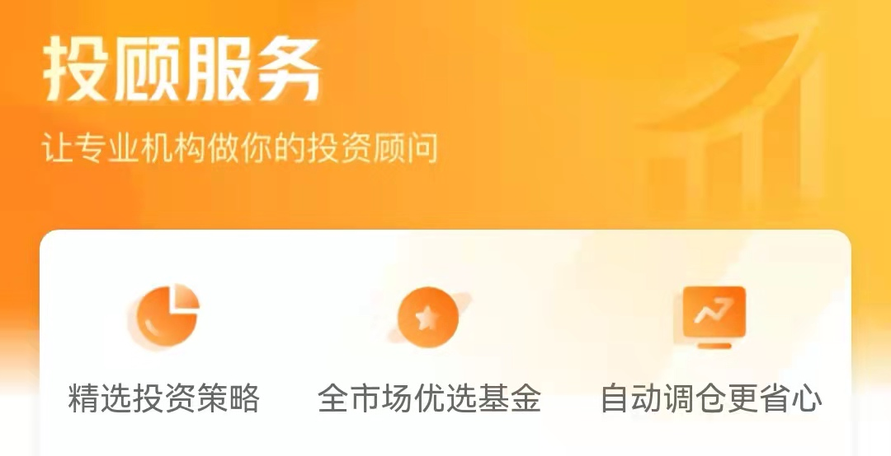

### 客观、公正的帮你全市场甄选基金

有些朋友会问我什么是基金投顾，能不能简单的阐述一下这个概念？用一句话说就是：基金投顾持牌机构根据约定的策略，通过授权账户帮客户进行基金的申购、赎回等一切相关事务。再通俗点就是“代您管理”，**一站式给投资者解决“买什么基金，买多少，什么时候买卖”的问题**。

我们是不是经常听到身边的朋友说：这基金看净值变化是赚钱了，可我们买基金的人怎么就没赚到钱呢？很大一个原因就是没“管住手”，不少人在买卖基金的时候没有一个完善的投资体系和严谨的投资规范，因此他们买卖基金时就很容易受市场情绪的影响。而作为专业的基金投顾机构，无论是在市场下跌恐慌之际、还是在市场上涨兴奋之时，投顾机构都会严格遵守投资纪律，这就很好的避免了有些基民追涨杀跌和频繁交易等短期非理性交易行为，做到了这一点那么大家赚钱的概率就又提升了不少。

上面说的非理性频繁交易只是普通投资者买卖基金常见误区的一小点，其实还有很多比如：单只基金持仓占比过大、买入了多只底层资产类似的基金、组合的年度换手率过高、对基金的底层资产没有一个充分的认识等。我们以易方达基金投顾为例，去看看专业的投顾机构是如何通过设定“投资限制”来规范基金交易的：

1、单人单只基金持仓不能高于该人资产的20%（货基、债基不限）；

2、单一组合策略下所有持有人单只基金份额总额不超过该基金总份额的20%（债券指数基金是30%）；

3、单一组合策略下所有持有人单日赎回单只基金份额总额原则上不超过该基金总份额的5%；

4、组合策略中不含有结构复杂的基金（比如分级基金场内份额）；

5、组合策略中不含有封闭基金、定开基金等流通受限的产品；

6、组合策略年换手率不应超过200%，到180%时应触发预警机制。

无论你是一个刚接触基金的初学者，还是有着一定投资经验的基民，看到如上的六点心里不禁多了一份很靠谱的感觉，也能体会到持牌基金投顾机构的专业和严谨。同时也告诉我们即便是一个专业的团队，也需要这样的“规则前置”，在约束规范投顾机构操作的同时也给产品持有人带来了一份踏实。

另外我们知道基金投顾机构的收入只来源于“投顾服务费”（不向基金公司或代销机构收任何费用），而非传统销售渠道的管理费等各类费用分成。**基于“向谁收费即对谁负责”的基本准则**，这就很好理解基金投顾机构和客户（即基民）的利益是一致的。这种模式也可能很好的避免机构为获取更多佣金分成，而给客户配置一些不合适的产品，更不会有什么赎旧买新、频繁操作这类操作（从上面说的六点“投资限制”里也可以看出，基金投顾机构从规范条款层面就已经避免了频繁操作）。

那这个“投顾服务费”是怎么收取的呢？我们再以易方达基金投顾为例，易方达主要有6种不同风险等级的组合策略产品，他们的投顾服务费率分别是（不同销售渠道策略数量和名字可能略有区别）：激进投资策略（0.8%/年）、进取投资策略（0.5%/年）、平衡增长策略（0.4%/年）、稳健理财策略（0.25%/年）、货币增强策略（0.2%/年）、货币优选策略（0.2%/年）。以我自己买的易方达平衡增长策略产品来说，按照账户资产1万元来算，每个月投顾服务费也就3块多钱，对比与之带来的省心、省事、省力收益还是很值得的。

现在持牌的基金投顾机构已经多达55家，其中有基金及基金子公司、独立基金销售公司、证券公司、商业银行，这些机构的固有特点也会给大家带来不同侧重点的基金投顾服务风格。以第一批获批的易方达基金为例，在获批投顾试点后设立了与传统基金销售业务完全隔离的独立板块，**不承担公司产品的规模任务、不向代销机构和管理人收取任何费用**，以此来确保其基金投顾业务立场的客观、公正，立足全市场甄选基金产品。

易方达基金运用自身行业优势，在全市场8千多只基金产品中，通过定量与定性研究相结合，多维度综合评价优选投资标的。根据宏观与行业中观研究形成资产配置观点，结合量化研究分析，构建基金投资组合策略。通过研发和实施机器学习、自然语言处理等，结合行业经验，力争提升投研、运营、风控和服务效能。整个基金投顾过程中充分考虑了基金资质的变化、基金交易状态的变更，还有对组合资产配置比例的优化与调整。

正因为易方达身处基金行业，所以对行业内的一些现象观察地更为细致，深知如何优化服务模式才能更好的与传统基金销售相互补。在专注于将基金投顾的策略和服务做好的同时，通过与各类基金代销平台合作，来将基金投顾服务带给更多的投资者。截止目前，易方达基金投顾已经和蛋卷基金(首页-投顾服务)、京东金融(基金-基金投顾)、蚂蚁财富(支付宝app-理财-基金-投顾管家)、广发证券(“易淘金”app-“理财”板块-财富管家)、天天基金（我的-快捷交易-投顾管家）等开展了合作，大家可以根据自身的偏好和便捷性，选择习惯的平台享受易方达基金投顾提供的“选基、投基、调仓”的一站式基金投资顾问服务。

最近易方达基金又在江海证券APP上线了6款基金投顾产品：激进投资策略（R4等级、权益基金 > 70%、建议持有1年半以上）；进取投资策略（R3等级、50% < 权益基金 < 70%、建议持有1年以上）、平衡增长策略（R3等级、20% < 权益基金 < 50%、建议持有9个月以上）、稳健理财策略（R2等级、权益基金 < 20%、建议持有6个月以上）、货币增强策略（R1等级、货币基金 + 债券基金、建议持有1个月以上）、货币优选策略（R1等级、100%货币基金）。大家可以**综合考虑自己的投资目标、投资期限、风险承受能力等因素**，根据平时的使用习惯去自己熟悉的平台体验易方达基金投顾的服务。
