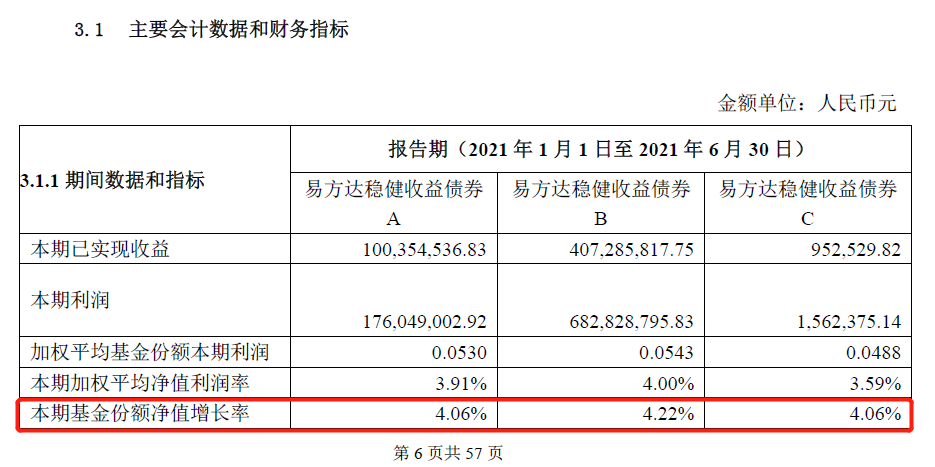

### 大过年的，买点固收+吧

看到话题君出了个测评12只固收+产品的征文活动，恰巧我又刚好新买了其中的一只（易方达稳健收益债券）。坦率地说我在固收类基金上的研究很薄弱，自己也想借着正好持有该产品，叠加这次征文的机会稍微深入地学习下，权当是一个开端吧。

至于为什么要买这个产品？这还得从年前写的 ☞ [《格局太小的我终究没能成为招行的金葵花》](/life/zh-jkh)说起。那篇文章里我有提到：元旦前止盈了一部分权益类基金的仓位，手里多了50多万的现金不知道买啥，想着存余额宝肯定不合适，那就顺带办个招行的金葵花体验下。虽然文中我是认可泥沼老哥的人间清醒，但好奇心还是驱使我最终办了金葵花卡。年前办完了金葵花，随即在招行买了几只基金产品，其中就有易方达稳健收益债券。

> 50万放招行买了哪些产品？

如果只是来看易方达稳健收益这只产品的测评，那么这大段可以跳过！

我对这50万的定位是：**收益超过银行理财就算及格，回撤控制和流动性一定要好。**因为如果2022年后面有什么好的机会，我还是需要能较快地转出，去买权益类基金或个股的。

这里就有小伙伴要问了：那你为什么不直接在招行里面买权益类基金呢？因为招行只有指数基金和债券基金的申购费是打1折的（个别特殊的产品除外），主动基金几乎都是原价申购（这里插一句，别看蚂蚁和东财的基金代销规模直逼招行，但你要知道招行代销的很多产品都是不打折的，这背后的利润可是天壤之别啊）！那这样我们可选的范围就比较明确了：

a、5万招行的特色产品朝朝宝，可惜单人限额仅5万，那不管了，反正买满就行。该产品优点就是**余额宝的平替产品**，且收益远超余额宝（朝朝宝近期年化可达2.8%~3%），非交日易也可方便迅捷地提取。

b、25万我选择招行在“基金”板块的“固收专区”推荐的天弘增利短债C，该主要优点是申购免费、7日后赎回免费**，成立以来最大回撤仅0.25%（2020年3月27日至今），近一年收益3.77%**（截至2022年2月8日，下文若无特殊说明接以此为准）。买这个短债基金的主要的考虑还是在低回撤、较高的流动性上。

c、10万的兴全稳态债券A，这只依然是纯债基金，主要是放宽了免赎回费的期限、回撤的控制等数值，但历史上也获得了更好的收益率（近一年收益5.63%）。

d、最后是景顺长城景颐双利A和易方达稳健收益A每只各5万，这两只产品则搭配了一定的权益产品，我认为是比较正宗的固收+ 基金。其实景顺长城这只含股票17.08%、易方达这只含11.69%（数据为2021年四季度报）。我个人认为权益资产如果超过20%，那就不能再以固收的名义宣传了，因为无论你有多么高超的控回撤水平，你的仓位比例就注定了这类产品**波动会远超普通基民所理解的固收类**波动，是极不负责任的产品描述。

这两只固收+产品，再包括上面的兴全稳态，我都是借助于自己买的几只基金投顾产品快速筛选出来的，主要还是自己对固收类产品不熟且决策时间较短（我当时花了1小时就匆忙的定下了这50万该投哪些产品）。

当时把自己持有投顾产品内的债券基金都列在表格里，然后把被多家机构选中的债券基金单独拎出来，再把他们的基础数据拉取后，按着我上面对回撤、收益、流动性的要求初略的筛选得到的。当然这样仓促之下的筛选还是有些不足的，这个后面具体测评的时候也会讲到。

> 对易方达稳健收益债券的一些信息整理

前面也说过了，我对固收类产品的认知还是比较薄弱的，所以这篇也不能算是什么严谨的测评文章。本文不会推荐任何基金，只是客观地把我看到该产品的一些信息汇总分享出来（数据主要来源是2021年半年报、四季报），但愿能给大家带去一些帮助，也欢迎大家多多交流与指正。

**1、基金名字的变迁。**

这只基金是2005年9月19日就成立的“古董级”基，但之前叫“易方达月月收益中短期债券投资基金”，在2007年12月21日的持有人大会审议通过后才转型为现在的“易方达稳健收益债券型证券投资基金”。需要说明的是当时只设立的A、B类，C类是在2019年10月23日设立的。

**2、ABC类的费率问题。**

a、0申购费、综合年费1.1%、30天免赎回费；

b、申购费0.08%（一折）、综合年费0.8%、30天免赎回费；

c、0申购费、综合年费1.08%、365天免赎回费；

这只基金比较特殊，**A类居然是免申购费的**，而且有了这样的A类后在2019年又新增了个C类，对比之后这C类是相当鸡肋呀，可能渠道也觉得比较鸡肋，支付宝和天天基金上都显示“暂不销售”。

而且对比A、B份额的费率后，我实在不理解为什么基金投顾产品要选A类？（易方达投顾的“进取投资策略“和“平衡增长策略”里均含有A类 ）我们算一下就知道买入后持有超过3个月基本上就是B类更具优势了，难道是因为自家投顾买自家基金产品都不敢持有超过一个季度？！

有人说你怎么那么在意这点费率？大哥你有所不知，这可是固收类产品，费率上省下的可都是到净值里的呀。以2021年半年报为例，6个月B类就比A类多了0.16%的收益（详见下图），而且我们可以从半年报“6.4.11 利润分配情况” 看到，B类比A类每10份多发0.02的现金分红。

另外一个佐证就是基金持有人结构（详见下图），可以看出聪明的机构自己买的时候大多选择了更划算的B类（tips:投顾产品不归类到机构份额，可以简单把基金投顾产品理解为一个子通道），而帮客户买投顾产品时却选择了费率更高的A类，这是为什么？！

这篇虽然是测评固收+ 产品，但过程中不小心发现了基金投顾的一个小疑惑，我相信这应该不是个例。我打心底里还是很希望基金投顾这个新事物能发展好的，如果还是换汤不换药的卖基金，那么多少有点遗憾。

**3、业绩基准的变更。**

我们在半年报中可以看到该产品的业绩基准是“中债新综合财富指数收益率* 90% + 沪深 300 指数收益率 *10%”，同时我们看到在2020年7月9日前的业绩基准是“中债总指数(全价)”。不得不说这只基金的历史业绩走势曲线（详见下图）真是非常的好看，属于买了能安心睡觉的那类。

对于业绩基准的变更，官方给出的解释是：“本基金是债券型基金，投资于债券等固定收益品种不低于基金资产的80%，投资于股票等权益类品种不高于基金资产的20%。在业绩比较基准中增加股票部分的基准，能够更加真实、客观地反映本基金的风险收益特征；而将债券部分的基准由反映利率债走势的中债总指数修改为反映境内债券市场走势的中债新综合指数，更贴近本基金的投资范围与投资策略，并可提高基金业绩表现与业绩比较基准的可比性。基金业绩比较基准收益率在变更前后期间分别根据相应的指标计算。”

**4、基金经理相关。**

本基金的基金经理是胡剑，头衔是易方达副总经理级高级管理人员、**固定收益**投资业务总部总经理、固定收益投资决策委员会委员。顺带说下，易方达另一位固收顶流张清华的头衔是易方达副总经理级高级管理人员、**多资产**投资业务总部总经理、固定收益投资决策委员会委员，本次测评列表的另一个产品易方达裕丰回报的基金经理之一就是张清华。

另外易方达稳健收益债券基金的不同是基金经理助理有一堆：纪玲云（固定收益分类资产研究管理部负责人）、李一硕（固定收益特定策略投资部负责人）、胡文伯、刘柱。而且让我稍感意外的是本基金的基金经理无本产品持仓。结合这两点，胡剑作为副总，在管资产超一千两百亿，**自己的代表作都没有持仓，且配置了4位基金经理助理**，我不禁有个疑惑：他会不会只是挂个名？

**5、规模变化及历史业绩。**

虽然现在易方达稳健收益已经超700亿规模（下图只展示了B类的规模），但主要增长也是在2021年的三季度才开始，所以2021下半年热度不断的固收+不是没有道理，居民财富从银行理财往优质固收+产品迁移是真实的。而且从风险收益指标与阶段涨跌幅看，易方达稳健收益确实是一只非常优秀的产品。

> 聊聊我是怎么看待固收+ 的？

**1、固收+的根基要落在“固收”两字上，**别给我整什么权益-，我真要大比例的权益我自己会去买股票型基金或者直接买个股的。因为买固收+ 的大部分人就是银行理财的替代，他们的风险承受能力往往较低，持有人需要稳稳的收益，哪怕少赚一点也是可以的。

**2、回撤控制的高要求和业绩回报的稳定性。**这两个要求就间接地强调了权益仓位不能过高，虽然底线是20%的权益仓位，但我认为要想**尽量保障以季度为单位的连续正收益**，那么权益仓位在10%附近更佳，即便少一点收益也是可以接受的。

**3、要做真正的固收+，而非打新基金。**虽然小规模的基金可以有较实惠的打新收益，但随着打新性价比的减弱，特别是基金规模增大后的摊薄，只有真正在权益部分给固收做加法才是王道。

4、要想较好地做到上面三点，那么权益的选择就很考验基金管理人，通常需要尽量选择低估值、低波动、高股息的个股，如果个股之间能较好的做到风险对冲那是更佳，可转债的选择亦如此。

5、提醒下大家，去年固收+基金整体业绩还不错，除了同行的衬托（股票类基金大多比较惨淡），还有就是赶上了可转债的大行情，去年可转债市场从年初的大面积破百到年底找不到百元以下的产品。这两个因素都是不可持续的，特别是第二个，所以从银行理财搬迁过来的朋友们要有一定的心理准备，不能总用去年的业绩标准来衡量今年的走势。