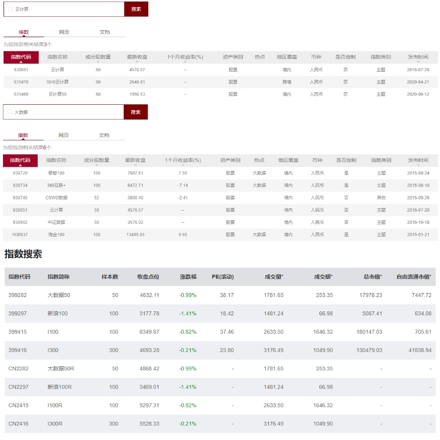
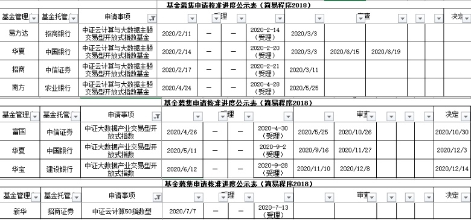
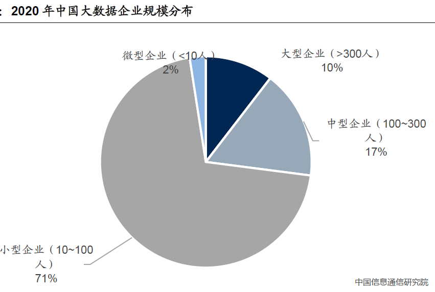

### 除了抱团，我们还可以有哪些选择？

去年四季度开始，大家讨论公募基金抱团的声音是越来越大，甚至有的口号喊出来：打不过基金就加入它。我们资金在没有更好、更可靠的去处之前与公募基金抱团也不失为一个好办法。但作为一位有经验的投资者，我们要有居安思危的意识，理应不断探寻新的具有前景的行业。就好比若能在去年三季度前提前介入新能源车和光伏这些热门行业，那么投资就会事半功倍，毕竟我们**投资其实就是对未来趋势的预判**。

我自己是这样想的，平时也是这么去找寻的，我在去年12月底也明确提到了医药板块内的生物科技这一细分领域未来会有很好的发展空间。但我前段时间在复盘整个2020年投资的时候发现了另外一个前景可人，且暂时来说估值较为合理的行业：人工智能。我自己是程序员，所以对于这个名词并不陌生，科技公司向来喜欢把自己的产品或项目冠上这些热门词汇。所以我们软件行业的从业者会比普通老百姓更早地听到这些词，而且听到的频率也会更高，与人工智能经常一起出现的词汇还有：云计算、大数据等。

那为什么如此有前景的人工智能，好像在去年热门一段时间后又很低调了呢？我个人的理解是：人工智能这个概念还是略显前卫，或者说我们现在普通老百姓能接触到的人工智能都还是很浅层的、初级的。但这不影响我们对于人工智能行业前景的认可，这就让我有了进一步挖掘的兴趣。既然人工智能这座大厦有点前卫，大家当下的接受程度好像还没那么高，那我们能不能找到它的下游或者说支撑这座大厦的砖瓦呢？

这就要联动我上面说的，伴随着人工智能一起高频出现的另外两个词汇就是：**云计算、大数据**。恰巧这两个事物又是人工智能的基础，云计算提供算力支持、大数据提供数据支持。在找到新思路后，作为一个指数基金钟爱粉，我本能的去中证指数有限公司官网、国证指数官网去检索相关的指数（详见下图）。

- 在中证指数官网检索‘云计算’：出现3个结果，分别是**云计算（930851）**、SHS云计算（931470）、云计算50（931469）；

- 在中证指数官网检索‘大数据’：出现3个结果，其中非定制指数只有三个，分别是：CSWD数据（930745）、**云计算（930851）**、中证数据（930902）；

- 在国证指数官网检索‘云计算’：暂无数据；

- 在国证指数官网检索‘大数据’：出现4组结果，分别是：大数据50（399282）、新浪100（399297）、l100(399415)、l300(399416)，以及对应的四个全收益指数。

对于这些指数我在第一层筛选时就是把国证的几个剔除了，国证的四个指数中有三个是新浪财经舆情数据相关的，显然不是我们需要的检索结果。唯一符合的大数据50指数也只是仅限于深证市场选股，这也显然不算是较好的选择，所以第一轮国证的相关指数都pass了，我也顺带吐槽下国证指数的官网体验比中证指数官网要差很多。然后再看中证指数官网的两次检索结果，首先第一眼剔除的就是CSWD数据，这个是指数看名字就能猜到和万得有关，而且你会发现十大权重股和其余几个指数有很明显的差异。剩下4个指数里我没急着再剔除，而是想看看公募基金们是如何选取的，我就去证监会官网去查了下相关的指数基金申报情况（详见下图）。

我们发现SHS云计算暂无申报，云计算50仅新华1家申报，中证数据有富国、华夏、华宝3家申报，云计算有易方达、华夏、招商、南方4家基金公司申报（其实融通还有一只对应的产品）。为什么要来查基金公司的申报呢？我们对投资的探索最终都是要落实到操作上的，没有对应的指数基金我们操作个空气啊？即便是我个人最看好的SHS云计算指数，但没机构申报对应产品我也只能暂不往下研究了。接着就是云计算50指数，虽然有人申报了，但这进度很慢啊，何况新华的指数产品规定都很小，也暂不考虑。最后两个云计算和中证数据都不错，前者是上报家数最多的指数，后者是现有产品最多的指数。

- 云计算（930851）：中证云计算与大数据主题指数选取50只业务涉及提供云计算服务、大数据服务以及上述服务相关硬件设备的上市公司A股作为样本股，以反映云计算与大数据主题股票的整体表现。

- 中证数据（930902）：中证大数据产业指数选取涉及大数据存储设备、大数据分析技术、大数据运营平台、大数据生产、大数据应用等领域的沪深A股作为样本，采用自由流通股本加权，设置10%的权重上限。

从两者的定义可以很清晰看到中证云计算与大数据主题指数是兼具云计算和大数据，而中证大数据产业指数只有大数据方向。对于云计算和大数据相关性很强的两个方面（云计算和大数据是一体两面的表达，只是角度不同而已），且都是支撑人工智能的左膀右臂，外加现在A股可选的相关优质标的总数也不是很多，我觉得选择**中证云计算与大数据主题指数（930851）**会更好一点。何况小孩才做选择，我们大人会义无反顾地说：我都要！

经过层层的筛选就是为了把研究的精力都放在最好的地方，下面我们就开始解析下中证云计算与大数据主题指数（930851）。指数样本的选取很常规，概括下来就是：选取中证全指中年日均成交额排名前80%的相关行业（对应的业务范围是：①云计算服务：基础设施即服务（IaaS）、平台即服务（PaaS）、软件即服务（SaaS）；②大数据服务：数据管理服务、数据分析服务；③硬件设备：为云计算或大数据提供服务器、存储等设备；）个股里年日均总市值排名前50只。选取后的前十大权重股就如下图（合计权重59.44%，龙头特征明显）：

看到这有人就要问了：你说投资就是对未来的预判，又预判云计算和大数据板块前景不错，那么凭啥呢？因为效率！**个人也好、企业也罢、乃至一个国家，你要有更好的发展只有两条路：①提升自己的稀缺性、②提升自己的效率。** 而云计算和大数据正是提升生产效率的大利器，它们正影响着我们生活、生产的方方面面，并将继续更深层次地推动我们社会高效发展。

我们就以云计算为例，看看它是如何帮助企业降本增效的。云计算具备下列几个特性：弹性扩容、按需付费、敏捷部署、高效运维。简单说就是企业需要多少运算服务就可以买多少并为之付费，部署和运维也是很高效便捷。这能很好的避免资源浪费，毕竟为企业节省下的每一分钱都是将来利润的来源，扩展到整个社会就是生产效率的提升。对于不同需求的企业，云计算可以提供差异化的服务：（服务模式）IaaS、PaaS、SaaS，（部署模式）公有云、私有云、混合云。这就可以组合出很个性化的产品服务来帮助不同需求的企业，在算力规模、服务模式、安全级别等方面更有针对性的提升企业的效率。

而且我开篇也说了，云计算和大数据相对于人工智能更贴近生活，是因为已经有很成熟的行业应用了。比如①政务云：已覆盖31个省级行政区，增加政府服务便利性，降低运行成本，助力数字化城市建设；②金融云：覆盖传统金融的各子行业，典型的有为中小银行提供基于云计算的各类解决方案，为金融客户提供IaaS和PaaS等基础设施服务；③交通云：利用云计算的强大算力，完成铁路、航空、物流等领域的资源调度，实现数据的高速传递和安全存储；④能源云：针对电力、石化领域的央企，将上下游业务迁至云端，实现数据稳定服务和安全管理，解决其分支过多、业务繁杂、管理难度大、成本高等问题。

再举一个云计算贴近生活的运用：疫情之下远程办公成为了刚需，相关业务量剧增。钉钉、腾讯会议、企业微信、金山办公等均得到了更广泛的使用。远程办公普及后会让公司其他方面也逐步在线化，包括业务、管理等流程，IT企业也将加速SaaS应用推广，以规避现场实施的限制。其实国内云计算市场还处在萌芽期，公有云和私有云市场增长依然齐头并进，而不是零和博弈。虽然阿里、腾讯、华为等IT巨头等纷纷进入，但中国企业级市场的复杂性使得IaaS层面依然存在机会，市场蛋糕正变得越来越诱人。

接着我们再看看大数据，首先解释下什么是大数据：IT行业术语，是指无法在一定时间范围内用常规软件工具进行捕捉、管理和处理的数据集合，是需要新处理模式才能具有更强的决策力、洞察发现力和流程优化能力的海量、高增长率和多样化的信息资产（引自百度百科）。

如果说云计算是人工智能的算力支持，那么大数据就是人工智能的数据支持。我们都知道好的人工智能除了一颗高速运算的大脑，还要有海量的大数据去“喂养”它，而这些我们常规办法无法处理和消化的大数据就是AI的最佳口粮。随着社会信息化、互联化的快速发展，人类所掌握的数据一直在呈指数式增长。我们在拥抱移动互联和万物互联的同时，所产生的新数据已经超过了历史总和，海量的数据不断挑战着我们的存储和处理能力，当然也为大数据的利用创造了丰富的想象空间。大数据中心是“新基建”的重要一环，是数字经济和流量经济赖以生存的基础设施，前景无限量。

同样大数据我们也举一个贴近生活的例子：大数据成为了疫情防控的重要抓手。新冠疫情防控中，大数据技术在实时跟踪、重点筛查、有效预测等工作中发挥着重要作用。卫生部门与公安、交运、通讯等其他部门的数据交换、汇聚、融合等需求越发凸显，为疫情防控相关部门提供科学决策的依据。那尝到了大数据高效之后的后疫情时代，社会各界都会进一步落实大数据技术的建设，相关需求的增加必将推动大数据产业盈利的快速增长。

综上我看好云计算和大数据板块未来的发展，而中证云计算与大数据主题指数（930851）是当下该板块不错的选择，至少你能看到该指数是相关板块里申报基金公司家数最多的。最后呼应下文章开头，虽然说去年三季度前买入新能源车和光伏行业的人都赚得盆满钵满，但你要知道这里面大部分能提前买入的都是更早就已开始研究这些板块的人，所以你们懂的。