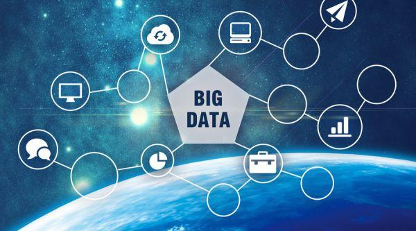

### 信息技术的新潮流：云计算与大数据

最近看到几篇文章都是在介绍云计算和大数据板块，我印象中这两个不都是人工智能的‘下游’领域吗？我带着些许疑惑再次去探究了下，这过程中获得了不少全新的认知，现在就和大家做一个简单的分享。

众所周知，人工智能(Artificial intelligence)、大数据(Big data)、云计算(Cloud computing)组成的“ABC”已经是公认的技术趋势。而云计算和大数据除了给人工智能（让机器以人类智能相似的方式做出反应）提供算力支持和数据支持的外，他们还将众多来自政府、企业以及个人用户的需求更紧密的结合，衍生出了更为广阔的应用空间和发展潜力。云计算与大数据将引领信息技术的新一轮潮流，会带来工作方式和商业模式的根本性改变。

- 云计算是分布式计算的一种升级，是分布式计算、效用计算、负载均衡、并行计算、网络存储、热备份冗杂和虚拟化等计算机技术混合演进并跃升的结果。**云计算的目的是提升效率，策略就是把资源放到云端，然后大家按需付费使用，也算是一种“共享经济”思维。**因此也造就了云计算的几个可贵之处：高灵活性、可扩展性和高性比；

- 百度百科对大数据的定义是：指无法在一定时间范围内用常规软件工具进行捕捉、管理和处理的数据集合，是需要新处理模式才能具有更强的决策力、洞察发现力和流程优化能力的海量、高增长率和多样化的信息资产。正是这些以指数级增长的海量数据不能以常规工具可捕捉处理，就更凸显出对大数据进行高效采集清洗的价值，**让这些含有意义的数据在进行专业化处理后实现数据的‘增值’**；

**个人也好、企业也罢、乃至一个国家，你要有更好的发展只有两条路：①提升自己的稀缺性、②提升自己的效率。** 而云计算和大数据正是提升生产效率的两大利器，它们正影响着我们生活、生产的方方面面，并将继续更深层次地推动我们社会高效发展。

我们就先以云计算为例，看看它是如何帮助企业降本增效的。云计算具备下列几个特性：弹性扩容、按需付费、敏捷部署、高效运维。简单说就是企业需要多少运算服务资源直接买多少并为之付费即可，部署和运维也都很高效便捷。这种云端计算运力资源的共享化，让企业和个人做到真正的按需索取、按量付费，因此能很好的避免资源浪费。进而提升企业和社会的生产效率，毕竟为企业节省下的每一分钱都是将来利润的来源，扩展到整个社会就是生产效率的提升。对于不同需求层次的企业，云计算可以提供差异化的服务：（服务模式）IaaS、PaaS、SaaS，（部署模式）公有云、私有云、混合云。这就可以组合出很有针对性的个性化产品服务，继而来最大程度满足不同需求的企业，在算力规模、服务模式、安全级别等方面更高效的提升企业效率。

而且我们发现云计算已经很成熟的运用在了众多行业，比如①政务云：已覆盖31个省级行政区，增加政府服务便利性，降低运行成本，助力数字化城市建设；②金融云：覆盖传统金融的各子行业，典型的有为中小银行提供基于云计算的各类解决方案，为金融客户提供IaaS和PaaS等基础设施服务；③交通云：利用云计算的强大算力，完成铁路、航空、物流等领域的资源调度，实现数据的高速传递和安全存储；④能源云：针对电力、石化领域的央企，将上下游业务迁至云端，实现数据稳定服务和安全管理，解决其分支过多、业务繁杂、管理难度大、成本高等问题。这些真真切切的使用，实实在在的提升了企业的效率，给企业和社会都带来了极高的效益，这就是云计算前景可期的有力支撑。

接着我们说下大数据，大数据技术通过对天量数据的高效专业化处理实现数据的‘增值’。最常见也最容易被大家理解的一个实例就是：对大量消费者提供产品或服务的企业可以利用大数据进行精准营销。阿里、腾讯、百度、今日头条、美团等互联网巨头都在用，并且运用的炉火纯青。我们程序员经常会听到产品经理说，最好能做到“千人千面”，给用户提供足够个性化的产品与服务，这就是最最最普遍的大数据应用。

现在的社会是一个高速发展的社会，科技发达，信息流通，人们之间的交流越来越密切，生活也越来越方便，大数据就是这个高科技时代的产物。我们毫无争议的处在一个信息爆炸的时代，以前我们总是抱怨数据信息不够多，但真的海量数据放你面前，你又不知道该如何处理和运用这些事物了。而大数据技术的产生就很好的解决了这个痛点，大数据在让我们生活更便利高效的同时也给企业和社会带来了更多的效益。大数据中心是“新基建”的重要一环，是数字经济和流量经济赖以生存的基础设施，前景亦无限量。

聊了这么多云计算和大数据的前景，那作为一名有经验的投资者，我们是需要把**对未来趋势的预判落实到具体的投资标的上**的。我在中证指数官网内分别检索‘云计算’和‘大数据’两个关键字，出现的检索结果里有一个指数出现了两次：云计算（930851），这也成功引起了我想看看这个指数的兴趣。

云计算（930851）全称是**中证云计算与大数据主题指数**，选取50只业务涉及提供云计算服务、大数据服务以及上述服务相关硬件设备的上市公司A股作为样本股，以反映云计算与大数据主题股票的整体表现。指数样本的选取概括如下：选取中证全指中年日均成交额排名前80%的相关行业（对应的业务范围是：①云计算服务：基础设施即服务（IaaS）、平台即服务（PaaS）、软件即服务（SaaS）；②大数据服务：数据管理服务、数据分析服务；③硬件设备：为云计算或大数据提供服务器、存储等设备；）个股里年日均总市值排名前50只。选取后的前十大权重股就如下图（合计权重59.44%，龙头特征明显）：

综上我看好云计算和大数据板块未来的发展，而中证云计算与大数据主题指数（930851）是当下该领域不错的选择。不少朋友总说，去年三季度前买入新能源车和光伏行业的人现在都赚得盆满钵满，但你要知道这里面能提前买入的都是更早就已开始研究这些板块的人，机会总是更倾向于那些提前准备的朋友们，所以你们懂的。