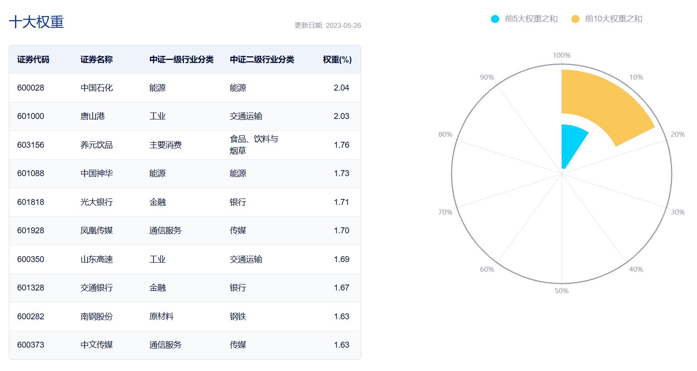

### 复苏有点“弱”，来点“攻守兼备”

五月貌似跌得大家有点萎靡不振，甚至有小伙伴直呼，说好的“弱复苏”怎么只剩下“弱”了！我理解大家的心情，炒高了的行业不敢追、深套的板块又实在没信心补。如果你和我一样，都认为中国经济短时间内很难有大的起色，或者说悬在当下大家头上的几把利剑都还没化解，那我觉得当下选择红利策略是个不错的“攻守兼备”打法。

以我自己唯一公开组合的仓位为例，目前占比最大的是中证红利指数基金（20.69%，截至5月28日）。红利策略类指数的成份股往往都是现金流充沛，具备较强安全边际的企业，所以结合现在环境我认为是值得去配置的。中证红利是A股产品化最成功的一个红利策略类指数，而且去年底中证红利指数编制规则进一步优化后我还没详细聊过这个“老朋友”，所以今天想简单地和大家做一些分享。

> 攻守兼备的红利策略

红利策略一直是我国Smart Beta产品的主力军，前几年Smart Beta盛行之时出现了很多“有效”因子，但现在还“健康”活着的貌似只有红利因子了（截至2022年底，红利策略ETF占所有Smart BetaETF的2/3以上）。

这就是市场选择下的结果，其他因子由于各种缘故都在出现“水土不服”后纷纷淡出大家了的视线，只有红利策略还坚强地活着，甚至规模一直有在稳步增长。红利策略的有效不仅给基民带去了不错的持有体验，最终很好的体现在了产品的规模上（以中证红利指数对应的几只ETF为例，产品规模自成立后一直稳中有升）。

我认为现金分红是观察企业经营情况的重要维度，上市公司通过持续、稳定的分红，可向市场传达企业盈利发展向好、愿意回馈投资者的信号。而红利策略就是以股息率为核心选股指标，聚焦那些长期持续现金分红且分红比例较高的上市公司。

高股息率的企业大多盈利能力稳定、现金流充沛、估值较低、具备安全边际，投资这类公司不仅能够获得较为稳定的分红，还可赚取公司业绩增长所带来的投资收益，在中长期投资中往往能获取不错的回报。

上面说红利策略是“攻守兼备”的打法，是因为其兼具顺周期属性和防御属性。顺周期属性是因高股息的企业通常商业模式成熟、行业格局稳定，主要集中在银行、煤炭、钢铁、房地产等周期性较强的行业，而这些行业对顺周期的环境比较敏感。防御属性是因为高分红的股票在震荡或下行市场环境中能够提供更高的安全边际，而且相对较低的估值水平也能在一定程度上降低股价下跌风险，从而体现出较好的防御属性。

> 优中选优的中证红利

中证红利应该是A股产品化最成功的一个红利策略类指数了，它根据市值、流动性和连续分红水平筛选样本股。不同于其他指数大多基于市值进行加权，中证红利指数采用的是股息率加权的方式，成份股的股息率越高，在指数中所占权重越大。

近年来，中证红利指数的股息率也有稳步在提升，从2015年的3.7%提升至2022年的6.5%（详见上图）。另外值得一提的是在2022年10月优化指数编制规则后，不仅补上了之前的一些不足，也为未来可能出现的极端情况预留了条框。

方案变动如下：（1）样本空间中分红条件修订为过去三年连续现金分红，且过去三年股利支付率均值以及过去一年股利支付率均大于0且小于1；（2）选样方法修订为选取过去三年平均现金股息率最高的100只证券；（3）设置单个样本权重不超过10%，且100亿元以下的样本权重不超过0.5%。

新方案不仅提升了样本现金分红的可持续性考察（二年改为三年），还补上了突击分红、“恶意”分红的漏洞，避免没啥盈利还过度分红的行为（新增股利支付率的要求），说到底还是在鼓励持续、稳定的分红。另外新方案还降低了小市值（100亿以下）样本的权重上限，旨在提升指数投资容量和流动性。如今中证红利指数的产品规模日益扩大，这个优化显得尤为重要。

 

> 企业持续分红为红利策略发展带去成长空间

总得来说，在分红相关政策的鼓励下，上市公司整体分红行为得到持续改善。持续稳定现金分红的上市公司比例显著提升，这也为红利策略相关产品的投资运作提供了较好的发展基础和成长空间。

据中证指数有限公司统计，2022年，A股市场分红总额在全球市场中排名第二，已快速增长至1.6万亿元，较2021年增长23%。截至2022年底，中证全指样本公司中连续5年现金分红的上市公司数量超过1600家，占上市满5年公司数量的近一半；连续3年红利有增长的上市公司超过了400 家，数量占比超过10%，分红的持续性与增长性进一步改善。

随着上市公司分红比例的持续提升，红利类指数产品渐受市场青睐。今年以来（截至2023年5月9日），红利策略相关ETF产品净流入超24亿元，受到市场关注。再次以中证红利对应的三只ETF为例，截至5月28日规模从小到大依次是：红利ETF易方达（27.08亿元）> 中证红利ETF（22.23亿元）> 红利ETF博时（3.50亿元）。
 
