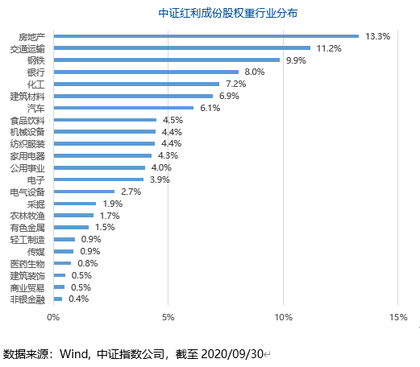
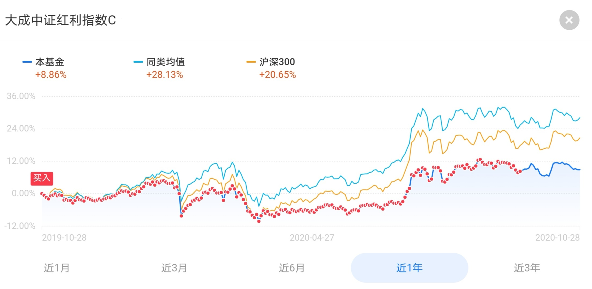
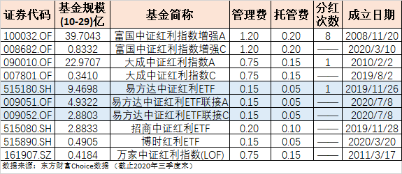

### ETF定期分红是一件很“帅气”的事

我每周一发车的定投组合【薪火相传】里会发布最新的指数估值，但我只选取了4个指数（大道至简）。散户必配的宽基指数：**沪深300和中证500**；最简单、最具弹性的行业指数：**证券公司**；我最钟爱、最符合常识的Smart Beta策略指数：**中证红利**。

老朋友们都知道我对红利因子的热爱是由来已久的，之前写的文章中红利策略也应该是最频繁的。那今天想再写下中证红利指数是看到易方达中证红利ETF在10月29日发放分红了，作为场内指数基金分红其实还是很少见的，那就借由这个再谈谈我对中证红利的一些认知吧。

中证红利里的‘红利’我们可以理解成是持仓股票派发的股利，一般以现金的形式发放。有些人会说分红就是数字游戏、分红后还得纳税、不分红企业就有更多的现金去扩张，但我想说的是：**定期稳定的分红是一个优秀企业必备的属性**（不接受反驳！）。

为什么这么说？股票投资的回报主要取决于股息回报、盈利增长和估值提升。其中后两者是相对容易被粉饰的，而且对于普通投资者很难辨别其中的虚实，但股息分红是真金白银的现金发放，你告诉我这个东西怎么造假？长期稳定的高股息回报是公司盈利能力保持持续稳定的一个重要信号，或者说股票的分红质量很大程度上能反应这个企业是否健康。当然由于A股部分行业特性或者企业性质的特殊关系，个别企业在股价一般的情况下依旧稳定分红，所以我们在投资的时候选择的是指数，也就是一篮子股票组合，他们的最大共性就是分红稳定且优秀，本文的主角就是其中一个成员：中证红利指数。

近两年红利类的指数貌似渐渐淡出了大家的视线，还有一部分人时常拿出来吐槽下红利指数业绩不行怎么的。其实你要是认真的看看红利因子选出来的成份股有哪些、分布于哪些行业你就理解为什么近两年红利指数表现如此平稳了。前五大行业分别是：地产、交通运输、钢铁、银行、化工。这五个兄弟近两年你告诉我哪个是能打的？所以指数定义很大程度上决定了成份股的特性，这种指数基金特有的魅力反而是我坚定不断买入中证红利的原因之一。

上图是我近一年来在支付宝上买的场外中证红利基金，我一直在推荐中证红利这个指数，也知行合一的在不断买入，就在这看似一般的表现下我依然取得了11.71%的收益率。还有我文章开头提到的每周【薪火相传】定投组合里，中证红利指数占比已是组合内仓位最大的指数基金了（占26.25%），对应最新的持仓收益是11.22%，是不是有点出乎意料的？我想表达的是：即便成分股行业当下不是很景气、即便股价表现也是比较弱，但依然可以通过定投低估值的中证红利指数基金获得一个**稳健且可观**的收益。

其实近几年监管层也在采取多项举措引导上市公司加大现金分红力度。2015年8月，证监会等四部委联合发文：要求具备现金分红条件的，应采用现金方式进行利润分配；2017年，证监会对连续三年具备现金分红条件而未分红的上市公司，及其国有上市公司的控股股东进行了约谈，向上市公司传达倡导现金分红的理念；2020年3月起实施的新证券法也明确指出，上市公司应当在章程中明确分配现金股利的具体安排和决策程序，依法保障股东的资产收益权。

另一方面，国资充实社保进程提速，推动A股完善分红机制。财政部表示，划转国有资本充实社保基金后，承接主体获取收益的方式是“分红为主，运作为辅”。在此背景下，有望进一步完善A股市场现金分红机制，促进上市公司进行合理的分红。这种监管层的引导会加速形成一批稳定高股息率的股票，也就给中证红利的成份股池提供了更优质的选择，对整个A股的投资风气也会带来更多正面的影响。

接着我们聊回到实际的投资标的，这次写文章的时候我拉了下第一跟踪指标是中证红利的基金总计有43只，剔除主动基金后还有10只，如果按同一家公司同一标的指数基金场内外合并计数则只有6只产品：富国、大成、易方达、招商、博时、万家。（详见下图）

我开始投资中证红利其实还是很早的，那时候易方达、招商、博时这三只ETF还没上市呢，所以当时考虑了规模和费率后选了大成的。那现在已经是20BP时代了，对于中证红利这种稳健低波动的指数而言，低费率是很重要的一个考量点，是时候要换一下投资标的了。

首先按基金规模排序，博时和万家规模太小，在第一轮就淘汰了；然后看富国（40.54亿）和大成（23.31亿），这两家规模上没问题，主要就是费率太贵，特别是富国的增强型直接按主动基金的标准收费了，而且两家的C类产品规模都极小，也就自然被淘汰了；最后淘汰的是招商的ETF，虽然费率还不行，可明明有更好的20BP我为什么还选这30BP呢？何况易方达的规模也更大，日均成交量也明显更充裕。

一系列选下来就是易方达的产品，而且场内场外都是它最优秀。场内**易方达中证红利ETF（515180）**近10亿的规模，千万级的日均成交量完全可以满足普通投资者的交易体量；场外的联接基金虽然只成立了三个多月，但规模都很可观了，截至2020年第三季度末，**易方达中证红利ETF联接A（009051）**4.93亿、**易方达中证红利ETF联接C（009052）**2.88亿。回头看我上面在支付宝买中证红利的那个图，你会发现9月中旬开始暂停了买入，那是因为这之后我逐渐开始往易方达的场内、场外迁移了。而且之前我在每周的定投组合报告上也说过，元旦过后现有的大成产品也会转换成**规模更大、费率更低**的易方达中证红利ETF联接C。

最后说回易方达中证红利ETF最近分红的事，即便有人说ETF没有必要分红，但我向来是不这么认为的。红利ETF定期分红是贯彻了中证红利这个指数的精髓，买红利指数基金的投资者是很笃信红利因子的，稳定的定期分红更多的是一种精神层面的认可，也能够为投资者提供一个可预期的分红收益。而且ETF能做到稳定分红也是基金公司对自己产品规模的信心体现，坦率的说在这个ETF争抢规模排名的年代，能主动分红降低规模是超级帅气的一件事。

以上就是一位红利因子爱好者的一些内心想法，希望大家能和我一样在中证红利指数基金上赚到钱、安安稳稳地赚点钱！

